# 6. Vista de tiempo de ejecución

## 6.1 Escenarios principales de ejecución

### 6.1.1 Flujo de autenticación y enrutamiento

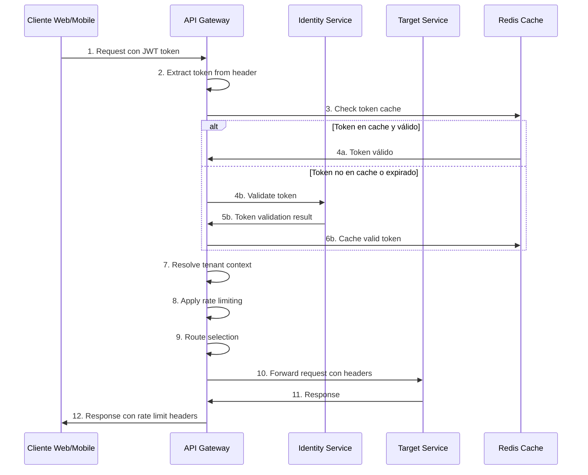

**Descripción del flujo**:
1. Cliente envía request con JWT token en Authorization header
2. Gateway extrae token del header Authorization
3. Verifica si token está en cache de Redis
4-6. Validación de token (cache hit o validación contra Identity Service)
7. Resolución del contexto de tenant basado en claims del token
8. Aplicación de rate limiting basado en client ID y endpoint
9. Selección de ruta y cluster de destino
10. Forwarding de request con headers enriquecidos (X-Tenant-ID, X-User-ID)
11-12. Retorno de response con headers de rate limiting

### 6.1.2 Health check y circuit breaker

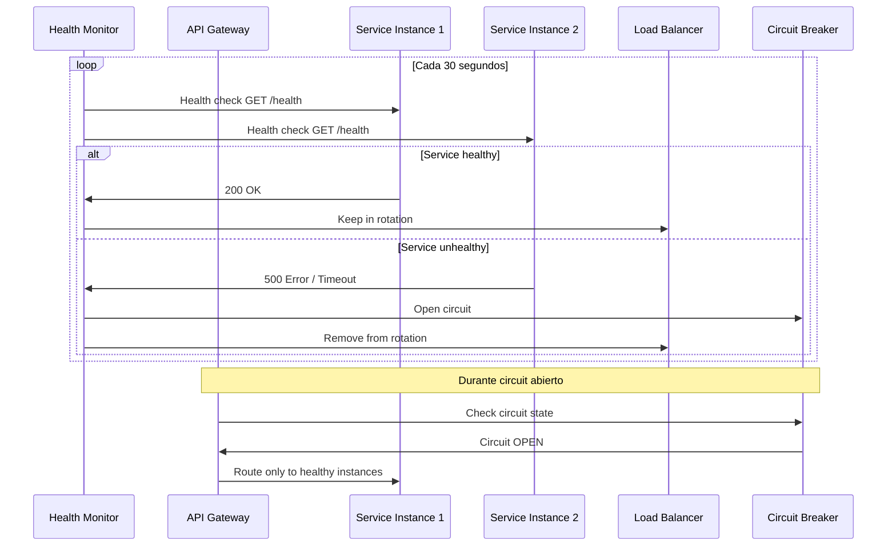

**Timing de health checks**:
- **Intervalo**: 30 segundos
- **Timeout**: 5 segundos
- **Threshold**: 3 fallos consecutivos para abrir circuit
- **Recovery**: Intento cada 60 segundos cuando circuit está abierto

### 6.1.3 Rate limiting distribuido

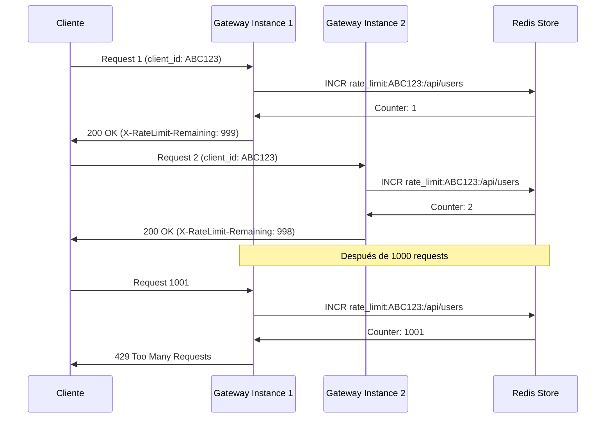

**Algoritmo de rate limiting**:
- **Sliding window**: Ventana deslizante de 1 minuto
- **Estado compartido**: Redis para sincronización entre instancias
- **Granularidad**: Por client_id + endpoint
- **Headers de respuesta**: X-RateLimit-Limit, X-RateLimit-Remaining, X-RateLimit-Reset

## 6.2 Escenarios de failover y recovery

### 6.2.1 Failover automático de servicios

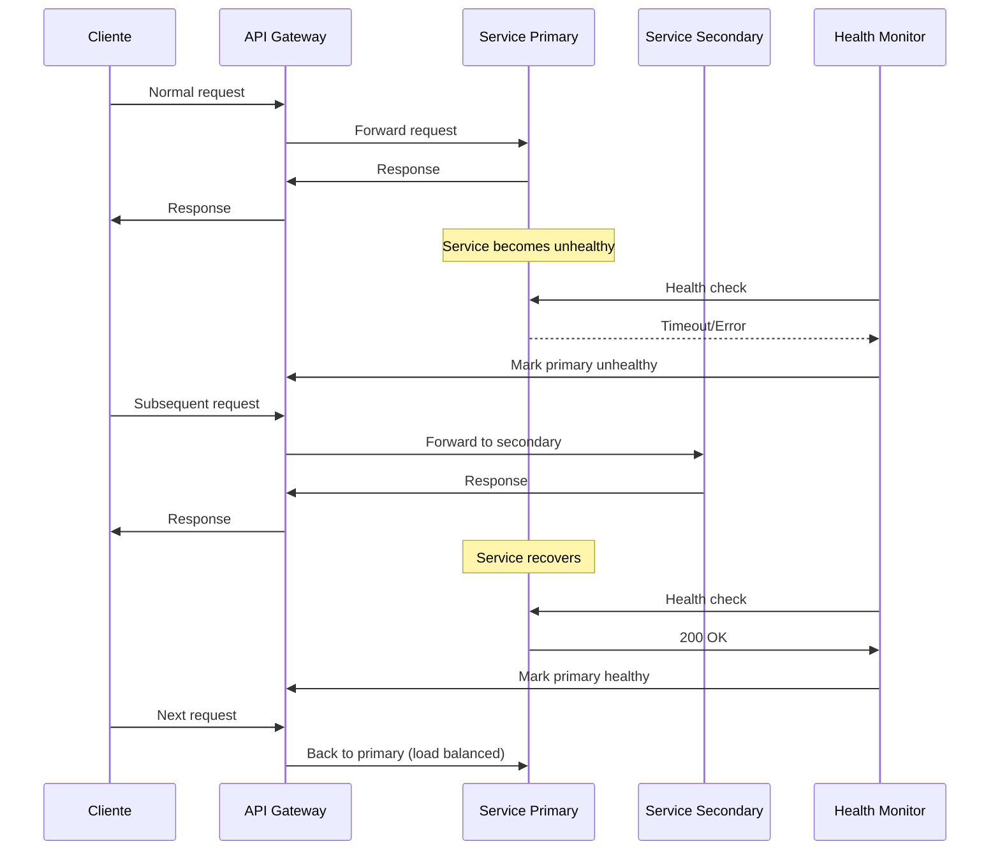

**Características del failover**:
- **Detección**: 3 health checks fallidos consecutivos
- **Switchover time**: < 30 segundos
- **Load balancing**: Round-robin entre instancias sanas
- **Recovery**: Gradual re-introduction con circuit breaker

### 6.2.2 Degradación graceful durante sobrecarga

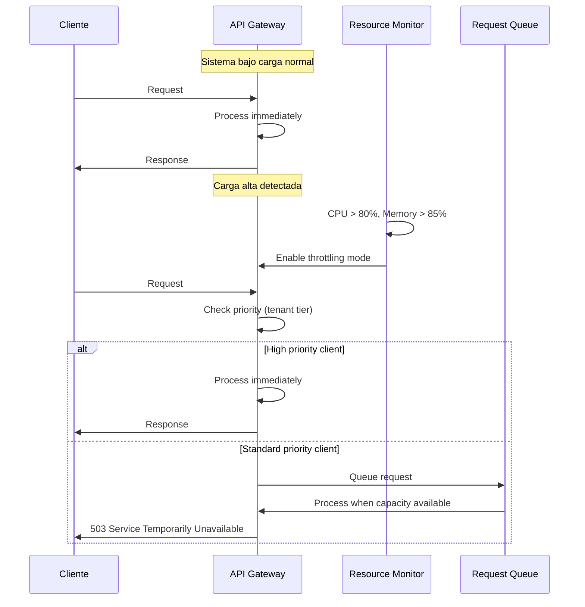

## 6.3 Scenarios de multi-tenancy

### 6.3.1 Resolución de contexto de tenant

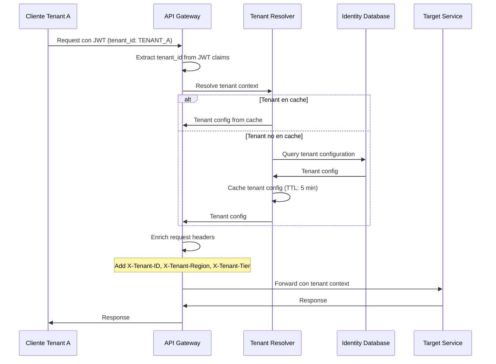

### 6.3.2 Routing inteligente por tenant

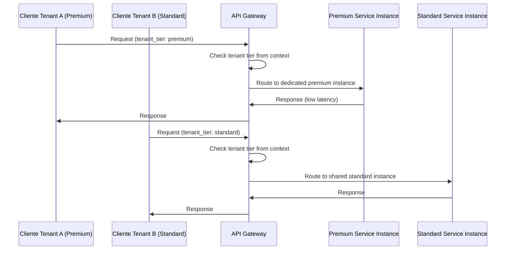

## 6.4 Monitoring y observability en tiempo de ejecución

### 6.4.1 Distributed tracing flow

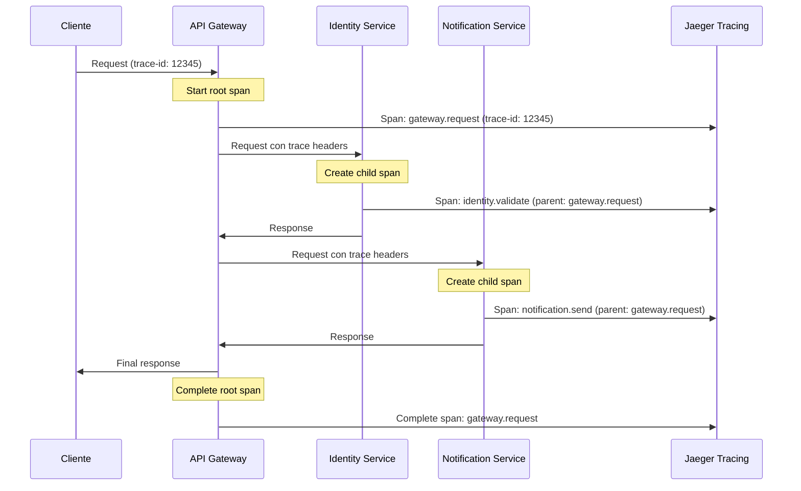

### 6.4.2 Métricas en tiempo real

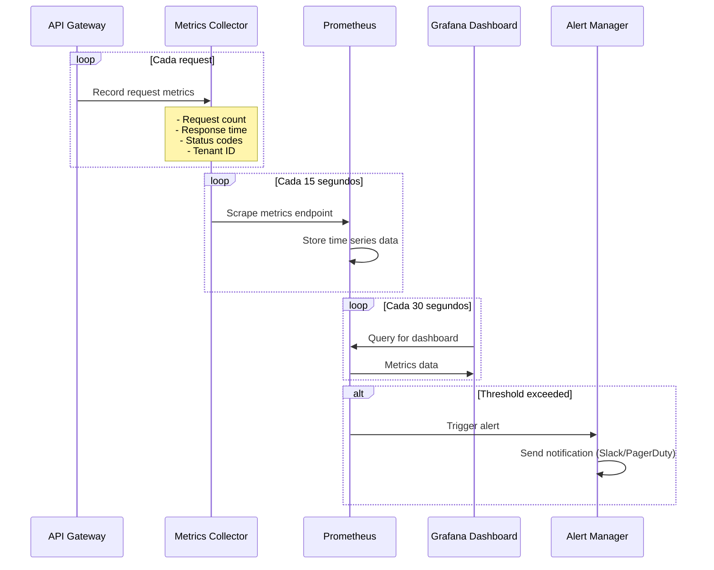

## 6.5 Patrones de performance

### 6.5.1 Request pooling y connection reuse

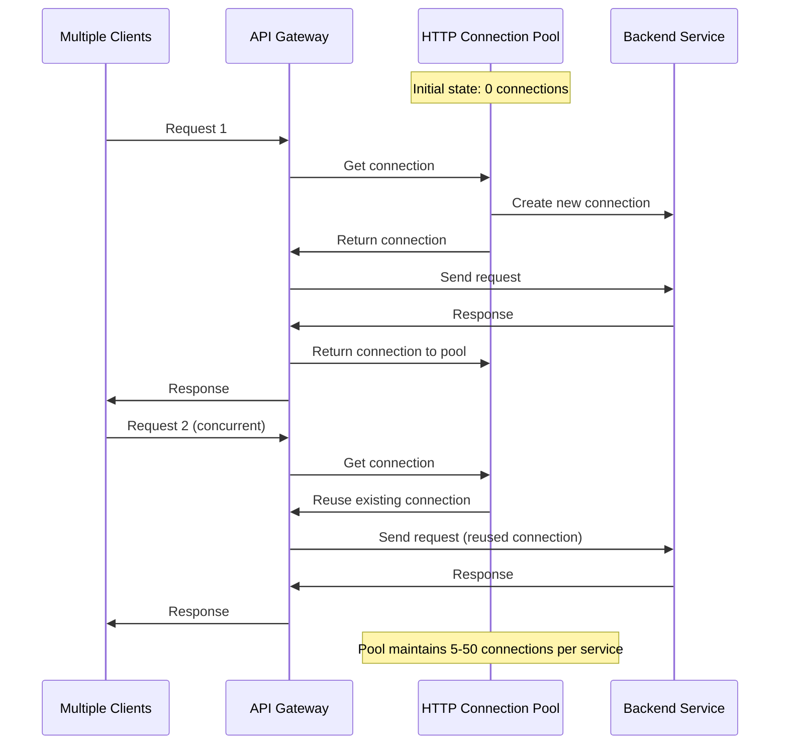

**Configuración del pool**:
- **Min connections**: 5 por service cluster
- **Max connections**: 50 por service cluster
- **Idle timeout**: 30 segundos
- **Connection lifetime**: 2 minutos

### 6.5.2 Caching strategy en tiempo de ejecución

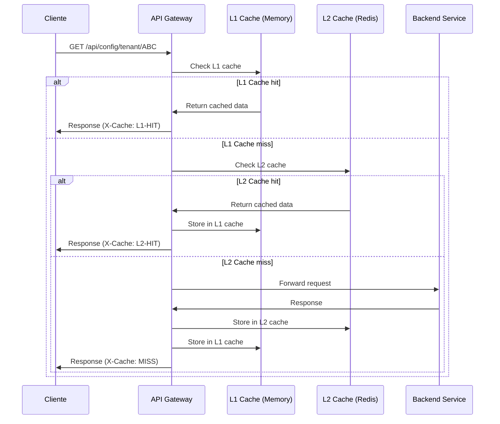

**TTL Configuration**:
- **L1 Cache (Memory)**: 2 minutos
- **L2 Cache (Redis)**: 10 minutos
- **Cache invalidation**: Event-driven para configuration changes

## 6.6 Timing y performance targets

| Operación | Target | Timeout | SLA |
|-----------|--------|---------|-----|
| Token validation (cached) | < 10ms | 100ms | 99.9% |
| Token validation (fresh) | < 100ms | 500ms | 99.5% |
| Request routing | < 5ms | 50ms | 99.9% |
| Health check | < 200ms | 5s | 95% |
| Rate limit check | < 5ms | 100ms | 99.9% |
| Configuration reload | < 1s | 30s | 99% |
| Circuit breaker activation | < 100ms | 500ms | 99% |

## 6.7 Error handling scenarios

### 6.7.1 Downstream service timeout

- **Timeout threshold**: 30 segundos
- **Retry policy**: 3 intentos con exponential backoff
- **Circuit breaker**: Abre después de 5 timeouts consecutivos
- **Response**: 504 Gateway Timeout con retry-after header

### 6.7.2 Authentication service unavailable

- **Fallback**: Cache de tokens válidos extendido a 1 hora
- **Degraded mode**: Permitir requests con tokens cached válidos únicamente
- **Response**: 503 Service Unavailable para nuevas autenticaciones
