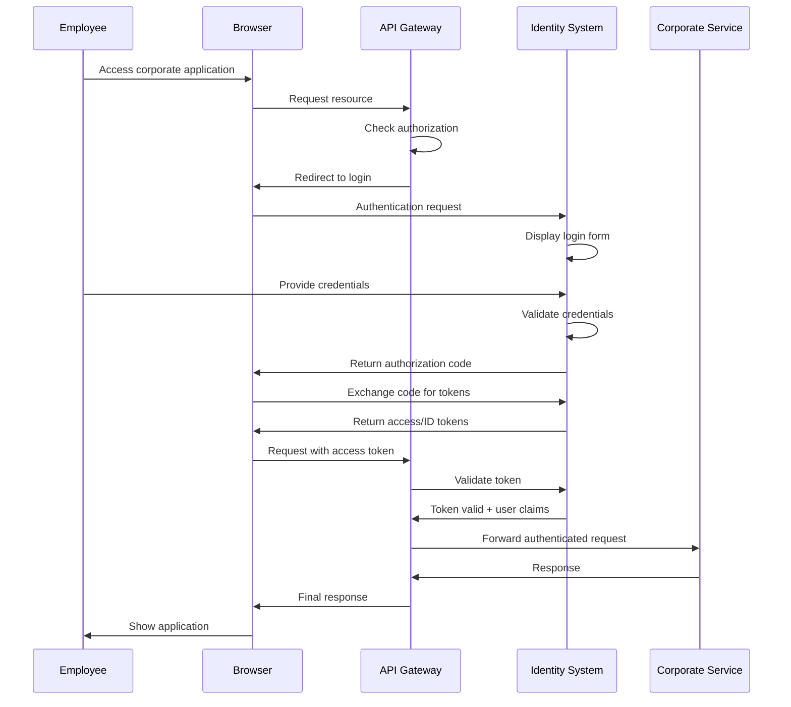
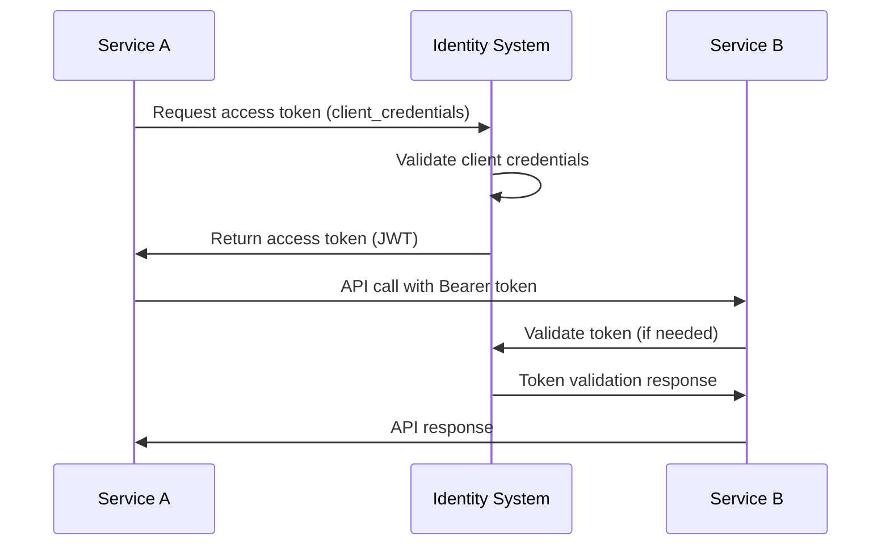
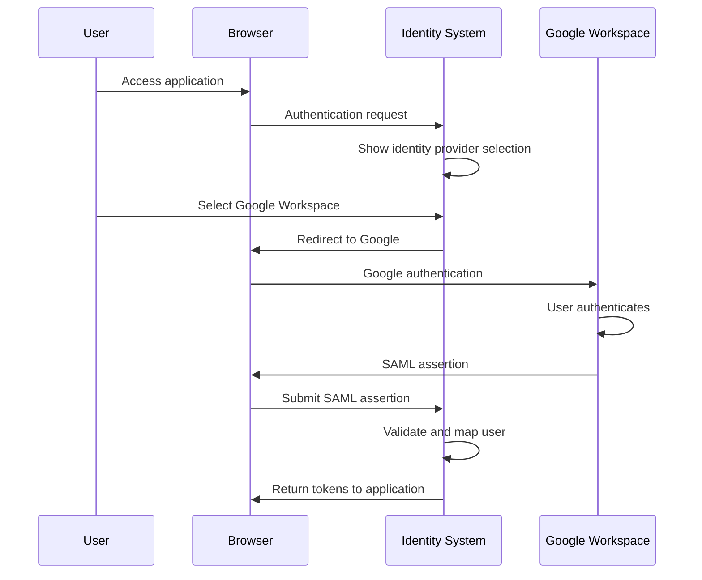
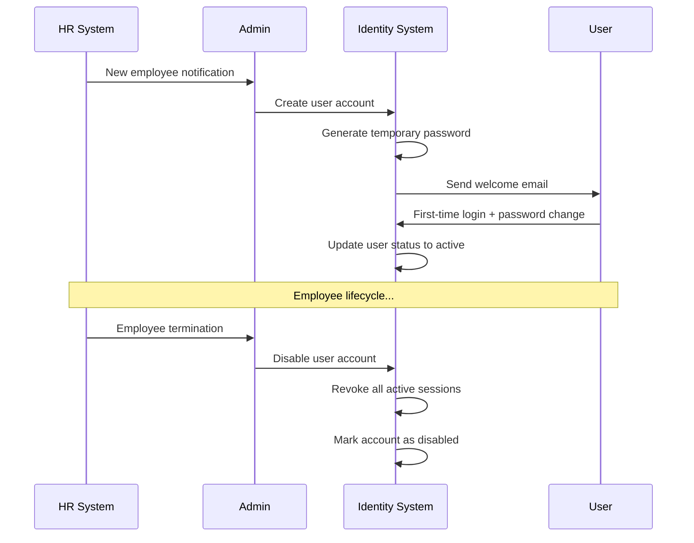
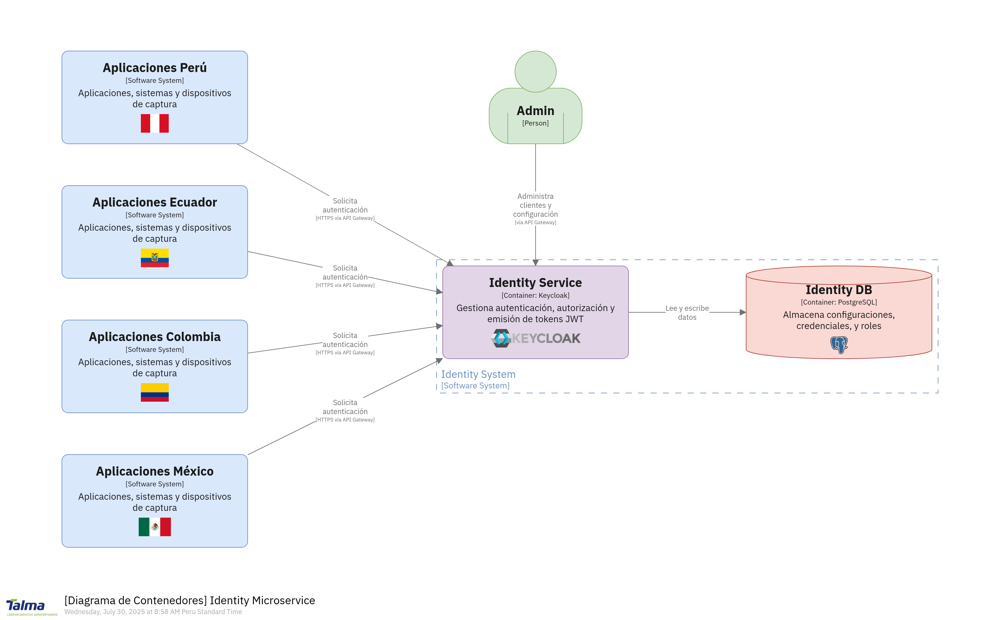

# 3. Contexto y alcance del sistema

El **Sistema de Identidad** actúa como la autoridad central de autenticación y autorización para todo el ecosistema de servicios corporativos, proporcionando Single Sign-On (SSO) y gestión de identidades multi-tenant.

## 3.1 Contexto de negocio

### Propósito del Sistema

El sistema de identidad es la piedra angular de la seguridad corporativa, proporcionando:

- **Autenticación centralizada** para todos los usuarios del ecosistema
- **Autorización granular** basada en roles y permisos específicos por tenant
- **Single Sign-On (SSO)** para una experiencia de usuario uniforme
- **Federación de identidades** con proveedores externos corporativos
- **Gestión de ciclo de vida** completo de usuarios y credenciales

### Stakeholders Principales

| Stakeholder | Rol | Responsabilidad | Expectativa |
|-------------|-----|----------------|-------------|
| **CISO** | Director de Seguridad de la Información | Políticas de seguridad, cumplimiento | Sistema seguro, cero violaciones |
| **Directores de RH** | Recursos Humanos | Gestión de usuarios, incorporación/desvinculación | Proceso eficiente, automatización |
| **Operaciones de TI** | Operaciones TI | Mantenimiento diario, soporte usuarios | Sistema estable, fácil administración |
| **Oficiales de Cumplimiento** | Oficiales de Cumplimiento | Auditoría, regulaciones | Trazabilidad completa, reportes |
| **Usuarios Finales** | Usuarios Finales | Acceso a aplicaciones | Experiencia fluida, seguridad transparente |

### Objetivos de Negocio

| Objetivo | Descripción | Métricas de Éxito |
|----------|-------------|-------------------|
| **Seguridad Centralizada** | Punto único de autenticación y autorización | Cero violaciones de seguridad, 100% cumplimiento auditoría |
| **Experiencia de Usuario** | SSO transparente para aplicaciones corporativas | < 3 clics para acceso, 95% satisfacción usuario |
| **Eficiencia Operacional** | Automatización de gestión de usuarios | 80% autoservicio, tiempo incorporación < 15 min |
| **Cumplimiento Regulatorio** | Cumplimiento GDPR, SOX, regulaciones locales | 100% éxito auditoría, cero violaciones |
| **Escalabilidad Multi-tenant** | Soporte crecimiento por países | Escalado lineal, aislamiento tenant |

## 3.2 Contexto técnico

### Posición en la Arquitectura

```
┌─────────────────────────────────────────────────────────────────┐
│                    External Identity Providers                  │
│  [Google Workspace] [Microsoft AD] [Corporate LDAP] [Gov PKI]  │
└─────────────────────┬───────────────────────────────────────────┘
                      │ SAML/OIDC Federation
                      ▼
┌─────────────────────────────────────────────────────────────────┐
│                    IDENTITY SYSTEM (Keycloak)                  │
│  ┌─────────────┐ ┌─────────────┐ ┌─────────────┐ ┌─────────────┐│
│  │Peru Realm   │ │Ecuador Realm│ │Colombia Realm│ │Mexico Realm ││
│  │Users: 2000  │ │Users: 800   │ │Users: 1500  │ │Users: 1200 ││
│  └─────────────┘ └─────────────┘ └─────────────┘ └─────────────┘│
└─────────────────────┬───────────────────────────────────────────┘
                      │ OAuth2/OIDC, JWT Tokens
                      ▼
┌─────────────────────────────────────────────────────────────────┐
│                      API GATEWAY (YARP)                        │
│              Token Validation & Authorization                   │
└─────────────────────┬───────────────────────────────────────────┘
                      │ Authenticated Requests
                      ▼
┌─────────────────────────────────────────────────────────────────┐
│                 CORPORATE SERVICES ECOSYSTEM                   │
│ [Notification] [Track&Trace] [SITA Messaging] [Web Apps]      │
└─────────────────────────────────────────────────────────────────┘
```

### Fronteras del Sistema

#### Dentro del Alcance

| Componente | Descripción | Responsabilidad |
|------------|-------------|-----------------|
| **Proveedor de Identidad Keycloak** | Servidor IdP central | Autenticación, autorización, gestión usuarios |
| **Gestión de Realms** | Realms multi-tenant | Aislamiento tenant por país |
| **Federación de Usuarios** | Integración IdP externos | Federación LDAP, SAML, OIDC |
| **Gestión de Tokens** | Ciclo de vida JWT | Generación, validación, renovación tokens |
| **Consola de Administración** | Interfaz de gestión | Administración usuarios/roles |
| **APIs Programáticas** | APIs REST | Gestión programática usuarios |
| **Auditoría y Logging** | Eventos de seguridad | Rastro de auditoría completo |

#### Fuera del Alcance

| Componente | Razón de Exclusión | Responsable |
|------------|-------------------|-------------|
| **Proveedores de Identidad Externos** | Sistemas de terceros | Google, Microsoft, Equipos TI |
| **Aplicaciones Cliente** | Consumidores de servicios | Equipos de servicios individuales |
| **Infraestructura de Red** | Capa de infraestructura | Equipo de infraestructura |
| **Gestión de Certificados** | Infraestructura PKI | Equipo de seguridad |
| **Plataforma de Monitoreo** | Herramientas de observabilidad | Equipo DevOps |

## 3.3 Interfaces externas

### Actores Principales

| Actor | Tipo | Descripción | Interacciones |
|-------|------|-------------|---------------|
| **System Administrator** | Humano | Administrador global del sistema | Configuración realms, políticas globales |
| **Realm Administrator** | Humano | Administrador por país/tenant | Gestión usuarios, roles específicos |
| **End User** | Humano | Usuario final del sistema | Login, profile management, password reset |
| **API Gateway** | Sistema | Proxy de servicios corporativos | Token validation, user context |
| **Corporate Services** | Sistema | Servicios de negocio | Authentication, authorization |
| **External IdP** | Sistema | Proveedores de identidad externos | User federation, SSO |
| **HRIS System** | Sistema | Sistema de recursos humanos | User provisioning, role sync |
| **Monitoring System** | Sistema | Plataforma de observabilidad | Metrics, logs, health checks |

### Canales de Comunicación

#### Frontend Interfaces

| Interface | Protocol | Port | Purpose | Security |
|-----------|----------|------|---------|----------|
| **Admin Console** | HTTPS | 8443 | Web-based administration | TLS 1.3, session auth |
| **Account Console** | HTTPS | 8443 | User portal de autoservicio | TLS 1.3, user auth |
| **Login Forms** | HTTPS | 8443 | Authentication UI | TLS 1.3, CSRF protection |

#### API Interfaces

| Endpoint | Protocol | Purpose | Authentication | Rate Limit |
|----------|----------|---------|---------------|------------|
| **Admin REST API** | HTTPS/REST | Administrative operations | Bearer token | 100 req/min |
| **User Account API** | HTTPS/REST | User self-service | Bearer token | 60 req/min |
| **OpenID Connect** | HTTPS/JSON | Token endpoints | Client auth | 1000 req/min |
| **SAML 2.0** | HTTPS/XML | Federation | SAML assertion | 500 req/min |

#### Integration Interfaces

| System | Protocol | Data Flow | Frequency | Format |
|--------|----------|-----------|-----------|--------|
| **LDAP Directory** | LDAP v3 | User import/sync | Real-time | LDAP attributes |
| **Google Workspace** | SAML/OIDC | Federation | Per login | SAML/JWT |
| **HRIS Database** | REST API | User provisioning | Daily batch | JSON |
| **Audit System** | syslog/JSON | Event streaming | Real-time | Structured logs |

## 3.4 Casos de uso principales

### UC-IDN-01: Employee Authentication Flow



### UC-IDN-02: Service-to-Service Authentication



### UC-IDN-03: External Identity Federation



### UC-IDN-04: Gestión de Ciclo de Vida de Usuario



## 3.5 Requisitos funcionales principales

### Autenticación Multi-factor

| Requirement ID | Descripción | Prioridad | Acceptance Criteria |
|----------------|-------------|-----------|-------------------|
| **REQ-AUTH-001** | MFA obligatorio para roles administrativos | Alta | Admin users must complete 2FA setup within 24h |
| **REQ-AUTH-002** | TOTP support (Google Authenticator, Authy) | Alta | QR code setup, 6-digit code validation |
| **REQ-AUTH-003** | WebAuthn/FIDO2 support for modern browsers | Media | Biometric authentication support |
| **REQ-AUTH-004** | SMS backup para MFA recovery | Baja | SMS OTP when primary method fails |

### Single Sign-On (SSO)

| Requirement ID | Descripción | Prioridad | Acceptance Criteria |
|----------------|-------------|-----------|-------------------|
| **REQ-SSO-001** | Cross-service SSO within ecosystem | Alta | User logs in once, accesses all authorized services |
| **REQ-SSO-002** | Session timeout configuration per realm | Alta | Configurable idle timeout (1-8 hours) |
| **REQ-SSO-003** | Remember device functionality | Media | "Trust this device" for 30 days |
| **REQ-SSO-004** | Concurrent gestión de sesiones | Media | Max 5 active sessions per user |

### User Management

| Requirement ID | Descripción | Prioridad | Acceptance Criteria |
|----------------|-------------|-----------|-------------------|
| **REQ-USER-001** | Self-service password reset | Alta | Email-based reset, security questions |
| **REQ-USER-002** | Profile management por usuarios | Alta | Update contact info, preferences |
| **REQ-USER-003** | Account lockout policies | Alta | Progressive lockout (3-5-10 failed attempts) |
| **REQ-USER-004** | Bulk user import/export | Media | CSV/LDIF support, data validation |

### Role-Based Access Control

| Requirement ID | Descripción | Prioridad | Acceptance Criteria |
|----------------|-------------|-----------|-------------------|
| **REQ-RBAC-001** | Hierarchical role inheritance | Alta | Nested roles, permission inheritance |
| **REQ-RBAC-002** | Fine-grained permissions | Alta | Resource-action level permissions |
| **REQ-RBAC-003** | Dynamic role assignment | Media | Rule-based role assignment |
| **REQ-RBAC-004** | Temporary role delegation | Baja | Time-limited role assignment |

## 3.6 Requisitos no funcionales

### Performance Requirements

| Metric | Requirement | Measurement | Acceptance |
|--------|-------------|-------------|------------|
| **Authentication Latency** | p95 < 200ms | Login response time | 95% requests under 200ms |
| **Token Validation** | p95 < 50ms | JWT validation time | 95% validations under 50ms |
| **Concurrent Users** | 10,000 simultaneous | Active sessions | No performance degradation |
| **Capacidad de procesamiento** | 1,000 req/sec | Authentication requests | Sustainable load |

### Disponibilidad Requirements

| Aspect | Requirement | Measurement | Recovery |
|--------|-------------|-------------|----------|
| **System Uptime** | 99.9% disponibilidad | Monthly uptime | < 43 minutes downtime/month |
| **Planned Maintenance** | < 4 hours/month | Scheduled maintenance | Off-peak hours only |
| **Disaster Recovery** | RTO: 4 hours, RPO: 15 min | Recovery metrics | Cross-region failover |
| **Backup Frequency** | Daily automated | Backup success rate | 100% backup success |

### Security Requirements

| Control | Requirement | Implementation | Validation |
|---------|-------------|----------------|------------|
| **Data Encryption** | AES-256 at rest, TLS 1.3 in transit | Database, file system, network | Regular security scans |
| **Audit Logging** | Complete audit trail | All security events | Tamper-evident logs |
| **Access Controls** | Principle of least privilege | Role-based permissions | Regular access review |
| **Vulnerability Management** | CVSS 7+ patched within 72h | Automated scanning | Security dashboard |



*Diagrama C4 - Contexto del Sistema de Identidad mostrando actores externos, sistemas integrados y fronteras del sistema.*

## 3.7 Compliance y regulatory context

### Data Protection Requirements

| Regulation | Scope | Key Requirements | Implementation |
|------------|-------|------------------|----------------|
| **GDPR (EU)** | European users | Consent, data minimization, right to deletion | Consent management, data retention policies |
| **LGPD (Brazil)** | Brazilian operations | Data processing lawfulness | Privacy by design |
| **CCPA (California)** | California residents | Data transparency, opt-out rights | Privacy controls |
| **Local Laws** | Peru, Ecuador, Colombia, Mexico | Data residency, local compliance | Regional deployment |

### Industry Standards

| Standard | Requirement | Implementation | Certification |
|----------|-------------|----------------|---------------|
| **ISO 27001** | Information Security Management | ISMS implementation | Annual audit |
| **SOC 2 Type II** | Security controls | Control effectiveness | Quarterly assessment |
| **NIST Framework** | Cybersecurity framework | Risk management | Self-assessment |
| **OAuth 2.1** | Modern authorization | Security mejores prácticas | Compliance testing |
| **HR Administrator** | Humano | Gestión de recursos humanos | Onboarding, offboarding usuarios |
| **End User** | Humano | Usuario final del sistema | Login, profile management, password reset |
| **Service Account** | Sistema | Cuentas para servicios/APIs | Service-to-service authentication |

### Sistemas Externos

| Sistema | Tipo | Protocolo | Propósito | Datos Intercambiados |
|---------|------|-----------|-----------|---------------------|
| **Google Workspace** | External IdP | OIDC Federation | Autenticación Ecuador | User profile, groups, authentication |
| **Microsoft AD** | External IdP | SAML Federation | Autenticación Colombia | User attributes, group membership |
| **Corporate LDAP** | Directory | LDAP v3 | User federation Peru/Mexico | User data, organizational structure |
| **API Gateway** | Internal Service | OAuth2/OIDC | Token validation | JWT tokens, user claims |
| **Notification System** | Internal Service | OAuth2 Client Credentials | Service authentication | Service tokens, scopes |
| **Track & Trace** | Internal Service | OAuth2 Authorization Code | User context | User tokens, permissions |
| **SITA Messaging** | Internal Service | OAuth2 Client Credentials | Background authentication | Service tokens, API access |

### Interfaces de Datos

#### Entrada de Datos

| Interface | Fuente | Tipo de Datos | Frecuencia | Formato |
|-----------|--------|---------------|------------|---------|
| **User Federation** | LDAP Directories | User attributes, groups | Sync: 4x/day | LDAP entries |
| **SAML Assertions** | External IdPs | Authentication responses | Real-time | SAML XML |
| **API Requests** | Client applications | Authentication requests | Real-time | OAuth2/OIDC |
| **Admin Operations** | Administrators | User management | On-demand | REST API calls |

#### Salida de Datos

| Interface | Destino | Tipo de Datos | Frecuencia | Formato |
|-----------|---------|---------------|------------|---------|
| **JWT Tokens** | Client applications | User claims, permissions | Real-time | JWT (JSON) |
| **User Info** | Authorized clients | User profile data | On-demand | JSON |
| **Audit Events** | SIEM systems | Security events | Real-time | Structured logs |
| **Metrics** | Monitoring systems | Performance metrics | Continuous | Prometheus metrics |

## 3.4 Alcance funcional

### Funcionalidades Incluidas

| Función | Descripción | Usuarios Objetivo | Prioridad |
|---------|-------------|-------------------|-----------|
| **Multi-tenant Authentication** | Autenticación aislada por realm/país | Todos los usuarios | Alta |
| **Single Sign-On (SSO)** | Acceso unificado a aplicaciones | End users | Alta |
| **Role-Based Access Control** | Autorización granular basada en roles | Administradores, end users | Alta |
| **Identity Federation** | Integración con IdPs externos | Usuarios federados | Alta |
| **Gestión de Ciclo de Vida de Usuario** | CRUD completo de usuarios | HR administrators | Media |
| **Portal de Autoservicio** | Gestión autónoma de perfiles | End users | Media |
| **Autenticación Multi-Factor** | Seguridad adicional para roles críticos | Usuarios privilegiados | Media |
| **Gestión de Sesiones** | Control de sesiones y timeouts | Todos los usuarios | Media |
| **Audit & Compliance** | Logging y reportes de seguridad | Compliance officers | Baja |

### Funcionalidades Excluidas

| Función | Razón de Exclusión | Alternativa |
|---------|-------------------|-------------|
| **Certificate Authority** | Fuera del dominio de identidad | External PKI systems |
| **Email Server** | No es responsabilidad de identidad | Corporate email systems |
| **LDAP Server** | Federación, no hosting | External LDAP directories |
| **Application Authorization** | Responsabilidad de aplicaciones | Application-level RBAC |
| **Data Storage** | Solo metadata de usuario | Business data in applications |

## 3.5 Casos de uso principales

### Autenticación de Usuario

```
Actor: End User
Precondición: Usuario tiene credenciales válidas
Flujo Principal:
1. Usuario accede a aplicación corporativa
2. Aplicación redirige a Identity System
3. Identity System presenta login form
4. Usuario ingresa credenciales
5. Identity System valida credenciales
6. Sistema genera JWT token
7. Usuario es redirigido a aplicación con token
8. Aplicación valida token y otorga acceso
Postcondición: Usuario autenticado con sesión activa
```

### Federación con External IdP

```
Actor: External User (via Google/Microsoft)
Precondición: Federación configurada
Flujo Principal:
1. Usuario accede a aplicación corporativa
2. Aplicación redirige a Identity System
3. Usuario selecciona external IdP
4. Identity System redirige a external IdP
5. Usuario se autentica en external IdP
6. External IdP retorna SAML/OIDC assertion
7. Identity System procesa assertion
8. Sistema genera JWT token interno
9. Usuario redirigido a aplicación
Postcondición: Usuario federado autenticado
```

### Gestión de Usuarios por HR

```
Actor: HR Administrator
Precondición: Administrator tiene permisos de gestión
Flujo Principal:
1. HR admin accede a admin console
2. Admin selecciona realm específico
3. Admin crea nuevo usuario
4. Sistema valida datos y reglas de negocio
5. Usuario creado en realm correspondiente
6. Sistema envía notificación de activación
7. Sistema registra acción en audit log
Postcondición: Usuario disponible para autenticación
```

### Service-to-Service Authentication

```
Actor: Corporate Service
Precondición: Service tiene client credentials
Flujo Principal:
1. Service necesita acceder a otro service
2. Service solicita token con client credentials
3. Identity System valida client credentials
4. Sistema genera service token con scopes
5. Service usa token para llamar API destino
6. API destino valida token con Identity System
7. API otorga acceso basado en scopes
Postcondición: Service-to-service communication autorizada
```

## 3.6 Atributos de calidad

### Performance

| Atributo | Métrica | Target | Medición |
|----------|---------|--------|----------|
| **Authentication Latency** | Response time | p95 < 100ms | APM monitoring |
| **Token Validation** | Validation time | p95 < 50ms | API monitoring |
| **Concurrent Users** | Simultaneous sessions | 10,000 users | Load testing |
| **Capacidad de procesamiento** | Authentications/second | 1,000 auth/sec | Performance testing |

### Security

| Atributo | Métrica | Target | Medición |
|----------|---------|--------|----------|
| **Security Incidents** | Breaches per year | Zero incidents | Security monitoring |
| **Token Security** | Compromised tokens | Zero compromises | Token monitoring |
| **Failed Login Attempts** | Brute force attacks | < 0.1% success rate | Authentication monitoring |
| **Audit Completeness** | Events logged | 100% coverage | Audit verification |

### Disponibilidad

| Atributo | Métrica | Target | Medición |
|----------|---------|--------|----------|
| **System Uptime** | Service disponibilidad | 99.9% | Health monitoring |
| **Recovery Time** | RTO | < 4 hours | Disaster recovery testing |
| **Data Loss** | RPO | < 15 minutes | Backup validation |
| **Mean Time to Recovery** | MTTR | < 30 minutes | Incident response |

## Referencias

### Standards y Protocolos
- [OAuth 2.0 Authorization Framework (RFC 6749)](https://tools.ietf.org/html/rfc6749)
- [OpenID Connect Core 1.0](https://openid.net/specs/openid-connect-core-1_0.html)
- [SAML 2.0 Core Specification](https://docs.oasis-open.org/security/saml/v2.0/saml-core-2.0-os.pdf)

### Keycloak Documentation
- [Keycloak Server Administration Guide](https://www.keycloak.org/docs/latest/server_admin/)
- [Keycloak Securing Applications Guide](https://www.keycloak.org/docs/latest/securing_apps/)

### Architecture References
- [Arc42 Context Template](https://docs.arc42.org/section-3/)
- [C4 Model for Software Architecture](https://c4model.com/)
