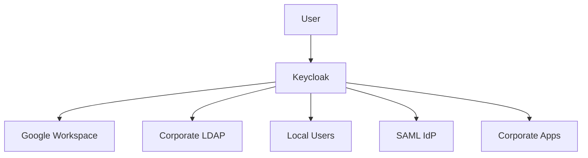
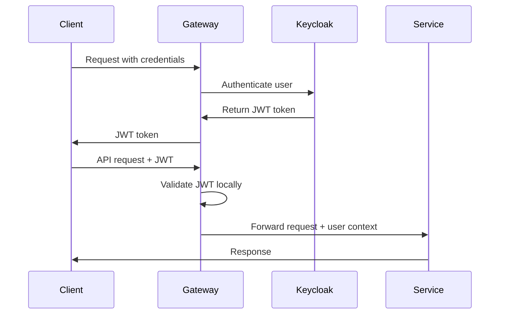

# 4. Estrategia de solución

Esta sección presenta las decisiones arquitectónicas fundamentales y la estrategia tecnológica para implementar el **Sistema de Identidad** como la autoridad central de autenticación y autorización para el ecosistema de servicios corporativos.

## 4.1 Resumen de la estrategia

### Enfoque Arquitectónico Central

El sistema de identidad se basa en una **arquitectura de microservicios orientada a identidad** que combina:

- **Keycloak como IdP central** con capacidades empresariales completas
- **Federación de identidades** para integrar múltiples fuentes de usuarios
- **Multi-tenancy nativo** con realms dedicados por país/organización
- **Protocolos estándar** (OAuth2, OIDC, SAML) para máxima interoperabilidad
- **Diseño stateless** para escalabilidad horizontal

### Principios de Diseño

| Principio | Descripción | Implementación |
|-----------|-------------|----------------|
| **Fuente Única de Verdad** | Keycloak como autoridad única de identidad | Gestión centralizada usuarios, identidad federada |
| **Cumplimiento de Estándares** | Adherencia a protocolos estándar | OAuth2, OIDC, SAML 2.0, JWT |
| **Defensa en Profundidad** | Múltiples capas de seguridad | MFA, cifrado tokens, logging auditoría |
| **Escalabilidad Primero** | Diseño para crecimiento horizontal | Diseño sin estado, soporte clustering |
| **Aislamiento de Tenant** | Aislamiento completo entre tenants | Realms separados, segregación datos |

## 4.2 Decisiones arquitectónicas clave

### Decisión 1: Keycloak como Identity Provider Central

**Contexto**: Necesidad de un IdP empresarial robusto con capacidades avanzadas

**Alternativas Evaluadas**:
- **Keycloak** (seleccionado): Código abierto, características empresariales, extensible
- **Auth0**: SaaS, fácil uso, costos escalables
- **Okta**: Características empresariales, dependencia de proveedor
- **AWS Cognito**: Nativo en la nube, limitaciones de personalización

**Decisión**: Keycloak por flexibilidad, control total, y costo-efectividad

**Consecuencias**:

- ✅ Control completo sobre configuración y extensiones
- ✅ Costos predecibles sin límites de usuarios
- ✅ Capacidades avanzadas de federación
- ❌ Responsabilidad de gestión y actualizaciones
- ❌ Curva de aprendizaje del equipo

### Decisión 2: Arquitectura Multi-Realm para Multi-Tenancy

**Contexto**: Requerimiento de aislamiento completo entre países/tenants

**Alternativas Evaluadas**:
- **Single Realm con Groups** (rechazado): Menor aislamiento
- **Multiple Realms** (seleccionado): Aislamiento completo
- **Multiple Keycloak Instances** (rechazado): Complejidad operacional

**Decisión**: Un realm dedicado por tenant/país

**Consecuencias**:
- ✅ Aislamiento completo de datos y configuración
- ✅ Customización específica por tenant
- ✅ Compliance con regulaciones locales
- ❌ Mayor complejidad de administración
- ❌ Replicación de configuraciones comunes

### Decisión 3: Federación Híbrida de Identidades

**Contexto**: Diferentes fuentes de usuarios por país (LDAP, Google, Microsoft)

**Alternativas Evaluadas**:
- **Full Migration** (rechazado): Disruptivo para usuarios
- **Federation Only** (rechazado): Dependencia total de externos
- **Hybrid Approach** (seleccionado): Federación + usuarios locales

**Decisión**: Federación con external IdPs + usuarios locales en Keycloak

**Consecuencias**:
- ✅ Flexibilidad para diferentes escenarios
- ✅ Gradual migration path
- ✅ Backup authentication en caso de fallos
- ❌ Complejidad de gestión de múltiples sources
- ❌ Sincronización de datos entre sistemas

## 4.3 Tecnologías y frameworks

### Stack Tecnológico Principal

| Capa | Tecnología | Versión | Justificación |
|------|------------|---------|---------------|
| **Proveedor de Identidad** | Keycloak | 23+ | Características empresariales, cumplimiento estándares |
| **Base de Datos** | PostgreSQL | 15+ | Compatibilidad Keycloak, cumplimiento ACID |
| **Tiempo de Ejecución** | Java/JVM | 21 LTS | Requerimiento Keycloak, soporte empresarial |
| **Contenedorización** | Docker | 24+ | Estandarización despliegue |
| **Orquestación** | Kubernetes | 1.28+ | Alta disponibilidad, auto-escalado |
| **Balanceador de Carga** | NGINX/HAProxy | Última | Terminación SSL, distribución carga |
| **Caché** | Redis | 7+ | Almacenamiento sesión, rendimiento |

### Protocolos y Estándares

| Protocolo | Versión | Uso Principal | Implementación |
|-----------|---------|---------------|----------------|
| **OAuth 2.0** | RFC 6749 + 2.1 | Authorization framework | Authorization Code, Client Credentials |
| **OpenID Connect** | OIDC 1.0 Core | Authentication layer | ID tokens, UserInfo endpoint |
| **SAML 2.0** | OASIS SAML 2.0 | Legacy federation | External IdP integration |
| **JWT** | RFC 7519 | Token format | RS256 signatures, standard claims |
| **LDAP v3** | RFC 4511 | Directory integration | User federation, attribute mapping |

### Tecnologías de Integración

| Componente | Tecnología | Propósito | Configuración |
|------------|------------|-----------|---------------|
| **API Integration** | REST/HTTP | Service communication | OpenAPI 3.0 specs |
| **Event Streaming** | Event Bus agnóstico | User lifecycle events | Event-driven architecture |
| **Monitoring** | Prometheus/Grafana | Performance metrics | Custom dashboards |
| **Logging** | ELK Stack | Audit trails | Structured logging |
| **Secrets Management** | HashiCorp Vault | Credential storage | Dynamic secrets |

## 4.4 Patrones de diseño aplicados

### Patron 1: Federated Identity Pattern

**Motivación**: Integrar múltiples fuentes de identidad manteniendo experiencia unificada

**Implementación**:


**Ventajas**:
- Experiencia de usuario unificada
- Gradual migration de usuarios
- Flexibilidad de authentication sources
- Centralized authorization

### Patron 2: Multi-Realm Tenant Isolation Pattern

**Motivación**: Aislamiento completo entre países para compliance

**Implementación**:
```yaml
Keycloak Instance:
  Realms:
    - peru-realm:
        users: peru_users
        roles: peru_roles
        config: peru_config
    - ecuador-realm:
        users: ecuador_users
        roles: ecuador_roles
        config: ecuador_config
    - colombia-realm:
        users: colombia_users
        roles: colombia_roles
        config: colombia_config
    - mexico-realm:
        users: mexico_users
        roles: mexico_roles
        config: mexico_config
```

**Ventajas**:
- Compliance con data residency
- Configuración específica por país
- Aislamiento de fallas
- Granular access control

### Patron 3: Token-Based Authentication Pattern

**Motivación**: Autenticación stateless para microservicios

**Flow Implementation**:


**Ventajas**:
- Stateless authentication
- Scalable validation
- Standard JWT format
- Microservices friendly

### Patron 4: Circuit Breaker for External IdPs

**Motivación**: Resilencia ante fallos de external identity providers

**Implementation**:
```csharp
public class ExternalIdPCircuitBreaker
{
    private CircuitBreakerState state = CircuitBreakerState.Closed;
    private int failureCount = 0;
    private DateTime lastFailureTime;

    public async Task<AuthResult> AuthenticateAsync(User user)
    {
        if (state == CircuitBreakerState.Open)
        {
            // Fallback to local authentication
            return await LocalAuthentication(user);
        }

        try
        {
            var result = await ExternalIdPAuthentication(user);
            OnSuccess();
            return result;
        }
        catch (Exception)
        {
            OnFailure();
            throw;
        }
    }
}
```

## 4.5 Calidad y atributos no funcionales

### Performance Strategy

| Aspecto | Target | Strategy | Implementation |
|---------|--------|----------|----------------|
| **Authentication Latency** | p95 < 200ms | Local token validation, cached user data | Redis caching, JVM optimization |
| **Token Validation** | p95 < 50ms | JWT signature validation, no database hits | Local JWT validation, RSA caching |
| **Concurrent Sessions** | 10,000 users | Stateless design, clustering | Keycloak clustering, session sharing |
| **Capacidad de procesamiento** | 1,000 auth/sec | Optimized database queries, connection pooling | PostgreSQL tuning, prepared statements |

### Security Strategy

| Control | Implementation | Technology | Monitoring |
|---------|----------------|------------|------------|
| **Autenticación Multi-Factor** | TOTP + WebAuthn + SMS | Keycloak MFA | Failed attempts tracking |
| **Token Security** | RS256 signatures, short TTL | JWT with RSA keys | Token validation metrics |
| **Data Encryption** | AES-256 at rest, TLS 1.3 in transit | PostgreSQL encryption, NGINX SSL | Certificate monitoring |
| **Audit Logging** | Complete user actions trail | Structured logging | SIEM integration |

### Disponibilidad Strategy

| Requirement | Target | Implementation | Recovery |
|-------------|--------|----------------|----------|
| **System Uptime** | 99.9% | Multi-AZ deployment, health checks | Automated failover |
| **Database Disponibilidad** | 99.95% | PostgreSQL streaming replication | Point-in-time recovery |
| **Disaster Recovery** | RTO: 4h, RPO: 15min | Cross-region backups | Documented procedures |
| **Maintenance Windows** | < 4h/month | Rolling updates, blue-green deployment | Zero-downtime deployments |

## 4.6 Organización y estructura

### Team Structure

| Role | Responsibility | Skills Required |
|------|----------------|-----------------|
| **Identity Architect** | Architecture decisions, standards compliance | Keycloak, OAuth/OIDC, security patterns |
| **DevOps Engineer** | Infrastructure, deployment, monitoring | Kubernetes, PostgreSQL, monitoring |
| **Security Engineer** | Security configuration, compliance | InfoSec, compliance frameworks, auditing |
| **Platform Developer** | Extensions, customizations, integrations | Java, Keycloak SPI, REST APIs |

### Development Standards

| Aspect | Standard | Rationale | Enforcement |
|--------|----------|-----------|-------------|
| **Configuration as Code** | Terraform + Ansible | Infrastructure immutability | CI/CD pipelines |
| **Realm Configuration** | JSON exports, version control | Change tracking, rollback capability | Git workflows |
| **Secret Management** | Vault integration | Security mejores prácticas | Policy enforcement |
| **Documentation** | Arc42 + ADRs | Knowledge management | Mandatory reviews |

### Integration Strategy

| Integration Point | Pattern | Technology | Governance |
|-------------------|---------|------------|------------|
| **API Gateway** | Token validation | JWT introspection | Rate limiting, monitoring |
| **Corporate Services** | OAuth2 client | Client credentials flow | Service registry |
| **External IdPs** | Federation | SAML/OIDC protocols | Security agreements |
| **Monitoring Systems** | Event streaming | Kafka, metrics export | SLA monitoring |

## 4.7 Migration and deployment strategy

### Deployment Phases

#### Phase 1: Infrastructure Setup (4 weeks)

- **Week 1-2**: Kubernetes cluster setup, networking configuration
- **Week 3**: PostgreSQL database deployment, backup configuration
- **Week 4**: Keycloak deployment, basic realm configuration

**Success Criteria**:
- Keycloak instance running with high disponibilidad
- Database replication configured
- Monitoring and alertas operational

#### Phase 2: Core Realm Configuration (6 weeks)

- **Week 1-2**: Peru realm setup, user import from LDAP
- **Week 3-4**: Ecuador and Colombia realm configuration
- **Week 5-6**: Mexico realm setup, Google Workspace federation

**Success Criteria**:
- All four country realms operational
- User federation working for each realm
- Basic authentication flows functional

#### Phase 3: Service Integration (8 weeks)

- **Week 1-2**: API Gateway integration, token validation
- **Week 3-4**: Notification service authentication
- **Week 5-6**: Other corporate services integration
- **Week 7-8**: End-to-end testing, performance validation

**Success Criteria**:
- All services integrated with identity system
- SSO working across all applications
- Performance targets met

### Migration Strategy

#### User Migration Approach

```yaml
Migration Strategy:
  Phase1_LDAP_Users:
    - Import existing users from corporate LDAP
    - Maintain LDAP federation for backwards compatibility
    - Gradual transition to Keycloak native users

  Phase2_Google_Users:
    - Configure Google Workspace SAML federation
    - Test with pilot group of users
    - Full rollout after validation

  Phase3_Legacy_Systems:
    - SAML integration for systems that support it
    - API integration for modern applications
    - Sunset plan for unsupported systems
```

#### Risk Mitigation

| Risk | Probability | Impact | Mitigation |
|------|-------------|--------|------------|
| **User lockout during migration** | Medium | High | Parallel authentication, rollback procedures |
| **Performance degradation** | Low | Medium | Load testing, gradual traffic increase |
| **Federation failures** | Medium | Medium | Circuit breakers, local fallback |
| **Data loss** | Low | High | Comprehensive backups, validation procedures |

### Quality Assurance Strategy

#### Testing Approach

| Test Type | Coverage | Tools | Frequency |
|-----------|----------|-------|-----------|
| **Unit Tests** | Core logic, validation | JUnit, Mockito | Every commit |
| **Integration Tests** | API endpoints, database | TestContainers | Daily build |
| **Security Tests** | Authentication flows | OWASP ZAP | Weekly |
| **Performance Tests** | Load, stress testing | JMeter, K6 | Pre-deployment |
| **Penetration Tests** | Security assessment | External vendor | Quarterly |

*[INSERTAR AQUÍ: Diagrama C4 - Solution Strategy Architecture]*

## 4.8 Decision rationale summary

### Technology Choices Summary

| Decision | Alternative | Chosen | Key Factors |
|----------|-------------|--------|-------------|
| **Identity Provider** | Auth0 vs Keycloak vs Okta | Keycloak | Cost, control, flexibility |
| **Database** | MySQL vs PostgreSQL | PostgreSQL | ACID compliance, JSON support |
| **Multi-tenancy** | Single realm vs Multiple realms | Multiple realms | Data isolation, compliance |
| **Federation** | All external vs Hybrid | Hybrid approach | Flexibility, backup authentication |
| **Deployment** | VM vs Container vs Serverless | Container (K8s) | Scalability, standardization |

### Architecture Trade-offs

| Trade-off | Decision | Rationale |
|-----------|----------|-----------|
| **Complexity vs Control** | Higher complexity accepted | Need for customization and compliance |
| **Cost vs Features** | Higher operational cost | Enterprise features justify investment |
| **Performance vs Security** | Balanced approach | Both are critical requirements |
| **Flexibility vs Simplicity** | Flexibility prioritized | Diverse integration requirements |

### Success Metrics

| Metric | Baseline | Target | Measurement |
|--------|----------|--------|-------------|
| **Authentication Success Rate** | N/A | 99.5% | Daily monitoring |
| **Average Login Time** | N/A | < 2 seconds | User experience metrics |
| **System Disponibilidad** | N/A | 99.9% | Uptime monitoring |
| **Security Incidents** | N/A | Zero breaches | Security dashboard |
| **User Satisfaction** | N/A | > 90% | Quarterly surveys |
|-----------|---------|---------------|----------------|
| **OAuth 2.0** | RFC 6749 | Authorization framework | Client Credentials, Authorization Code |
| **OpenID Connect** | 1.0 Core | Authentication layer | ID tokens, UserInfo endpoint |
| **SAML 2.0** | OASIS standard | Enterprise federation | External IdP integration |
| **JWT** | RFC 7519 | Token format | RS256 signing, claims-based |
| **LDAP v3** | RFC 4511 | Directory integration | User federation, attribute sync |

### Herramientas de Desarrollo y Operaciones

| Categoría | Herramienta | Propósito |
|-----------|-------------|-----------|
| **Monitoring** | Prometheus + Grafana | Metrics and dashboards |
| **Logging** | ELK Stack | Centralized logging |
| **Tracing** | OpenTelemetry + Jaeger | Distributed tracing |
| **Security Scanning** | Trivy, OWASP ZAP | Vulnerability assessment |
| **Backup** | Velero, pg_dump | Data protection |

## 4.4 Arquitectura de despliegue

### Modelo de Despliegue

```text
┌─────────────────────────────────────────────────────────────┐
│                    PRODUCTION ENVIRONMENT                   │
│                                                             │
│  ┌─────────────────┐  ┌─────────────────┐  ┌─────────────────┐│
│  │   NGINX LB      │  │   NGINX LB      │  │   NGINX LB      ││
│  │   (Primary)     │  │   (Secondary)   │  │   (Backup)      ││
│  └─────────────────┘  └─────────────────┘  └─────────────────┘│
│           │                     │                     │      │
│  ┌─────────────────┐  ┌─────────────────┐  ┌─────────────────┐│
│  │  Keycloak Pod   │  │  Keycloak Pod   │  │  Keycloak Pod   ││
│  │  (Instance 1)   │  │  (Instance 2)   │  │  (Instance 3)   ││
│  └─────────────────┘  └─────────────────┘  └─────────────────┘│
│           │                     │                     │      │
│  ┌─────────────────────────────────────────────────────────┐  │
│  │              PostgreSQL Cluster                        │  │
│  │  ┌─────────────┐  ┌─────────────┐  ┌─────────────┐     │  │
│  │  │  Primary    │  │  Replica 1  │  │  Replica 2  │     │  │
│  │  │  (Master)   │  │  (Read)     │  │  (Read)     │     │  │
│  │  └─────────────┘  └─────────────┘  └─────────────┘     │  │
│  └─────────────────────────────────────────────────────────┘  │
│                                                             │
│  ┌─────────────────────────────────────────────────────────┐  │
│  │                   Redis Cluster                        │  │
│  │  ┌─────────────┐  ┌─────────────┐  ┌─────────────┐     │  │
│  │  │  Master     │  │  Replica 1  │  │  Replica 2  │     │  │
│  │  └─────────────┘  └─────────────┘  └─────────────┘     │  │
│  └─────────────────────────────────────────────────────────┘  │
└─────────────────────────────────────────────────────────────┘
```

### Configuración de Alta Disponibilidad

| Componente | HA Strategy | Configuration | Failover Time |
|------------|-------------|---------------|---------------|
| **Keycloak** | Active-Active cluster | 3 instances, session replication | < 30 seconds |
| **PostgreSQL** | Primary-Replica | Streaming replication, automatic failover | < 2 minutes |
| **Redis** | Master-Replica | Redis Sentinel, automatic promotion | < 10 seconds |
| **Load Balancer** | Multiple instances | Health checks, weighted routing | < 5 seconds |

### Estrategia de Escalamiento

| Métrica Trigger | Action | Configuration | Limits |
|-----------------|--------|---------------|--------|
| **CPU > 70%** | Scale up Keycloak pods | HPA with CPU target | Max 10 pods |
| **Memory > 80%** | Scale up resources | Vertical pod autoscaler | Max 8GB per pod |
| **DB Connections > 80%** | Add read replicas | Read replica scaling | Max 5 replicas |
| **Request rate > 10k/min** | Scale horizontally | Request-based HPA | Dynamic scaling |

## 4.5 Seguridad y compliance

### Modelo de Seguridad

| Layer | Security Measure | Implementation | Validation |
|-------|------------------|----------------|------------|
| **Network** | Network segmentation | VPC, security groups, firewalls | Penetration testing |
| **Transport** | TLS encryption | TLS 1.3, certificate management | SSL/TLS scanning |
| **Application** | Authentication & authorization | OAuth2/OIDC, RBAC | Security audits |
| **Data** | Encryption at rest | Database encryption, encrypted volumes | Encryption verification |
| **Audit** | Comprehensive logging | Security events, trazas de auditoría | Log analysis |

### Compliance Framework

| Regulation | Requirements | Implementation | Verification |
|------------|--------------|----------------|--------------|
| **GDPR** | Data protection, consent | Data minimization, consent management | Privacy audits |
| **SOX** | Financial controls | Access controls, trazas de auditoría | Financial audits |
| **ISO 27001** | Security management | Security policies, risk management | Certification audits |
| **Local Laws** | Regional compliance | Country-specific configurations | Legal reviews |

### Estrategia de Secrets Management

| Secret Type | Storage | Rotation | Access Control |
|-------------|---------|----------|----------------|
| **Database Passwords** | Kubernetes secrets | 90 days | RBAC, service accounts |
| **JWT Signing Keys** | HashiCorp Vault | 365 days | Vault policies |
| **TLS Certificates** | Cert-manager | 90 days | Automated renewal |
| **External API Keys** | External Secrets Operator | 180 days | Least privilege |

## 4.6 Integración y APIs

### Estrategia de Integración

| Integration Type | Pattern | Protocol | Use Case |
|------------------|---------|----------|----------|
| **Client Authentication** | Token-based | OAuth2/OIDC | Web/aplicaciones móviles |
| **Service-to-Service** | Mutual authentication | mTLS + OAuth2 | Microservices |
| **External Federation** | Identity federation | SAML/OIDC | Enterprise IdPs |
| **Legacy Systems** | Directory integration | LDAP | Existing user stores |

### API Strategy

| API Type | Exposure | Authentication | Limitación de Velocidad |
|----------|----------|----------------|---------------|
| **Admin APIs** | Internal only | Admin tokens | High limits |
| **User APIs** | Public with auth | User tokens | Standard limits |
| **Federation APIs** | Partner access | Mutual TLS | Partner-specific |
| **Health/Metrics** | Monitoring only | Service accounts | No limits |

### Event-Driven Integration

| Event Type | Publisher | Consumers | Protocol |
|------------|-----------|-----------|----------|
| **User Lifecycle** | Keycloak | Audit, Notification | Kafka |
| **Authentication Events** | Keycloak | Security monitoring | Kafka |
| **Configuration Changes** | Admin APIs | Change management | Kafka |

## 4.7 Estrategia de datos

### Data Architecture

| Data Type | Storage | Backup Strategy | Retention |
|-----------|---------|-----------------|-----------|
| **User Profiles** | PostgreSQL | Daily backups, PITR | Indefinite |
| **Authentication Events** | PostgreSQL + ElasticSearch | Daily backups | 7 years |
| **Session Data** | Redis | Memory snapshots | Session lifetime |
| **Configuration** | PostgreSQL | Daily backups | Version controlled |
| **Audit Logs** | ElasticSearch | Weekly snapshots | 10 years |

### Data Privacy Strategy

| Privacy Aspect | Implementation | Compliance |
|----------------|----------------|------------|
| **Data Minimization** | Collect only necessary data | GDPR Article 5 |
| **Consent Management** | Explicit consent workflows | GDPR Article 7 |
| **Right to Deletion** | Automated deletion workflows | GDPR Article 17 |
| **Data Portability** | Export APIs | GDPR Article 20 |
| **Anonymization** | PII scrubbing in logs | Privacy by design |

## 4.8 Decisiones tecnológicas específicas

### Keycloak Configuration Strategy

| Configuration Aspect | Approach | Rationale |
|----------------------|----------|-----------|
| **Realm Management** | Infrastructure as Code | Version control, reproducibility |
| **User Federation** | Multiple providers per realm | Flexibility, redundancy |
| **Theme Customization** | Docker build-time | Performance, consistency |
| **Extensions** | Custom SPI development | Specific business requirements |

### Performance Optimization

| Optimization | Implementation | Expected Gain |
|--------------|----------------|---------------|
| **Connection Pooling** | HikariCP configuration | 30% latency reduction |
| **Query Optimization** | Database indexing | 50% query performance |
| **Caching Strategy** | Redis + Infinispan | 70% cache hit rate |
| **JVM Tuning** | G1GC, heap sizing | 20% capacidad de procesamiento increase |

### Monitoring Strategy

| Monitoring Level | Tools | Metrics | Alertas |
|------------------|-------|---------|----------|
| **Infrastructure** | Prometheus, Node Exporter | CPU, memory, disk | Resource exhaustion |
| **Application** | Keycloak metrics | Authentication rate, errors | Performance degradation |
| **Business** | Custom metrics | User activity, tenant usage | Business KPIs |
| **Security** | Security logs | Failed logins, privilege escalation | Security incidents |

## Referencias

### Keycloak Architecture

- [Keycloak High Disponibilidad Guide](https://www.keycloak.org/docs/latest/server_installation/#_clustering)
- [Keycloak Performance Tuning](https://www.keycloak.org/docs/latest/server_installation/#_performance)
- [Keycloak Custom Extensions](https://www.keycloak.org/docs/latest/server_development/)

### Security Standards

- [OAuth 2.0 Security Mejores Prácticas](https://tools.ietf.org/html/draft-ietf-oauth-security-topics-16)
- [OpenID Connect Security Considerations](https://openid.net/specs/openid-connect-core-1_0.html#Security)
- [NIST Cybersecurity Framework](https://www.nist.gov/cyberframework)

### Compliance Resources

- [GDPR Implementation Guide](https://gdpr.eu/what-is-gdpr/)
- [SOX IT Controls](https://www.sox-online.com/basics_IT_controls.html)
- [ISO 27001 Implementation](https://www.iso.org/isoiec-27001-information-security.html)

### Architecture Patterns

- [Identity and Access Management Patterns](https://docs.microsoft.com/en-us/azure/architecture/patterns/category/security)
- [Microservices Security Patterns](https://microservices.io/patterns/security/)
