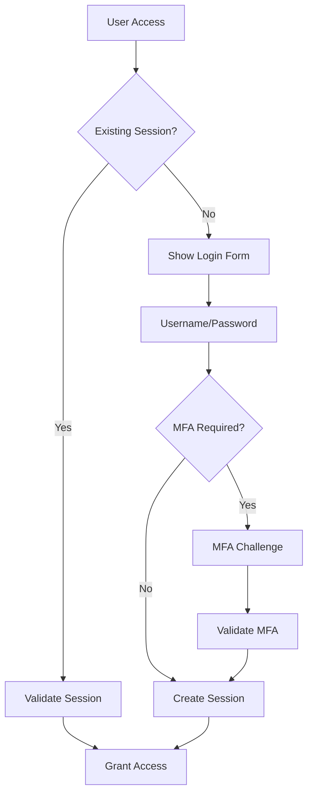
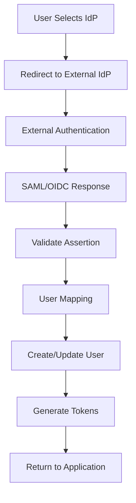

# 5. Vista de bloques de construcción

Esta sección describe la descomposición estática del **Sistema de Identidad** en sus componentes principales, siguiendo un enfoque jerárquico desde la vista general hasta los detalles de implementación específicos de Keycloak.

*[INSERTAR AQUÍ: Diagrama C4 - Container Level del Sistema de Identidad]*

## 5.1 Sistema de Identidad - Nivel 1 (Caja Blanca)

### Motivación de la Descomposición

El sistema se estructura siguiendo los principios de arquitectura de microservicios y separación de responsabilidades:

- **Separación de preocupaciones:** Autenticación vs Autorización vs Administración
- **Escalabilidad independiente:** Componentes pueden escalar según demanda específica
- **Tolerancia a fallos:** Aislamiento de fallas entre componentes
- **Mantenibilidad:** Interfaces bien definidas y cohesión alta

### Bloques de Construcción Principales

| Componente | Responsabilidad | Tecnología | Interfaces |
|------------|-----------------|------------|------------|
| **Núcleo Keycloak** | Proveedor de identidad central | Keycloak 23+ | OAuth2/OIDC, SAML, Admin API |
| **API de Gestión de Identidad** | Gestión programática de identidades | ASP.NET Core 8 | API REST, GraphQL |
| **Servicio de Validación de Tokens** | Validación distribuida de JWT | .NET 8 gRPC | gRPC, HTTP/2 |
| **Auditoría y Cumplimiento** | Logging y cumplimiento | Event Sourcing | Event Bus, Reportes REST |
| **Gateway de Federación** | Integración IdPs externos | Conectores Personalizados | SAML, OIDC, LDAP |
| **Consola de Administración** | Interfaz administrativa | React SPA | Consumo API REST |

#### Núcleo Keycloak

**Propósito/Responsabilidad:**
- Autoridad central de autenticación y autorización
- Gestión de usuarios, roles y permisos por realm
- Implementación de flujos OAuth2/OIDC estándar
- Federación con proveedores de identidad externos

**Interfaces:**
- Endpoints OAuth2/OIDC para aplicaciones cliente
- IdP SAML para sistemas legacy
- API REST de administración para gestión programática
- SPI de eventos para auditoría

**Tecnología:** Keycloak 23+, Java 21, PostgreSQL

**Ubicación:** Despliegue Kubernetes con alta disponibilidad

#### API de Gestión de Identidad

**Propósito/Responsabilidad:**
- API empresarial para operaciones de identidad
- Abstracción sobre API de administración Keycloak
- Flujos de trabajo de negocio específicos
- Integración con sistemas corporativos

**Interfaces:**
- API REST con especificación OpenAPI 3.0
- GraphQL para consultas complejas
- Callbacks webhook para eventos

**Tecnología:** ASP.NET Core 8, Entity Framework Core

**Ubicación:** `/src/Identity.Api/`

#### Servicio de Validación de Tokens

**Propósito/Responsabilidad:**
- Validación alto rendimiento de tokens JWT
- Caché distribuido de claves públicas
- Endpoint de introspección optimizado
- Enriquecimiento y transformación de claims

**Interfaces:**
- Servicio gRPC para alto rendimiento
- API REST HTTP/2 como respaldo
- Endpoints de verificación de salud

**Tecnología:** .NET 8, gRPC, Redis Cluster

**Ubicación:** `/src/Identity.TokenValidation/`

### Interfaces Importantes

#### OAuth2/OIDC Token Exchange

```json
{
  "access_token": "eyJhbGciOiJSUzI1NiJ9...",
  "token_type": "Bearer",
  "expires_in": 900,
  "refresh_token": "eyJhbGciOiJSUzI1NiJ9...",
  "id_token": "eyJhbGciOiJSUzI1NiJ9...",
  "scope": "openid profile email tenant:peru"
}
```

#### User Management API Schema

```json
{
  "userId": "uuid",
  "tenantId": "peru|ecuador|colombia|mexico",
  "username": "string",
  "email": "string",
  "profile": {
    "firstName": "string",
    "lastName": "string",
    "department": "string",
    "country": "string"
  },
  "roles": ["role1", "role2"],
  "attributes": {
    "employeeId": "string",
    "costCenter": "string"
  },
  "preferences": {
    "language": "es|en",
    "timezone": "America/Lima"
  }
}
```

## 5.2 Keycloak Core - Nivel 2 (Caja Blanca)

### Arquitectura Multi-Realm

*[INSERTAR AQUÍ: Diagrama C4 - Component Level de Keycloak Realms]*

#### Realm Configuration per Country

```yaml
Keycloak Instance:
  Master Realm:
    purpose: "Administrative realm"
    users: "System administrators only"

  Peru Realm:
    display_name: "Talma Peru"
    default_locale: "es"
    login_theme: "talma-peru"
    users: 2000
    integration:
      ldap: "peru-ad.talma.pe"
      google: "talma.pe domain"

  Ecuador Realm:
    display_name: "Talma Ecuador"
    default_locale: "es"
    login_theme: "talma-ecuador"
    users: 800
    integration:
      ldap: "ecuador-ad.talma.ec"

  Colombia Realm:
    display_name: "Talma Colombia"
    default_locale: "es"
    login_theme: "talma-colombia"
    users: 1500
    integration:
      ldap: "colombia-ad.talma.co"

  Mexico Realm:
    display_name: "Talma Mexico"
    default_locale: "es"
    login_theme: "talma-mexico"
    users: 1200
    integration:
      ldap: "mexico-ad.talma.mx"
```

#### Authentication Flows

**Standard Authentication Flow**



**Federated Authentication Flow**



#### User Federation Components

**LDAP Federation Configuration**

```java
@Component
public class LdapUserStorageProvider implements UserStorageProvider {

    @Override
    public UserModel getUserByUsername(String username, RealmModel realm) {
        // LDAP user lookup
        // Attribute mapping
        // Role assignment
    }

    @Override
    public boolean isValid(UserModel user, String credential) {
        // LDAP bind authentication
        // Password policy validation
    }
}
```

**Google Workspace Federation**

```xml
<saml2:Assertion>
    <saml2:AttributeStatement>
        <saml2:Attribute Name="email">
            <saml2:AttributeValue>user@talma.pe</saml2:AttributeValue>
        </saml2:Attribute>
        <saml2:Attribute Name="department">
            <saml2:AttributeValue>IT</saml2:AttributeValue>
        </saml2:Attribute>
    </saml2:AttributeStatement>
</saml2:Assertion>
```

## 5.3 Identity Management API - Nivel 2 (Caja Blanca)

### Controllers y Endpoints

#### User Management Controller

```csharp
[Route("api/v1/users")]
[Authorize(Policy = "RequireUserManagementRole")]
public class UserController : ControllerBase
{
    [HttpPost]
    [ProducesResponseType(typeof(UserResponse), 201)]
    public async Task<IActionResult> CreateUser([FromBody] CreateUserRequest request)
    {
        // Validate request
        // Create user in Keycloak
        // Send welcome notification
        // Return user details
    }

    [HttpGet("{id}")]
    [ProducesResponseType(typeof(UserResponse), 200)]
    public async Task<IActionResult> GetUser(Guid id)
    {
        // Tenant isolation check
        // Fetch user from Keycloak
        // Enrich with additional data
    }

    [HttpPut("{id}")]
    [ProducesResponseType(typeof(UserResponse), 200)]
    public async Task<IActionResult> UpdateUser(Guid id, [FromBody] UpdateUserRequest request)
    {
        // Validate changes
        // Update in Keycloak
        // Audit log changes
    }

    [HttpDelete("{id}")]
    [ProducesResponseType(204)]
    public async Task<IActionResult> DeleteUser(Guid id)
    {
        // Soft delete implementation
        // Revoke all sessions
        // GDPR compliance handling
    }

    [HttpPost("bulk")]
    [ProducesResponseType(typeof(BulkOperationResult), 200)]
    public async Task<IActionResult> BulkUserOperations([FromBody] BulkUserRequest request)
    {
        // Validate batch size
        // Process asynchronously
        // Return operation tracking ID
    }
}
```

#### Role & Permission Controller

```csharp
[Route("api/v1/roles")]
[Authorize(Policy = "RequireRoleManagementRole")]
public class RoleController : ControllerBase
{
    [HttpPost]
    public async Task<IActionResult> CreateRole([FromBody] CreateRoleRequest request)
    {
        // Create realm role in Keycloak
        // Define composite roles if needed
        // Set up role hierarchy
    }

    [HttpPost("{roleId}/users/{userId}")]
    public async Task<IActionResult> AssignRoleToUser(string roleId, Guid userId)
    {
        // Validate role assignment policies
        // Assign role in Keycloak
        // Log role assignment event
    }

    [HttpGet("{roleId}/permissions")]
    public async Task<IActionResult> GetRolePermissions(string roleId)
    {
        // Fetch role mappings
        // Return effective permissions
    }
}
```

#### Tenant Management Controller

```csharp
[Route("api/v1/tenants")]
[Authorize(Policy = "RequireSystemAdminRole")]
public class TenantController : ControllerBase
{
    [HttpPost]
    public async Task<IActionResult> CreateTenant([FromBody] CreateTenantRequest request)
    {
        // Create new realm in Keycloak
        // Configure realm settings
        // Set up default roles and policies
        // Initialize branding
    }

    [HttpPut("{tenantId}/configuration")]
    public async Task<IActionResult> UpdateTenantConfiguration(
        string tenantId,
        [FromBody] TenantConfigurationRequest request)
    {
        // Update realm configuration
        // Apply branding changes
        // Configure authentication flows
    }
}
```

### Servicios de Dominio

#### User Provisioning Service

```csharp
public class UserProvisioningService : IUserProvisioningService
{
    private readonly IKeycloakClient _keycloakClient;
    private readonly INotificationService _notificationService;
    private readonly IAuditService _auditService;

    public async Task<ProvisioningResult> ProvisionUserAsync(ProvisionUserCommand command)
    {
        using var transaction = await _unitOfWork.BeginTransactionAsync();

        try
        {
            // 1. Create user in Keycloak
            var keycloakUser = await _keycloakClient.CreateUserAsync(command.UserData);

            // 2. Assign default roles
            await AssignDefaultRolesAsync(keycloakUser.Id, command.TenantId);

            // 3. Send welcome notification
            await _notificationService.SendWelcomeEmailAsync(keycloakUser.Email);

            // 4. Audit log
            await _auditService.LogUserCreationAsync(keycloakUser.Id, command.CreatedBy);

            await transaction.CommitAsync();

            return ProvisioningResult.Success(keycloakUser.Id);
        }
        catch (Exception ex)
        {
            await transaction.RollbackAsync();
            return ProvisioningResult.Failure(ex.Message);
        }
    }
}
```

## 5.4 Token Validation Service - Nivel 2 (Caja Blanca)

### High-Performance JWT Validation

#### gRPC Service Implementation

```csharp
public class TokenValidationService : TokenValidator.TokenValidatorBase
{
    private readonly IJwtSecurityTokenHandler _tokenHandler;
    private readonly IKeyProvider _keyProvider;
    private readonly ITokenCache _tokenCache;

    public override async Task<ValidateTokenResponse> ValidateToken(
        ValidateTokenRequest request,
        ServerCallContext context)
    {
        var cacheKey = ComputeTokenHash(request.Token);

        // Check cache first
        if (await _tokenCache.TryGetAsync(cacheKey, out var cachedResult))
        {
            return cachedResult;
        }

        try
        {
            // Parse token
            var token = _tokenHandler.ReadJwtToken(request.Token);

            // Get signing key
            var signingKey = await _keyProvider.GetKeyAsync(token.Header.Kid);

            // Validate signature
            var principal = _tokenHandler.ValidateToken(request.Token, new TokenValidationParameters
            {
                IssuerSigningKey = signingKey,
                ValidateIssuer = true,
                ValidateAudience = true,
                ValidateLifetime = true,
                ClockSkew = TimeSpan.FromMinutes(1)
            });

            var response = new ValidateTokenResponse
            {
                IsValid = true,
                UserId = principal.FindFirst("sub")?.Value,
                TenantId = principal.FindFirst("tenant")?.Value,
                Roles = { principal.FindAll("realm_access.roles").Select(c => c.Value) }
            };

            // Cache successful validation
            await _tokenCache.SetAsync(cacheKey, response, TimeSpan.FromMinutes(5));

            return response;
        }
        catch (SecurityTokenException ex)
        {
            return new ValidateTokenResponse { IsValid = false, Error = ex.Message };
        }
    }
}
```

#### Key Management Component

```csharp
public class KeyProvider : IKeyProvider
{
    private readonly IMemoryCache _keyCache;
    private readonly HttpClient _httpClient;
    private readonly ILogger<KeyProvider> _logger;

    public async Task<SecurityKey> GetKeyAsync(string keyId)
    {
        var cacheKey = $"jwk:{keyId}";

        if (_keyCache.TryGetValue(cacheKey, out SecurityKey cachedKey))
        {
            return cachedKey;
        }

        // Fetch from Keycloak JWKS endpoint
        var jwks = await FetchJwksAsync();
        var jwk = jwks.Keys.FirstOrDefault(k => k.Kid == keyId);

        if (jwk == null)
        {
            throw new SecurityTokenException($"Key '{keyId}' not found");
        }

        var securityKey = new RsaSecurityKey(jwk.ToRSAParameters());

        // Cache for 1 hour
        _keyCache.Set(cacheKey, securityKey, TimeSpan.FromHours(1));

        return securityKey;
    }
}
```

## 5.5 Audit & Compliance Service - Nivel 2 (Caja Blanca)

### Event Sourcing Implementation

#### Identity Events

```csharp
public abstract class IdentityEvent : IEvent
{
    public Guid EventId { get; } = Guid.NewGuid();
    public DateTime Timestamp { get; } = DateTime.UtcNow;
    public string UserId { get; set; }
    public string TenantId { get; set; }
    public string IPAddress { get; set; }
    public string UserAgent { get; set; }
}

public class UserLoggedInEvent : IdentityEvent
{
    public string AuthenticationMethod { get; set; } // password, mfa, federated
    public bool IsSuccessful { get; set; }
    public string FailureReason { get; set; }
}

public class UserCreatedEvent : IdentityEvent
{
    public string CreatedByUserId { get; set; }
    public UserProfile UserProfile { get; set; }
}

public class RoleAssignedEvent : IdentityEvent
{
    public string RoleName { get; set; }
    public string AssignedByUserId { get; set; }
    public DateTime? ExpiresAt { get; set; }
}
```

#### Compliance Reporting

```csharp
public class ComplianceReportingService : IComplianceReportingService
{
    public async Task<GdprDataExport> GenerateGdprExportAsync(string userId)
    {
        // Collect all user data across systems
        var userData = await _userService.GetUserDataAsync(userId);
        var loginHistory = await _auditService.GetLoginHistoryAsync(userId);
        var permissions = await _roleService.GetUserPermissionsAsync(userId);

        return new GdprDataExport
        {
            UserProfile = userData,
            LoginHistory = loginHistory,
            Permissions = permissions,
            DataRetentionPolicies = await GetDataRetentionPoliciesAsync(),
            GeneratedAt = DateTime.UtcNow
        };
    }

    public async Task<AuditReport> GenerateSoxAuditReportAsync(DateTime fromDate, DateTime toDate)
    {
        // Generate SOX compliance report
        var privilegedAccess = await _auditService.GetPrivilegedAccessEventsAsync(fromDate, toDate);
        var dataChanges = await _auditService.GetDataChangeEventsAsync(fromDate, toDate);
        var accessReviews = await _auditService.GetAccessReviewsAsync(fromDate, toDate);

        return new AuditReport
        {
            Period = new DateRange(fromDate, toDate),
            PrivilegedAccessEvents = privilegedAccess,
            DataChangeEvents = dataChanges,
            AccessReviews = accessReviews,
            ComplianceScore = CalculateComplianceScore(privilegedAccess, dataChanges)
        };
    }
}
```

### Interfaces Externas

#### Event Publishing

```yaml
Event Topics:
  identity.user.created:
    schema: UserCreatedEvent
    retention: 7 days
    routing: user-events

  identity.user.login:
    schema: UserLoggedInEvent
    retention: 90 days
    partitions: 24

  identity.role.assigned:
    schema: RoleAssignedEvent
    retention: 5 years
    partitions: 6

  identity.compliance.export:
    schema: ComplianceExportEvent
    retention: 7 years
    partitions: 3
```

#### REST API for Reporting

```csharp
[Route("api/v1/compliance")]
[Authorize(Policy = "RequireComplianceRole")]
public class ComplianceController : ControllerBase
{
    [HttpGet("gdpr/export/{userId}")]
    public async Task<IActionResult> ExportUserData(string userId)
    {
        var export = await _complianceService.GenerateGdprExportAsync(userId);
        return File(export.ToJson(), "application/json", $"user-data-{userId}.json");
    }

    [HttpPost("gdpr/delete/{userId}")]
    public async Task<IActionResult> DeleteUserData(string userId, [FromBody] DeletionRequest request)
    {
        await _complianceService.DeleteUserDataAsync(userId, request.Reason);
        return NoContent();
    }

    [HttpGet("audit/report")]
    public async Task<IActionResult> GetAuditReport([FromQuery] AuditReportQuery query)
    {
        var report = await _complianceService.GenerateAuditReportAsync(query);
        return Ok(report);
    }
}
```

*[INSERTAR AQUÍ: Diagrama C4 - Component Level de Identity System Components]*

## 5.6 Modelo de datos y persistencia

### Keycloak Database Schema (PostgreSQL)

#### Core Tables

| Tabla | Propósito | Relaciones Clave |
|-------|-----------|------------------|
| `REALM` | Configuración de realms | 1:N con USERS, ROLES |
| `USER_ENTITY` | Usuarios principales | N:1 con REALM, 1:N con USER_ROLE_MAPPING |
| `KEYCLOAK_ROLE` | Definición de roles | N:1 con REALM, N:M con USERS |
| `CLIENT` | Aplicaciones cliente OAuth2 | N:1 con REALM |
| `USER_SESSION` | Sesiones activas | N:1 con USER_ENTITY |

#### Multi-Tenant Isolation

```sql
-- Automatic realm filtering in queries
CREATE OR REPLACE FUNCTION get_user_by_realm(realm_name VARCHAR, username VARCHAR)
RETURNS TABLE(user_id VARCHAR, email VARCHAR, first_name VARCHAR)
AS $$
BEGIN
    RETURN QUERY
    SELECT u.id, u.email, u.first_name
    FROM user_entity u
    JOIN realm r ON u.realm_id = r.id
    WHERE r.name = realm_name AND u.username = username;
END;
$$ LANGUAGE plpgsql;
```

### Custom Identity Database

#### Extended User Profiles

```sql
CREATE TABLE user_profiles (
    user_id UUID PRIMARY KEY,
    keycloak_user_id VARCHAR(255) NOT NULL UNIQUE,
    tenant_id UUID NOT NULL,
    employee_id VARCHAR(50),
    department VARCHAR(100),
    cost_center VARCHAR(50),
    manager_id UUID REFERENCES user_profiles(user_id),
    hire_date DATE,
    termination_date DATE,
    preferences JSONB,
    created_at TIMESTAMP WITH TIME ZONE DEFAULT NOW(),
    updated_at TIMESTAMP WITH TIME ZONE DEFAULT NOW(),

    INDEX idx_user_profiles_tenant (tenant_id),
    INDEX idx_user_profiles_employee (employee_id),
    INDEX idx_user_profiles_department (department)
);
```

#### Audit Log Tables

```sql
CREATE TABLE identity_audit_log (
    audit_id UUID PRIMARY KEY DEFAULT gen_random_uuid(),
    event_type VARCHAR(50) NOT NULL,
    user_id VARCHAR(255),
    tenant_id UUID,
    resource_type VARCHAR(50),
    resource_id VARCHAR(255),
    action VARCHAR(50) NOT NULL,
    old_values JSONB,
    new_values JSONB,
    ip_address INET,
    user_agent TEXT,
    session_id VARCHAR(255),
    timestamp TIMESTAMP WITH TIME ZONE DEFAULT NOW(),

    INDEX idx_audit_timestamp (timestamp),
    INDEX idx_audit_user (user_id),
    INDEX idx_audit_tenant (tenant_id),
    INDEX idx_audit_action (action)
);
```

## Referencias

### Keycloak Documentation

- [Keycloak Server Administration Guide](https://www.keycloak.org/docs/latest/server_admin/)
- [Keycloak Server Developer Guide](https://www.keycloak.org/docs/latest/server_development/)
- [Keycloak Clustering Guide](https://www.keycloak.org/docs/latest/server_installation/#_clustering)

### Security Standards

- [OAuth 2.0 Authorization Framework (RFC 6749)](https://tools.ietf.org/html/rfc6749)
- [OpenID Connect Core 1.0](https://openid.net/specs/openid-connect-core-1_0.html)
- [JSON Web Token (JWT) (RFC 7519)](https://tools.ietf.org/html/rfc7519)

### Architecture References

- [Arc42 Componentes de Construcción Template](https://docs.arc42.org/section-5/)
- [C4 Model for Software Architecture](https://c4model.com/)
- [Microservices Patterns](https://microservices.io/patterns/)

#### Token Cache
- **Tecnología:** Redis con TTL automático
- **Estrategia:** Token signature + claims cache
- **Invalidation:** Real-time via pub/sub
- **Performance:** < 5ms token validation

#### Introspection Endpoint
```http
POST /token/introspect
Content-Type: application/x-www-form-urlencoded

token=<access_token>&
token_type_hint=access_token
```

## 5.5 Audit & Compliance Service - Nivel 2 (Caja Blanca)

### Event Collectors

#### Authentication Events
```json
{
  "eventType": "USER_LOGIN",
  "timestamp": "2024-08-04T10:30:00Z",
  "userId": "user123",
  "tenantId": "tenant456",
  "sourceIp": "192.168.1.100",
  "userAgent": "Mozilla/5.0...",
  "result": "SUCCESS",
  "mfaMethod": "TOTP"
}
```

#### Administrative Events
```json
{
  "eventType": "USER_CREATED",
  "timestamp": "2024-08-04T10:30:00Z",
  "adminUserId": "admin123",
  "targetUserId": "user456",
  "changes": {
    "email": "new@example.com",
    "roles": ["USER", "VIEWER"]
  }
}
```

### Compliance Reporters

#### GDPR Compliance
- **Data Subject Requests:** Automated export/delete
- **Consent Management:** Granular permission tracking
- **Data Mapping:** Complete user data inventory
- **Breach Notification:** Automated regulatory reporting

#### SOX Compliance
- **Access Reviews:** Quarterly certification workflows
- **Segregation of Duties:** Conflict detection
- **Change Management:** All identity changes logged
- **Financial Controls:** ERP system access monitoring

## 5.6 Interfaces Externas

### Downstream Services
```yaml
Service Integrations:
  - API Gateway: Token validation
  - Notification Service: MFA codes, alerts
  - Audit Service: Security events
  - Corporate Services: User context
```

### External Identity Providers
```yaml
Federation Partners:
  - Microsoft Azure AD
  - Google Workspace
  - SAML Enterprise IdPs
  - LDAP Directories
```

### Monitoring & Observability
```yaml
Integrations:
  - Prometheus: Metrics export
  - Grafana: Identity dashboards
  - Jaeger: Distributed tracing
  - ELK Stack: Centralized logging
```

## Referencias
- [Keycloak Architecture Guide](https://www.keycloak.org/docs/latest/server_development/)
- [OAuth2/OIDC Specifications](https://oauth.net/2/)
- [NIST Digital Identity Guidelines](https://pages.nist.gov/800-63-3/)
- [Arc42 Componentes de Construcción](https://docs.arc42.org/section-5/)
