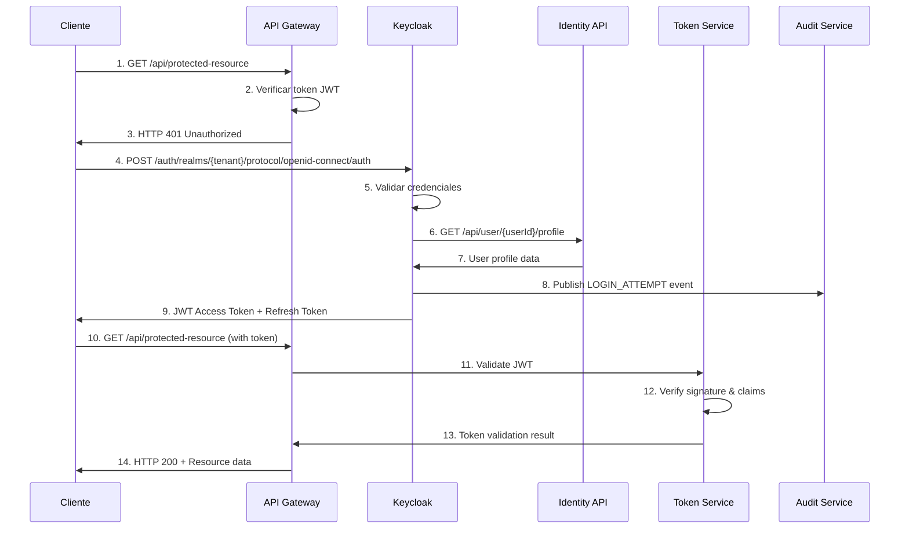
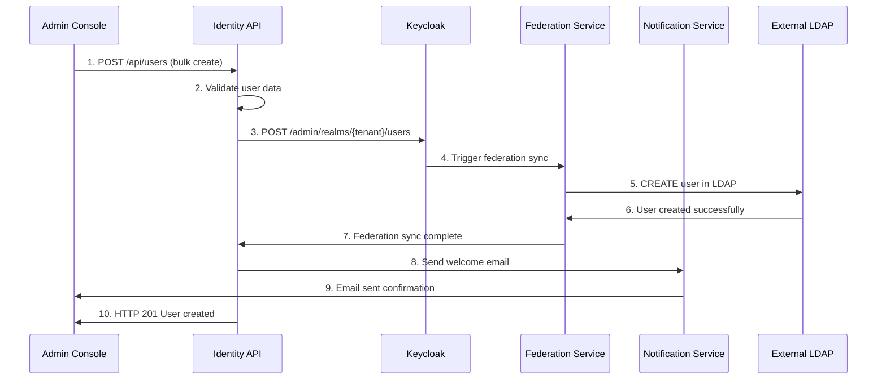
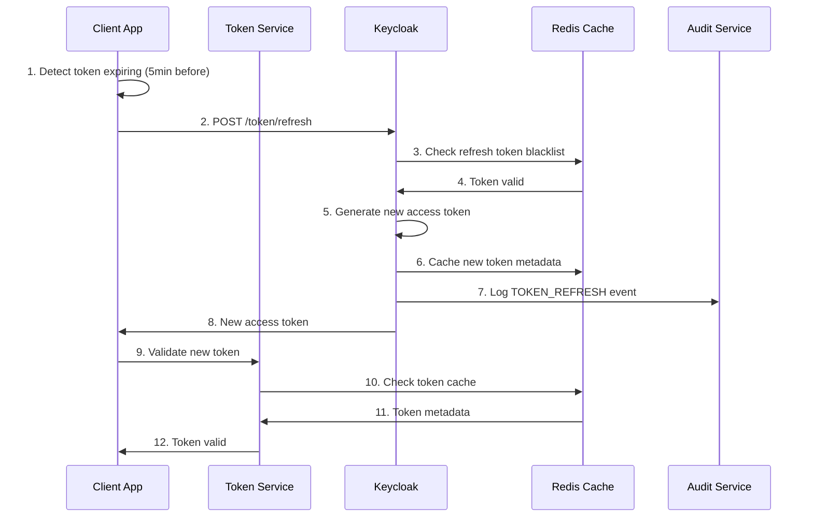
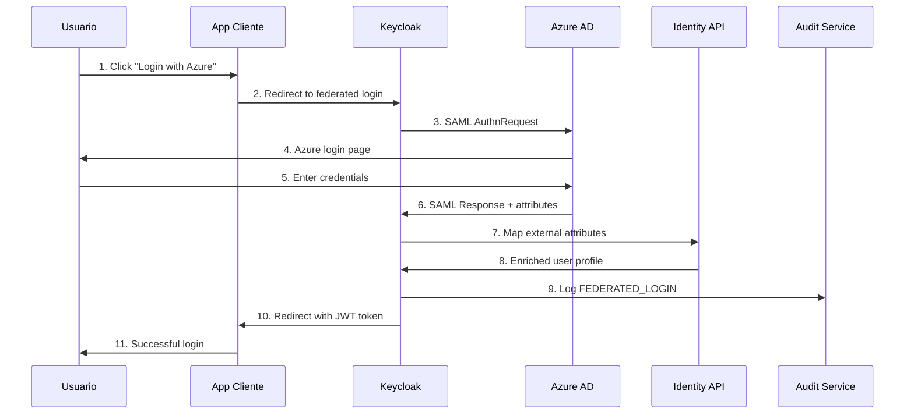
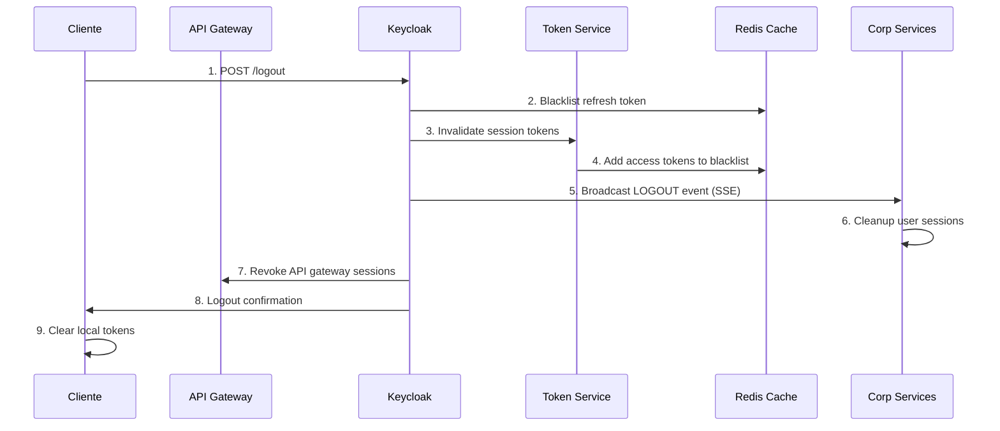
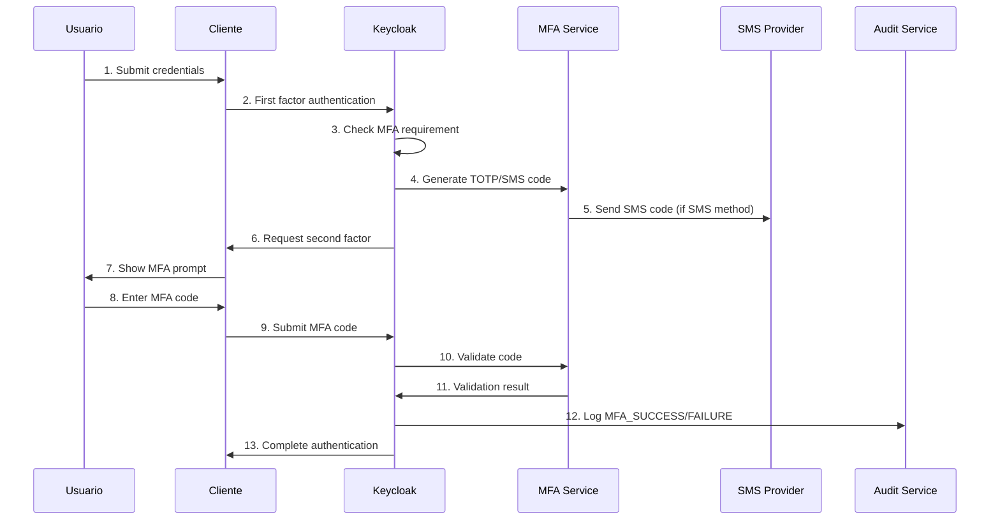
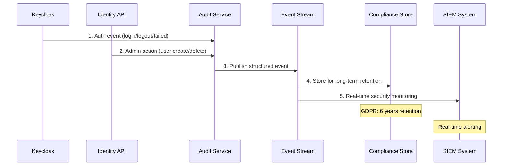

# 6. Vista de tiempo de ejecución

## 6.1 Escenario: Autenticación de Usuario (Login Flow)

### Descripción
Flujo completo de autenticación de usuario desde aplicación cliente hasta obtención de token JWT válido.

### Participantes
- **Client Application:** Aplicación web/móvil del usuario
- **API Gateway:** Punto de entrada unificado
- **Keycloak:** Proveedor de identidad central
- **Identity API:** API de gestión de identidades
- **Token Validation Service:** Servicio de validación distribuida

### Flujo de Ejecución



### Detalles Temporales
- **Paso 4-9:** Autenticación completa < 500ms
- **Paso 11-13:** Validación de token < 10ms (cached)
- **Timeout total:** 30 segundos para flow completo

## 6.2 Escenario: Provisioning de Usuario Multi-Tenant

### Descripción
Creación automática de usuario en múltiples realms cuando se registra en tenant específico.

### Participantes
- **Admin Console:** Interfaz administrativa
- **Identity API:** API de gestión
- **Keycloak Admin API:** API administrativa de Keycloak
- **User Federation Service:** Servicio de sincronización
- **Notification Service:** Servicio de notificaciones

### Flujo de Ejecución



### Políticas de Retry
- **LDAP Sync Failure:** 3 reintentos con backoff exponencial
- **Email Failure:** 5 reintentos, fallback a SMS
- **Keycloak API Failure:** Circuit breaker tras 5 fallos consecutivos

## 6.3 Escenario: Token Refresh y Renovación

### Descripción
Renovación automática de tokens JWT antes de expiración para mantener sesión activa.

### Flujo de Ejecución



### Performance Metrics
- **Token refresh time:** < 100ms
- **Cache hit ratio:** > 95%
- **Concurrent refresh capacity:** 1000 req/sec

## 6.4 Escenario: Federación con Identity Provider Externo

### Descripción
Autenticación delegada a proveedor externo (Azure AD, Google) con mapping de atributos.

### Flujo de Ejecución



### Attribute Mapping
```yaml
Azure AD → Keycloak:
  - mail → email
  - givenName → firstName
  - surname → lastName
  - department → organization
  - groups → roles (conditional mapping)
```

## 6.5 Escenario: Logout y Session Termination

### Descripción
Terminación segura de sesión con invalidación de tokens en todos los servicios.

### Flujo de Ejecución



### Security Considerations
- **Token blacklist TTL:** Igual a token expiration time
- **Session cleanup:** Async para no bloquear logout
- **Event propagation:** < 5 segundos para todos los servicios

## 6.6 Escenario: Multi-Factor Authentication (MFA)

### Descripción
Flujo de autenticación de segundo factor utilizando TOTP o SMS.

### Flujo de Ejecución



### MFA Policies
- **Code validity:** 30 segundos (TOTP), 5 minutos (SMS)
- **Rate limiting:** 3 intentos por 15 minutos
- **Backup codes:** 10 códigos de un solo uso

## 6.7 Escenario: Compliance y Auditoría

### Descripción
Captura automática de eventos de auditoría para cumplimiento regulatorio.

### Flujo de Ejecución



### Audit Event Types
- **Authentication Events:** Login, logout, MFA, failed attempts
- **Administrative Events:** User CRUD, role changes, config updates
- **Access Events:** Resource access, permission checks
- **Security Events:** Suspicious activity, brute force, anomalies

## Referencias
- [OAuth2 Flow Specifications](https://tools.ietf.org/html/rfc6749)
- [Keycloak Event SPI Documentation](https://www.keycloak.org/docs/latest/server_development/#_events)
- [JWT Best Practices](https://tools.ietf.org/html/rfc8725)
- [Arc42 Runtime View](https://docs.arc42.org/section-6/)
