# 6. Vista de tiempo de ejecución

Esta sección describe los escenarios dinámicos más importantes del **Sistema de Identidad**, mostrando cómo los bloques de construcción colaboran en tiempo de ejecución para cumplir con los requisitos funcionales.

*[INSERTAR AQUÍ: Diagrama C4 - Vista de Tiempo de Ejecución del Sistema de Identidad]*

## 6.1 Escenario: Autenticación de Usuario con MFA (Primary Login Flow)

### Descripción

Flujo completo de autenticación de usuario corporativo con multi-factor authentication, incluyendo validaciones de seguridad y audit trail completo.

### Participantes

- **User Browser:** Cliente web del usuario final
- **API Gateway (YARP):** Punto de entrada con políticas de seguridad
- **Keycloak:** Autoridad de autenticación central
- **Identity Management API:** Servicios de enriquecimiento de perfil
- **Token Validation Service:** Validación distribuida de JWT
- **Audit Service:** Logging de eventos de seguridad
- **Notification Service:** Comunicaciones con usuario

### Precondiciones

- Usuario tiene cuenta activa en realm correspondiente
- MFA configurado para el usuario (TOTP app)
- Red corporativa o VPN conectada

### Flujo de Ejecución Detallado

```mermaid
sequenceDiagram
    participant User as 👤 Usuario
    participant Browser as 🌐 Browser
    participant Gateway as 🛡️ API Gateway
    participant KC as 🔐 Keycloak
    participant IdAPI as 📋 Identity API
    participant TokenSvc as 🎫 Token Service
    participant AuditSvc as 📊 Audit Service
    participant NotifSvc as 📧 Notification

    Note over User,NotifSvc: Inicio del flujo de autenticación

    User->>Browser: 1. Accede a aplicación corporativa
    Browser->>Gateway: 2. GET /app/dashboard
    Gateway->>Gateway: 3. Verificar Authorization header
    Note right of Gateway: No hay token válido
    Gateway->>Browser: 4. HTTP 401 + WWW-Authenticate header

    Note over User,NotifSvc: Redirección a Keycloak para autenticación

    Browser->>KC: 5. GET /auth/realms/peru/protocol/openid-connect/auth
    KC->>KC: 6. Verificar sesión existente
    Note right of KC: Sin sesión activa
    KC->>Browser: 7. Render login form (branded)
    Browser->>User: 8. Mostrar formulario de login

    Note over User,NotifSvc: Primera fase: credenciales básicas

    User->>Browser: 9. Ingresa email + password
    Browser->>KC: 10. POST /auth/realms/peru/login-actions/authenticate
    KC->>KC: 11. Validar credenciales contra LDAP/DB
    KC->>AuditSvc: 12. LOG: LOGIN_ATTEMPT (successful)

    Note over User,NotifSvc: Segunda fase: Multi-Factor Authentication

    KC->>Browser: 13. Render MFA challenge form
    Browser->>User: 14. Solicitar código TOTP
    User->>Browser: 15. Ingresa código 6-digit
    Browser->>KC: 16. POST /auth/realms/peru/login-actions/required-action
    KC->>KC: 17. Validar TOTP code
    KC->>AuditSvc: 18. LOG: MFA_SUCCESS

    Note over User,NotifSvc: Enriquecimiento de perfil y creación de sesión

    KC->>IdAPI: 19. GET /api/v1/users/{userId}/profile
    IdAPI->>KC: 20. Enhanced user profile + permissions
    KC->>KC: 21. Crear sesión + generar tokens JWT
    KC->>AuditSvc: 22. LOG: LOGIN_SUCCESS + session_id

    Note over User,NotifSvc: Finalización y redirección a aplicación

    KC->>Browser: 23. HTTP 302 redirect + authorization_code
    Browser->>KC: 24. POST /auth/realms/peru/protocol/openid-connect/token
    KC->>Browser: 25. JWT tokens (access + refresh + id)
    Browser->>Gateway: 26. GET /app/dashboard + Bearer token

    Note over User,NotifSvc: Validación de token y autorización

    Gateway->>TokenSvc: 27. gRPC ValidateToken(jwt)
    TokenSvc->>TokenSvc: 28. Verificar firma RSA + claims
    TokenSvc->>Gateway: 29. Token válido + user context
    Gateway->>Gateway: 30. Aplicar políticas de autorización
    Gateway->>Browser: 31. HTTP 200 + dashboard data
    Browser->>User: 32. Mostrar aplicación autenticada

    Note over User,NotifSvc: Notificación de seguridad (opcional)

    alt Login desde nueva ubicación/dispositivo
        KC->>NotifSvc: 33. Send security alert email
        NotifSvc->>User: 34. Email de alerta de login
    end
```



### Métricas de Performance

| Fase | Target | Medición | Monitoreo |
|------|--------|----------|-----------|
| **Steps 2-4:** Initial redirect | < 50ms | Gateway latency | Prometheus metrics |
| **Steps 5-8:** Login form render | < 200ms | Keycloak response time | Application metrics |
| **Steps 10-12:** Credential validation | < 300ms | LDAP + DB query time | Custom metrics |
| **Steps 16-18:** MFA validation | < 100ms | TOTP algorithm time | Authentication metrics |
| **Steps 19-25:** Token generation | < 200ms | JWT creation + DB write | Session metrics |
| **Steps 27-29:** Token validation | < 10ms | gRPC call + cache hit | Token service metrics |
| **Total Flow:** Complete authentication | < 2 seconds | End-to-end user experience | Synthetic monitoring |

### Error Handling y Resilencia

| Error Scenario | Response | Recovery Action |
|----------------|----------|-----------------|
| **LDAP Unavailable** | HTTP 503 | Fallback to local Keycloak users |
| **MFA Failure (3x)** | Account lockout | Send unlock email + admin notification |
| **Token Service Down** | HTTP 503 | Circuit breaker + local JWT validation |
| **Audit Service Down** | Continue flow | Store events locally + replay when up |

## 6.2 Escenario: Federación con Google Workspace (SSO Corporativo)

### Descripción

Autenticación de usuarios corporativos utilizando cuentas de Google Workspace (@talma.pe) con protocolo SAML 2.0.

### Participantes

- **Corporate User:** Empleado con cuenta Google Workspace
- **Keycloak:** Identity Provider (SP role)
- **Google Workspace:** External Identity Provider (IdP role)
- **SAML Processor:** Componente de federación

### Flujo de Ejecución



```mermaid
sequenceDiagram
    participant User as 👤 Usuario
    participant Browser as 🌐 Browser
    participant KC as 🔐 Keycloak (SP)
    participant Google as 🔍 Google Workspace (IdP)
    participant SAMLProc as 🔄 SAML Processor
    participant AuditSvc as 📊 Audit Service

    Note over User,AuditSvc: Inicio de autenticación federada

    User->>Browser: 1. Click "Login with Google"
    Browser->>KC: 2. GET /auth/realms/peru/broker/google/login
    KC->>KC: 3. Generate SAML AuthnRequest
    KC->>Browser: 4. HTTP 302 redirect to Google
    Browser->>Google: 5. POST SAML AuthnRequest

    Note over User,AuditSvc: Autenticación en Google Workspace

    Google->>Google: 6. Validar dominio @talma.pe
    Google->>User: 7. Google OAuth2 login (if needed)
    User->>Google: 8. Authorize application
    Google->>Google: 9. Generate SAML Response + Assertion

    Note over User,AuditSvc: Procesamiento de respuesta SAML

    Google->>Browser: 10. HTTP 302 + SAML Response
    Browser->>KC: 11. POST /auth/realms/peru/broker/google/endpoint
    KC->>SAMLProc: 12. Validate SAML signature + assertion
    SAMLProc->>SAMLProc: 13. Extract user attributes
    SAMLProc->>KC: 14. User identity + attributes

    Note over User,AuditSvc: User mapping y creación de sesión

    KC->>KC: 15. Map to existing user OR create new
    KC->>AuditSvc: 16. LOG: FEDERATED_LOGIN_SUCCESS
    KC->>KC: 17. Create Keycloak session + JWT tokens
    KC->>Browser: 18. Redirect to original application + tokens
    Browser->>User: 19. Authenticated access granted
```

### Configuración SAML

```xml
<!-- SAML AuthnRequest to Google -->
<samlp:AuthnRequest
    xmlns:samlp="urn:oasis:names:tc:SAML:2.0:protocol"
    ID="_8e8dc5f69a98cc4c1ff3427e5ce34606fd672f91e6"
    Version="2.0"
    IssueInstant="2024-01-15T09:30:47Z"
    Destination="https://accounts.google.com/o/saml2/idp?idpid=C01abc234"
    AssertionConsumerServiceURL="https://identity.talma.pe/auth/realms/peru/broker/google/endpoint">

    <saml:Issuer>https://identity.talma.pe/auth/realms/peru</saml:Issuer>

    <samlp:NameIDPolicy
        Format="urn:oasis:names:tc:SAML:1.1:nameid-format:emailAddress"
        AllowCreate="true"/>
</samlp:AuthnRequest>
```

```xml
<!-- SAML Response from Google -->
<samlp:Response
    xmlns:samlp="urn:oasis:names:tc:SAML:2.0:protocol"
    ID="_8e8dc5f69a98cc4c1ff3427e5ce34606fd672f91e6">

    <saml:Assertion>
        <saml:AttributeStatement>
            <saml:Attribute Name="http://schemas.xmlsoap.org/ws/2005/05/identity/claims/emailaddress">
                <saml:AttributeValue>juan.perez@talma.pe</saml:AttributeValue>
            </saml:Attribute>
            <saml:Attribute Name="http://schemas.xmlsoap.org/ws/2005/05/identity/claims/givenname">
                <saml:AttributeValue>Juan</saml:AttributeValue>
            </saml:Attribute>
            <saml:Attribute Name="http://schemas.xmlsoap.org/ws/2005/05/identity/claims/surname">
                <saml:AttributeValue>Perez</saml:AttributeValue>
            </saml:Attribute>
        </saml:AttributeStatement>
    </saml:Assertion>
</samlp:Response>
```

## 6.3 Escenario: Service-to-Service Authentication (Machine-to-Machine)

### Descripción

Autenticación automática entre microservicios utilizando OAuth2 Client Credentials flow para acceso programático.

### Participantes

- **Corporate Service A:** Servicio iniciador (ej: Notification Service)
- **Corporate Service B:** Servicio destino (ej: User Profile Service)
- **Keycloak:** Authorization Server
- **Token Cache:** Cache distribuido de tokens

### Flujo de Ejecución



```mermaid
sequenceDiagram
    participant ServiceA as 🔧 Service A
    participant TokenCache as ⚡ Token Cache
    participant KC as 🔐 Keycloak
    participant ServiceB as 🔧 Service B
    participant AuditSvc as 📊 Audit Service

    Note over ServiceA,AuditSvc: Service A necesita llamar a Service B

    ServiceA->>TokenCache: 1. GET cached_token(client_id, scope)
    alt Token en cache y válido
        TokenCache->>ServiceA: 2a. Return valid access_token
    else Token expirado o no existe
        Note over ServiceA,AuditSvc: Obtener nuevo token de Keycloak
        ServiceA->>KC: 2b. POST /auth/realms/services/protocol/openid-connect/token
        Note right of ServiceA: grant_type=client_credentials<br/>client_id=notification-service<br/>client_secret=***<br/>scope=user-profile:read
        KC->>KC: 3. Validate client credentials
        KC->>AuditSvc: 4. LOG: CLIENT_CREDENTIALS_GRANT
        KC->>ServiceA: 5. JWT access_token (15min TTL)
        ServiceA->>TokenCache: 6. CACHE token with TTL
    end

    Note over ServiceA,AuditSvc: Llamada API con token

    ServiceA->>ServiceB: 7. GET /api/users/{id}/profile + Bearer token
    ServiceB->>ServiceB: 8. Validate JWT signature locally
    ServiceB->>ServiceB: 9. Check required scopes
    alt Token válido y scope autorizado
        ServiceB->>ServiceA: 10a. HTTP 200 + user profile data
    else Token inválido o scope insuficiente
        ServiceB->>AuditSvc: 10b. LOG: UNAUTHORIZED_ACCESS_ATTEMPT
        ServiceB->>ServiceA: 10c. HTTP 403 Forbidden
    end
```

### Token Caching Strategy

```csharp
public class ServiceTokenManager
{
    private readonly IMemoryCache _cache;
    private readonly IKeycloakClient _keycloakClient;

    public async Task<string> GetAccessTokenAsync(string scope)
    {
        var cacheKey = $"service_token:{_clientId}:{scope}";

        if (_cache.TryGetValue(cacheKey, out string cachedToken))
        {
            // Verificar si el token expira en los próximos 2 minutos
            var jwt = new JwtSecurityTokenHandler().ReadJwtToken(cachedToken);
            if (jwt.ValidTo > DateTime.UtcNow.AddMinutes(2))
            {
                return cachedToken;
            }
        }

        // Obtener nuevo token
        var tokenResponse = await _keycloakClient.GetClientCredentialsTokenAsync(scope);

        // Cache con TTL 80% del tiempo de vida del token
        var cacheExpiry = TimeSpan.FromSeconds(tokenResponse.ExpiresIn * 0.8);
        _cache.Set(cacheKey, tokenResponse.AccessToken, cacheExpiry);

        return tokenResponse.AccessToken;
    }
}
```

## 6.4 Escenario: User Provisioning Multi-Tenant

### Descripción

Provisioning automático de usuarios corporativos desde sistema HRIS hacia múltiples realms con sincronización de roles y permisos.

### Participantes

- **HRIS System:** Sistema de recursos humanos
- **Identity Management API:** API de gestión centralizada
- **Keycloak Admin API:** Interface administrativa
- **LDAP Connector:** Servicio de sincronización
- **Notification Service:** Servicio de comunicaciones

### Flujo de Ejecución



```mermaid
sequenceDiagram
    participant HRIS as 🏢 HRIS System
    participant IdAPI as 📋 Identity API
    participant KC as 🔐 Keycloak
    participant LDAP as 📁 LDAP Connector
    participant NotifSvc as 📧 Notification Service
    participant AuditSvc as 📊 Audit Service

    Note over HRIS,AuditSvc: Nuevo empleado en el sistema HRIS

    HRIS->>IdAPI: 1. POST /api/v1/users/provision (employee data)
    IdAPI->>IdAPI: 2. Validate employee data + map to realm
    IdAPI->>AuditSvc: 3. LOG: USER_PROVISIONING_STARTED

    Note over HRIS,AuditSvc: Creación en Keycloak por tenant

    loop Para cada realm relevante (ej: peru, global)
        IdAPI->>KC: 4. POST /admin/realms/{realm}/users
        KC->>KC: 5. Create user with temp password
        IdAPI->>KC: 6. POST /admin/realms/{realm}/users/{id}/role-mappings
        KC->>KC: 7. Assign default roles based on department
    end

    Note over HRIS,AuditSvc: Sincronización con directorios corporativos

    IdAPI->>LDAP: 8. CREATE user in corporate directory
    LDAP->>LDAP: 9. Provision AD account + group memberships
    LDAP->>IdAPI: 10. Confirm directory creation

    Note over HRIS,AuditSvc: Notificaciones de bienvenida

    IdAPI->>NotifSvc: 11. Send welcome package
    NotifSvc->>NotifSvc: 12. Generate temp credentials + onboarding links
    NotifSvc->>HRIS: 13. Email sent to new employee

    Note over HRIS,AuditSvc: Finalización y confirmación

    IdAPI->>AuditSvc: 14. LOG: USER_PROVISIONING_COMPLETED
    IdAPI->>HRIS: 15. HTTP 201 + user_id + credentials_sent=true
```

### Bulk Provisioning Support

```csharp
[HttpPost("bulk")]
public async Task<IActionResult> BulkProvisionUsers([FromBody] BulkProvisionRequest request)
{
    var batchId = Guid.NewGuid();

    // Validar tamaño del lote (máximo 100 usuarios)
    if (request.Users.Count > 100)
    {
        return BadRequest("Maximum batch size is 100 users");
    }

    // Procesar de manera asíncrona
    _ = Task.Run(async () =>
    {
        var results = new List<ProvisioningResult>();

        foreach (var user in request.Users)
        {
            try
            {
                var result = await _provisioningService.ProvisionUserAsync(user);
                results.Add(result);

                // Progress callback cada 10 usuarios
                if (results.Count % 10 == 0)
                {
                    await _progressNotifier.NotifyProgress(batchId, results.Count, request.Users.Count);
                }
            }
            catch (Exception ex)
            {
                results.Add(ProvisioningResult.Failed(user.Email, ex.Message));
            }
        }

        // Notificar finalización
        await _progressNotifier.NotifyCompletion(batchId, results);
    });

    return Accepted(new { BatchId = batchId, Status = "Processing" });
}
```

## 6.5 Escenario: Token Refresh y Session Management

### Descripción

Renovación automática de tokens JWT y gestión del ciclo de vida de sesiones para mantener experiencia de usuario continua.

### Flujo de Ejecución



```mermaid
sequenceDiagram
    participant Client as 💻 Client App
    participant Gateway as 🛡️ API Gateway
    participant TokenSvc as 🎫 Token Service
    participant KC as 🔐 Keycloak
    participant SessionStore as 🗄️ Session Store

    Note over Client,SessionStore: Token cerca de expirar (< 2 minutos)

    Client->>Client: 1. Detect token expiry (timer/interceptor)
    Client->>KC: 2. POST /auth/realms/peru/protocol/openid-connect/token
    Note right of Client: grant_type=refresh_token<br/>refresh_token=***<br/>client_id=webapp

    KC->>SessionStore: 3. Validate refresh token + session
    SessionStore->>KC: 4. Session valid + user context
    KC->>KC: 5. Generate new access token (rotate refresh token)
    KC->>SessionStore: 6. Update session with new tokens
    KC->>Client: 7. New access_token + refresh_token

    Note over Client,SessionStore: Continuar operación con nuevo token

    Client->>Gateway: 8. API call with new access_token
    Gateway->>TokenSvc: 9. Validate new JWT
    TokenSvc->>Gateway: 10. Token valid
    Gateway->>Client: 11. HTTP 200 + API response

    Note over Client,SessionStore: Manejo de refresh token inválido

    alt Refresh token expirado/inválido
        KC->>Client: 7a. HTTP 400 + invalid_grant error
        Client->>Client: 7b. Redirect to login page
        Client->>KC: 7c. Iniciar nuevo flujo de autenticación
    end
```

### Session Management Policies

| Policy | Configuration | Enforcement |
|--------|---------------|-------------|
| **Access Token TTL** | 15 minutes | JWT exp claim |
| **Refresh Token TTL** | 8 hours (workday) | Keycloak session |
| **Session Inactivity** | 1 hour idle timeout | Last activity tracking |
| **Max Concurrent Sessions** | 5 per user | Session counting |
| **Remember Me** | 30 days | Extended refresh token |

## 6.6 Escenario: GDPR Data Export Request

### Descripción

Procesamiento de solicitud de exportación de datos personales bajo compliance GDPR, incluyendo agregación desde múltiples sistemas.

### Flujo de Ejecución



```mermaid
sequenceDiagram
    participant User as 👤 Data Subject
    participant Portal as 🌐 Privacy Portal
    participant ComplianceSvc as ⚖️ Compliance Service
    participant IdAPI as 📋 Identity API
    participant KC as 🔐 Keycloak
    participant AuditSvc as 📊 Audit Service
    participant NotifSvc as 📧 Notification Service

    Note over User,NotifSvc: Usuario solicita exportación GDPR

    User->>Portal: 1. Submit GDPR export request
    Portal->>ComplianceSvc: 2. POST /api/compliance/gdpr/export-request
    ComplianceSvc->>ComplianceSvc: 3. Validate request + verify identity
    ComplianceSvc->>AuditSvc: 4. LOG: GDPR_EXPORT_REQUESTED

    Note over User,NotifSvc: Agregación de datos del sistema de identidad

    ComplianceSvc->>IdAPI: 5. GET /api/users/{userId}/complete-profile
    IdAPI->>KC: 6. GET user data from all realms
    KC->>IdAPI: 7. User profile + attributes + preferences
    IdAPI->>ComplianceSvc: 8. Consolidated user identity data

    Note over User,NotifSvc: Recuperación del historial de auditoría

    ComplianceSvc->>AuditSvc: 9. GET /api/audit/user/{userId}?period=all
    AuditSvc->>ComplianceSvc: 10. Complete audit trail (logins, changes, access)

    Note over User,NotifSvc: Generación del paquete de exportación

    ComplianceSvc->>ComplianceSvc: 11. Aggregate all data + anonymize if needed
    ComplianceSvc->>ComplianceSvc: 12. Generate encrypted ZIP package
    ComplianceSvc->>NotifSvc: 13. Send secure download link
    NotifSvc->>User: 14. Email with download instructions

    Note over User,NotifSvc: Audit y finalización

    ComplianceSvc->>AuditSvc: 15. LOG: GDPR_EXPORT_COMPLETED
    ComplianceSvc->>Portal: 16. HTTP 202 + request_id + expected_completion
```

### Data Export Structure

```json
{
  "export_metadata": {
    "request_id": "uuid",
    "generated_at": "2024-01-15T10:30:00Z",
    "data_controller": "Talma Corporation",
    "legal_basis": "GDPR Article 20 - Right to data portability"
  },
  "identity_data": {
    "user_profile": {
      "user_id": "uuid",
      "username": "juan.perez",
      "email": "juan.perez@talma.pe",
      "first_name": "Juan",
      "last_name": "Perez",
      "created_at": "2023-01-15T08:00:00Z"
    },
    "realms": ["peru", "global"],
    "roles": ["employee", "peru-user"],
    "attributes": {
      "employee_id": "EMP001234",
      "department": "IT",
      "cost_center": "CC-IT-001"
    }
  },
  "activity_history": {
    "login_events": [
      {
        "timestamp": "2024-01-15T09:00:00Z",
        "ip_address": "192.168.1.100",
        "user_agent": "Mozilla/5.0...",
        "successful": true
      }
    ],
    "data_changes": [
      {
        "timestamp": "2024-01-10T14:30:00Z",
        "field": "phone_number",
        "old_value": "[REDACTED]",
        "new_value": "[REDACTED]",
        "changed_by": "self"
      }
    ]
  },
  "permissions_granted": {
    "applications": ["notification-system", "hr-portal"],
    "scopes": ["profile:read", "notifications:send"],
    "consent_history": [
      {
        "application": "notification-system",
        "granted_at": "2023-02-01T10:00:00Z",
        "scopes": ["email:send", "profile:read"]
      }
    ]
  }
}
```

*[INSERTAR AQUÍ: Diagrama C4 - Runtime Scenarios Overview]*

## Referencias

### Protocolos y Estándares

- [OAuth 2.0 Authorization Framework (RFC 6749)](https://tools.ietf.org/html/rfc6749)
- [OpenID Connect Core 1.0](https://openid.net/specs/openid-connect-core-1_0.html)
- [SAML 2.0 Core Specification](http://docs.oasis-open.org/security/saml/v2.0/saml-core-2.0-os.pdf)
- [GDPR Regulation Text](https://gdpr-info.eu/)

### Keycloak Documentation

- [Keycloak Admin REST API](https://www.keycloak.org/docs-api/latest/rest-api/index.html)
- [Keycloak Token Exchange](https://www.keycloak.org/docs/latest/securing_apps/#_token-exchange)
- [Keycloak Identity Brokering](https://www.keycloak.org/docs/latest/server_admin/#_identity_broker)

### Architecture References

- [Arc42 Runtime View Template](https://docs.arc42.org/section-6/)
- [Microservices Runtime Patterns](https://microservices.io/patterns/)
    participant Cache as Redis Cache
    participant AuditSvc as Audit Service

    Client->>Client: 1. Detect token expiring (5min before)
    Client->>KC: 2. POST /token/refresh
    KC->>Cache: 3. Check refresh token blacklist
    Cache->>KC: 4. Token valid
    KC->>KC: 5. Generate new access token
    KC->>Cache: 6. Cache new token metadata
    KC->>AuditSvc: 7. Log TOKEN_REFRESH event
    KC->>Client: 8. New access token

    Client->>TokenSvc: 9. Validate new token
    TokenSvc->>Cache: 10. Check token cache
    Cache->>TokenSvc: 11. Token metadata
    TokenSvc->>Client: 12. Token valid
```

### Performance Metrics
- **Token refresh time:** < 100ms
- **Cache hit ratio:** > 95%
- **Concurrent refresh capacity:** 1000 req/sec

## 6.4 Escenario: Federación con Identity Provider Externo

### Descripción
Autenticación delegada a proveedor externo (Azure AD, Google) con mapping de atributos.

### Flujo de Ejecución


### Attribute Mapping
```yaml
Azure AD → Keycloak:
  - mail → email
  - givenName → firstName
  - surname → lastName
  - department → organization
  - groups → roles (conditional mapping)
```

## 6.5 Escenario: Logout y Session Termination

### Descripción
Terminación segura de sesión con invalidación de tokens en todos los servicios.

### Flujo de Ejecución


### Security Considerations
- **Token blacklist TTL:** Igual a token expiration time
- **Session cleanup:** Async para no bloquear logout
- **Event propagation:** < 5 segundos para todos los servicios

## 6.6 Escenario: Multi-Factor Authentication (MFA)

### Descripción
Flujo de autenticación de segundo factor utilizando TOTP o SMS.

### Flujo de Ejecución


### MFA Policies
- **Code validity:** 30 segundos (TOTP), 5 minutos (SMS)
- **Rate limiting:** 3 intentos por 15 minutos
- **Backup codes:** 10 códigos de un solo uso

## 6.7 Escenario: Compliance y Auditoría

### Descripción
Captura automática de eventos de auditoría para cumplimiento regulatorio.

### Flujo de Ejecución


### Audit Event Types
- **Authentication Events:** Login, logout, MFA, failed attempts
- **Administrative Events:** User CRUD, role changes, config updates
- **Access Events:** Resource access, permission checks
- **Security Events:** Suspicious activity, brute force, anomalies

## Referencias
- [OAuth2 Flow Specifications](https://tools.ietf.org/html/rfc6749)
- [Keycloak Event SPI Documentation](https://www.keycloak.org/docs/latest/server_development/#_events)
- [JWT Best Practices](https://tools.ietf.org/html/rfc8725)
- [Arc42 Runtime View](https://docs.arc42.org/section-6/)
