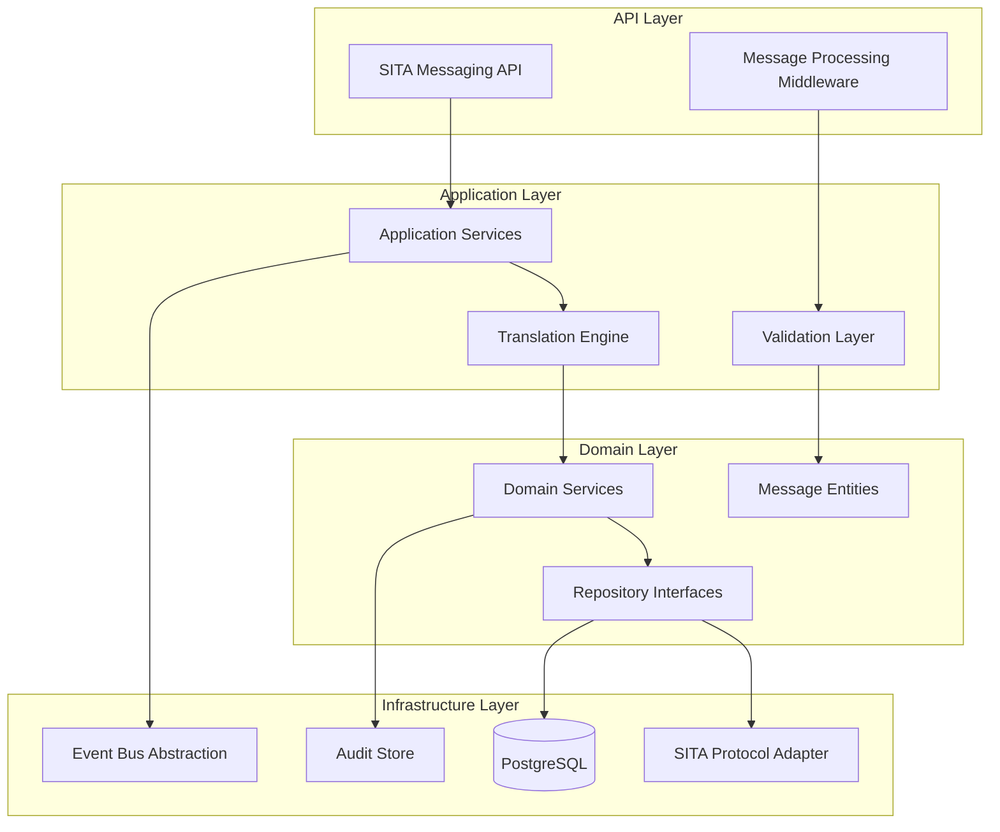

# 5. Vista de bloques de construcción

## 5.1 Descripción general del sistema

El Servicio SITA Messaging está diseñado como un adaptador especializado que facilita la comunicación entre los servicios corporativos internos y la red global de mensajería SITA, utilizada principalmente en la industria aeronáutica.

### 5.1.1 Arquitectura de capas



## 5.2 Nivel 1 - Contexto del sistema

### 5.2.1 Interfaces externas

#### SITA Network Interface
- **Propósito**: Comunicación con la red global SITA
- **Protocolo**: SITA Type B messaging over X.25/IP
- **Formato**: IATA estándar para mensajes aeronáuticos
- **Autenticación**: Certificados SITA + credenciales específicas

#### Corporate Services Interface
- **Propósito**: Integración con servicios corporativos internos
- **Protocolo**: REST API + Event bus events
- **Formato**: JSON con esquemas versionados
- **Autenticación**: OAuth2 JWT tokens

#### Track & Trace Integration
- **Propósito**: Registrar eventos de mensajería para trazabilidad
- **Método**: Event publishing via Event Bus
- **Formato**: CloudEvents estándar
- **Garantías**: At-least-once delivery

## 5.3 Nivel 2 - Contenedores

### 5.3.1 SITA Messaging API

**Responsabilidad**: Punto de entrada para solicitudes de mensajería SITA

**Tecnología**: ASP.NET Core 8.0, C#

**Interfaces**:
- REST API endpoints para envío de mensajes
- Health checks y metrics endpoint
- Authentication middleware
- Rate limiting y throttling

**Patrones implementados**:
- Controller → Application Service → Domain Service
- Command/Query separation
- Validation pipeline con FluentValidation

```csharp
[ApiController]
[Route("api/v1/sita-messages")]
[Authorize]
public class SitaMessageController : ControllerBase
{
    private readonly ISitaMessageService _messageService;

    [HttpPost("send")]
    public async Task<IActionResult> SendMessage([FromBody] SendSitaMessageCommand command)
    {
        var result = await _messageService.SendMessageAsync(command);
        return result.IsSuccess ? Ok(result.Value) : BadRequest(result.Error);
    }

    [HttpGet("status/{messageId}")]
    public async Task<IActionResult> GetMessageStatus(string messageId)
    {
        var status = await _messageService.GetMessageStatusAsync(messageId);
        return Ok(status);
    }
}
```

### 5.3.2 Message Processing Engine

**Responsabilidad**: Procesamiento central de mensajes SITA

**Componentes principales**:

#### Message Validator
- Validación de formato IATA
- Verificación de códigos de aeropuerto
- Validación de sintaxis específica por tipo de mensaje

#### Message Translator
- Conversión entre formatos internos y SITA
- Mapeo de códigos de aerolíneas
- Normalización de formatos de fecha/hora

#### Protocol Adapter
- Implementación del protocolo SITA Type B
- Manejo de conexiones X.25/IP
- Gestión de acknowledgments y retries

```csharp
public class SitaMessageProcessor : IMessageProcessor
{
    private readonly IMessageValidator _validator;
    private readonly IMessageTranslator _translator;
    private readonly ISitaProtocolAdapter _protocolAdapter;

    public async Task<ProcessingResult> ProcessMessageAsync(SitaMessage message)
    {
        // 1. Validate message format
        var validationResult = await _validator.ValidateAsync(message);
        if (!validationResult.IsValid)
            return ProcessingResult.Failed(validationResult.Errors);

        // 2. Translate to SITA format
        var sitaFormat = await _translator.TranslateToSitaAsync(message);

        // 3. Send via SITA protocol
        var sendResult = await _protocolAdapter.SendAsync(sitaFormat);

        return sendResult;
    }
}
```

### 5.3.3 SITA Protocol Adapter

**Responsabilidad**: Interfaz directa con la red SITA

**Características**:
- Conexión permanente con SITA network
- Pool de conexiones para alta disponibilidad
- Automatic reconnection y heartbeat
- Message queuing para resilience

**Implementación**:
```csharp
public class SitaProtocolAdapter : ISitaProtocolAdapter
{
    private readonly ISitaConnectionPool _connectionPool;
    private readonly ILogger<SitaProtocolAdapter> _logger;

    public async Task<SendResult> SendAsync(SitaMessage message)
    {
        using var connection = await _connectionPool.AcquireAsync();

        try
        {
            var acknowledgment = await connection.SendMessageAsync(message);
            await _auditService.LogMessageSentAsync(message, acknowledgment);

            return SendResult.Success(acknowledgment);
        }
        catch (SitaException ex)
        {
            _logger.LogError(ex, "Failed to send SITA message {MessageId}", message.Id);
            return SendResult.Failed(ex.Message);
        }
    }
}
```

### 5.3.4 Message Store

**Responsabilidad**: Persistencia de mensajes y audit trail

**Tecnología**: PostgreSQL con particionamiento por fecha

**Schema principal**:
```sql
CREATE TABLE sita_messages (
    id UUID PRIMARY KEY DEFAULT gen_random_uuid(),
    tenant_id VARCHAR(100) NOT NULL,
    message_type VARCHAR(20) NOT NULL,
    source_system VARCHAR(100) NOT NULL,
    destination VARCHAR(100) NOT NULL,
    content JSONB NOT NULL,
    sita_format TEXT,
    status VARCHAR(20) NOT NULL DEFAULT 'PENDING',
    created_at TIMESTAMPTZ DEFAULT NOW(),
    sent_at TIMESTAMPTZ,
    acknowledged_at TIMESTAMPTZ,
    error_details JSONB,

    -- Indexing for performance
    CONSTRAINT fk_tenant FOREIGN KEY (tenant_id) REFERENCES tenants(id)
) PARTITION BY RANGE (created_at);

-- Índices especializados
CREATE INDEX idx_sita_messages_tenant_status ON sita_messages(tenant_id, status);
CREATE INDEX idx_sita_messages_type_date ON sita_messages(message_type, created_at);
CREATE INDEX idx_sita_messages_destination ON sita_messages(destination, created_at);
```

## 5.4 Nivel 3 - Componentes

### 5.4.1 Application Services

#### SitaMessageService
```csharp
public class SitaMessageService : ISitaMessageService
{
    public async Task<Result<MessageId>> SendMessageAsync(SendSitaMessageCommand command)
    {
        // 1. Create domain message
        var message = SitaMessage.Create(
            command.TenantId,
            command.MessageType,
            command.Destination,
            command.Content);

        // 2. Validate business rules
        var validation = await _domainService.ValidateMessageAsync(message);
        if (!validation.IsValid)
            return Result.Failed<MessageId>(validation.Errors);

        // 3. Persist message
        await _messageRepository.SaveAsync(message);

        // 4. Queue for processing
        await _messageQueue.EnqueueAsync(new ProcessSitaMessageCommand(message.Id));

        // 5. Publish integration event
        await _eventBus.PublishAsync(new SitaMessageCreatedEvent(message));

        return Result.Success(message.Id);
    }
}
```

#### Message Type Handlers

```csharp
// Patrón Strategy para diferentes tipos de mensajes SITA
public interface ISitaMessageTypeHandler
{
    string MessageType { get; }
    Task<ValidationResult> ValidateAsync(SitaMessage message);
    Task<string> FormatAsync(SitaMessage message);
}

public class FlightPlanMessageHandler : ISitaMessageTypeHandler
{
    public string MessageType => "FPL"; // Flight Plan

    public async Task<ValidationResult> ValidateAsync(SitaMessage message)
    {
        // Validaciones específicas para Flight Plan
        var validator = new FlightPlanValidator();
        return await validator.ValidateAsync(message.Content);
    }

    public async Task<string> FormatAsync(SitaMessage message)
    {
        // Formato específico ICAO para Flight Plan
        return _flightPlanFormatter.Format(message.Content);
    }
}
```

### 5.4.2 Domain Services

#### MessageRoutingService
```csharp
public class MessageRoutingService : IMessageRoutingService
{
    public async Task<RoutingDecision> DetermineRoutingAsync(SitaMessage message)
    {
        // Determinar la mejor ruta basada en:
        // - Tipo de mensaje
        // - Destino
        // - Prioridad
        // - Disponibilidad de conexiones

        var routes = await _routingRepository.GetAvailableRoutesAsync(message.Destination);
        var selectedRoute = _routingAlgorithm.SelectOptimalRoute(routes, message);

        return new RoutingDecision(selectedRoute, message);
    }
}
```

#### AuditService
```csharp
public class AuditService : IAuditService
{
    public async Task LogMessageEventAsync(MessageAuditEvent auditEvent)
    {
        var auditRecord = new MessageAuditRecord
        {
            MessageId = auditEvent.MessageId,
            TenantId = auditEvent.TenantId,
            EventType = auditEvent.EventType,
            Timestamp = auditEvent.Timestamp,
            Details = auditEvent.Details,
            UserContext = auditEvent.UserContext
        };

        await _auditRepository.SaveAsync(auditRecord);

        // Publish to Track & Trace for comprehensive tracking
        await _eventBus.PublishAsync(new MessageAuditCreatedEvent(auditRecord));
    }
}
```

## 5.5 Interfaces entre componentes

### 5.5.1 Internal APIs

```csharp
// Application Layer → Domain Layer
public interface ISitaMessageService
{
    Task<Result<MessageId>> SendMessageAsync(SendSitaMessageCommand command);
    Task<MessageStatus> GetMessageStatusAsync(MessageId messageId);
    Task<Result> CancelMessageAsync(CancelMessageCommand command);
}

// Domain Layer → Infrastructure Layer
public interface ISitaMessageRepository
{
    Task<SitaMessage> GetByIdAsync(MessageId id);
    Task SaveAsync(SitaMessage message);
    Task<IEnumerable<SitaMessage>> GetPendingMessagesAsync();
}

public interface ISitaProtocolAdapter
{
    Task<SendResult> SendAsync(SitaMessage message);
    Task<ConnectionStatus> GetConnectionStatusAsync();
    Task<IEnumerable<IncomingMessage>> ReceiveMessagesAsync();
}
```

### 5.5.2 Event Contracts

```csharp
// Events publicados hacia otros servicios
public class SitaMessageSentEvent : IntegrationEvent
{
    public MessageId MessageId { get; }
    public string TenantId { get; }
    public string MessageType { get; }
    public string Destination { get; }
    public DateTime SentAt { get; }
    public string AcknowledgmentCode { get; }
}

public class SitaMessageFailedEvent : IntegrationEvent
{
    public MessageId MessageId { get; }
    public string TenantId { get; }
    public string ErrorCode { get; }
    public string ErrorMessage { get; }
    public DateTime FailedAt { get; }
    public int RetryAttempt { get; }
}
```

## 5.6 Patrones arquitectónicos implementados

### 5.6.1 Adapter Pattern
- SITA Protocol Adapter abstrae la complejidad del protocolo
- Message Format Adapters para diferentes tipos de mensaje
- Database Adapters para diferentes stores

### 5.6.2 Strategy Pattern
- Message Type Handlers para diferentes formatos SITA
- Routing Strategies para optimización de rutas
- Retry Strategies para diferentes tipos de fallo

### 5.6.3 Command Pattern
- Commands para todas las operaciones de escritura
- Command Handlers con validación y procesamiento
- Command Queue para procesamiento asíncrono

### 5.6.4 Observer Pattern
- Event publishing para integración con otros servicios
- Audit logging para compliance
- Status notifications para monitoreo

## 5.7 Quality Attributes

### 5.7.1 Reliability
- Circuit breaker para SITA connections
- Retry policies con exponential backoff
- Dead letter queue para mensajes fallidos
- Audit trail completo para troubleshooting

### 5.7.2 Performance
- Connection pooling para SITA network
- Async/await pattern en toda la stack
- Caching de routing decisions
- Partitioned storage para escalabilidad

### 5.7.3 Security
- Certificate-based authentication con SITA
- OAuth2 para internal APIs
- Encryption at rest para mensajes sensibles
- Role-based access control por tenant

### 5.7.4 Maintainability
- Clean Architecture separation
- Dependency injection para testability
- Comprehensive logging y monitoring
- Documentation inline en código crítico
