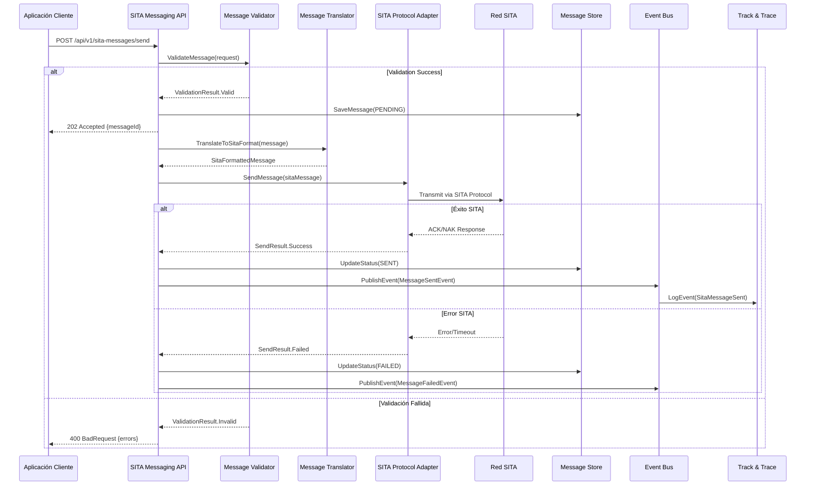
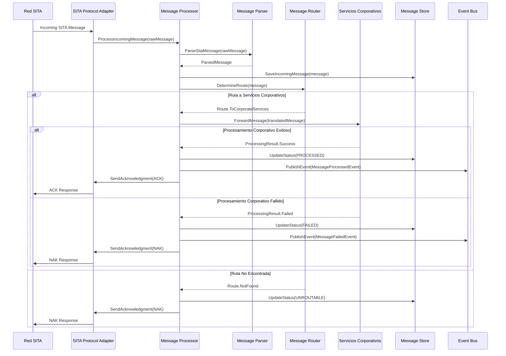
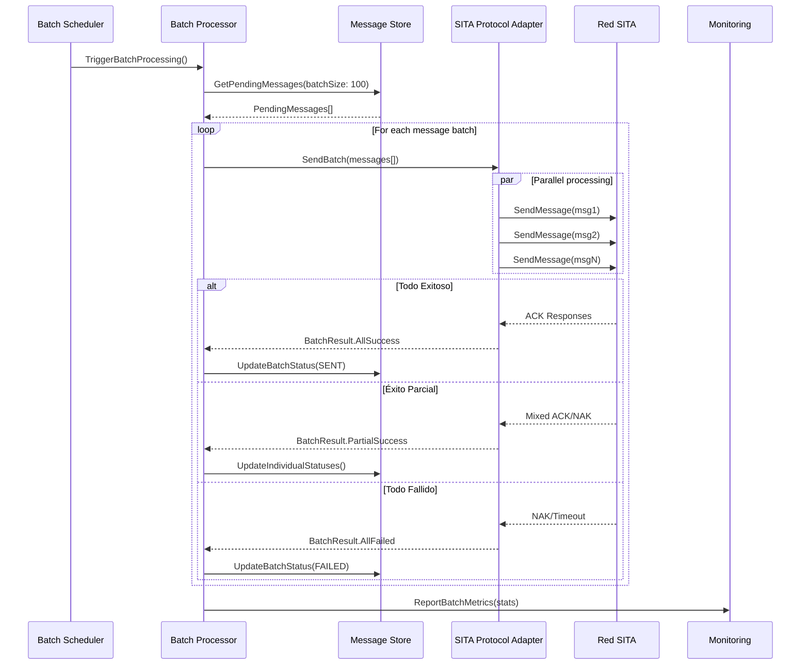

# 6. Vista de tiempo de ejecución

## 6.1 Escenarios principales

### 6.1.1 Envío de mensaje SITA outbound



### 6.1.2 Recepción de mensaje SITA inbound



### 6.1.3 Procesamiento batch de mensajes



## 6.2 Flujos de control

### 6.2.1 Gestión de conexiones SITA

**Descripción**: Mantenimiento de conexiones permanentes con la red SITA

**Actores**: SITA Protocol Adapter, Connection Pool Manager, Health Monitor

**Flujo normal**:
1. **Inicialización**: Establecer pool de conexiones al arranque
2. **Heartbeat**: Envío periódico de keep-alive messages
3. **Health check**: Verificación de estado de conexiones
4. **Load balancing**: Distribución de mensajes entre conexiones
5. **Monitoring**: Reporte de métricas de conexión

**Flujo de error**:

- **Conexión perdida**: Reintento automático con backoff exponencial
- **Autenticación fallida**: Renovación de certificados
- **Partición de red**: Activación de conexiones backup

### 6.2.2 Validación y transformación de mensajes

**Descripción**: Validación y transformación de mensajes entre formatos

**Precondiciones**:
- Mensaje recibido en formato interno o SITA
- Reglas de validación configuradas por tenant
- Mapeos de transformación disponibles

**Flujo normal**:
1. **Schema validation**: Verificar estructura del mensaje
2. **Business rules**: Aplicar reglas de negocio específicas
3. **Format transformation**: Convertir entre formatos
4. **Enrichment**: Agregar metadata y contexto
5. **Final validation**: Verificar resultado final

**Optimizaciones**:
- Cache de reglas de validación
- Validación asíncrona para mensajes batch
- Pre-compilación de transformaciones frecuentes

### 6.2.3 Error handling y retry logic

**Descripción**: Manejo robusto de errores con estrategias de reintento

**Tipos de error**:

- **Errores transitorios**: Network timeouts, temporary unavailability
- **Errores permanentes**: Invalid format, authentication failures
- **Errores de negocio**: Invalid routing, missing permissions

**Estrategias**:

```csharp
public class RetryPolicy
{
    public async Task<T> ExecuteAsync<T>(Func<Task<T>> operation)
    {
        var retryCount = 0;
        var delays = new[] { 1, 2, 4, 8, 16 }; // seconds

        while (retryCount < MaxRetries)
        {
            try
            {
                return await operation();
            }
            catch (TransientException ex) when (retryCount < MaxRetries - 1)
            {
                await Task.Delay(TimeSpan.FromSeconds(delays[retryCount]));
                retryCount++;
                _logger.LogWarning("Retry {Count}/{Max} for operation after {Error}",
                    retryCount, MaxRetries, ex.Message);
            }
        }

        throw new MaxRetriesExceededException();
    }
}
```

## 6.3 Patrones de runtime

### 6.3.1 Connection Pool Pattern
- **Pool size**: 5-10 conexiones concurrentes por destino SITA
- **Lifecycle**: Long-lived connections con automatic renewal
- **Load balancing**: Round-robin con health-based routing
- **Monitoring**: Connection health metrics y alertas

### 6.3.2 Circuit Breaker Pattern
- **Estados**: Closed, Open, Half-Open
- **Thresholds**: 50% error rate en 1 minuto
- **Recovery**: Gradual re-enabling con test requests
- **Metrics**: Success/failure rates, response times

### 6.3.3 Bulkhead Pattern
- **Isolation**: Separate thread pools por tipo de mensaje
- **Resource limits**: CPU y memory quotas por tenant
- **Failure containment**: Aislamiento de fallos entre tenants
- **Monitoring**: Resource utilization metrics

### 6.3.4 Saga Pattern (para flujos complejos)
- **Coordination**: State machine para multi-step processes
- **Compensation**: Rollback automático en caso de fallo
- **Persistence**: Estado almacenado para recovery
- **Monitoring**: Progress tracking y timeout handling

## 6.4 Performance characteristics

### 6.4.1 Throughput
- **Messages/second**: 1,000 mensajes salientes por instancia
- **Batch processing**: 100 mensajes por batch para efficiency
- **Concurrent connections**: 10 conexiones SITA simultáneas
- **Queue depth**: Máximo 10,000 mensajes pendientes

### 6.4.2 Latency
- **API response**: P95 < 200ms para operations síncronas
- **SITA transmission**: P95 < 2 segundos end-to-end
- **Message validation**: P95 < 50ms por mensaje
- **Database operations**: P95 < 100ms para writes

### 6.4.3 Resource utilization
- **Memory**: 512MB baseline, 2GB max por instancia
- **CPU**: 2 cores baseline, auto-scaling hasta 4 cores
- **Network**: 10Mbps sustained, 50Mbps peak
- **Storage**: 100GB para message store con archiving

## 6.5 Monitoreo de runtime

### 6.5.1 Health checks
```csharp
public class SitaMessagingHealthCheck : IHealthCheck
{
    public async Task<HealthCheckResult> CheckHealthAsync(HealthCheckContext context)
    {
        var checks = await Task.WhenAll(
            CheckSitaConnectionsAsync(),
            CheckDatabaseAsync(),
            CheckMessageQueueAsync()
        );

        if (checks.All(c => c.IsHealthy))
            return HealthCheckResult.Healthy("All subsystems operational");

        var unhealthy = checks.Where(c => !c.IsHealthy).ToList();
        return HealthCheckResult.Degraded($"Issues detected: {string.Join(", ", unhealthy)}");
    }
}
```

### 6.5.2 Métricas de negocio
- **Message success rate**: % de mensajes enviados exitosamente
- **Response time distribution**: P50, P95, P99 para operaciones
- **Error categorization**: Breakdown por tipo de error
- **Tenant usage**: Mensajes por tenant y throttling status

### 6.5.3 Alertas operacionales
- **Critical**: SITA connection down, database unavailable
- **Warning**: High error rate, slow response times
- **Info**: Unusual traffic patterns, capacity thresholds
- **Business**: SLA breaches, compliance violations

## 6.6 Deployment scenarios

### 6.6.1 Blue-Green deployment
- **Zero downtime**: Parallel deployment con traffic switching
- **Validation**: Automated testing en environment nuevo
- **Rollback**: Instant switchback en caso de issues
- **SITA connections**: Graceful migration de conexiones

### 6.6.2 Canary deployment
- **Gradual rollout**: 5% → 25% → 50% → 100% traffic
- **Monitoring**: Enhanced metrics durante rollout
- **Auto-rollback**: Automatic revert en error rate spike
- **Feature flags**: Runtime control de new features

### 6.6.3 Disaster recovery
- **RTO**: 15 minutos para restore basic functionality
- **RPO**: 5 minutos maximum data loss
- **Failover**: Automatic switch a secondary region
- **Data sync**: Real-time replication de message store
