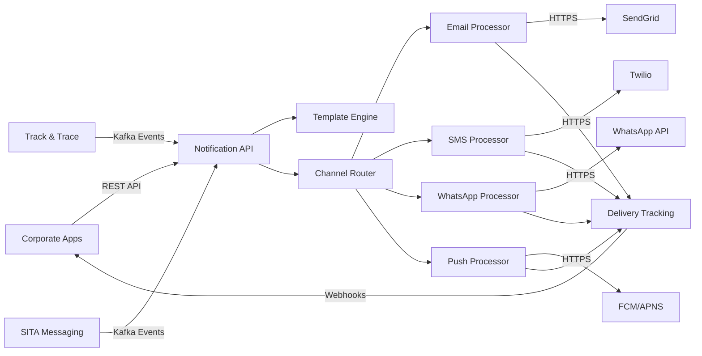

# 3. Contexto y alcance del sistema

El **Sistema de Notificaciones** actúa como la plataforma centralizada de comunicaciones multi-canal dentro de la arquitectura de servicios corporativos de Talma, proporcionando capacidades de notificación agnósticas al proveedor para todas las aplicaciones corporativas.

## 3.1 Contexto de negocio

### Posición en el Ecosistema

El sistema se integra con el ecosistema corporativo para proporcionar comunicaciones confiables y trazables:

**🎯 Diagrama de Contexto de Negocio**
*[INSERTAR AQUÍ: Diagrama C4 - Context Level]*

### Actores del Sistema

#### Usuarios Primarios

| Actor | Descripción | Interacciones Principales |
|-------|-------------|---------------------------|
| **Aplicaciones Corporativas** | Sistemas que requieren envío de notificaciones | Envío de requests vía API REST |
| **Usuarios Finales** | Destinatarios de las notificaciones | Recepción por Email, SMS, WhatsApp, Push |
| **Administradores del Sistema** | Gestores de configuración y monitoreo | Configuración de templates, canales, monitoring |

#### Usuarios Secundarios

| Actor | Descripción | Interacciones |
|-------|-------------|---------------|
| **Marketing Teams** | Equipos de marketing regional | Configuración de campañas promocionales |
| **Operations Teams** | Equipos operacionales | Monitoreo de entregas, troubleshooting |
| **Compliance Officers** | Responsables de cumplimiento | Audit de entregas, gestión de opt-outs |

### Interfaces de Dominio

#### Entradas al Sistema

| Origen | Interface | Tipo de Datos | Propósito |
|--------|-----------|---------------|-----------|
| **Aplicaciones Corporativas** | REST API `/notifications` | JSON notification requests | Solicitudes de envío |
| **Sistema de Templates** | Template Management API | Template definitions | Gestión de plantillas |
| **Admin Console** | Configuration API | Configuration data | Gestión de configuraciones |
| **Webhook Providers** | Callback endpoints | Delivery status | Status de entrega |

#### Salidas del Sistema

| Destino | Interface | Tipo de Datos | Propósito |
|---------|-----------|---------------|-----------|
| **Proveedores Email** | SMTP/API | Email messages | Envío de emails |
| **Proveedores SMS** | HTTP API | SMS messages | Envío de SMS |
| **WhatsApp Business** | WhatsApp API | WhatsApp messages | Mensajes WhatsApp |
| **Push Services** | FCM/APNS | Push notifications | Notificaciones push |
| **Sistemas Origen** | Webhooks | Delivery callbacks | Status de entrega |
| **Observability Stack** | Metrics/Logs | Telemetry data | Monitoreo y alertas |

### Objetivos de Negocio

| Prioridad | Objetivo | KPI | Target |
|-----------|----------|-----|--------|
| **Alta** | **Confiabilidad de Entrega** | Delivery Success Rate | > 99.5% |
| **Alta** | **Tiempo de Respuesta** | API Response Time p95 | < 200ms |
| **Media** | **Escalabilidad** | Peak Load Handling | 50K notifications/min |
| **Media** | **Compliance** | Opt-out Processing | < 1 hora |
| **Baja** | **Cost Efficiency** | Cost per Notification | < $0.05 |

## 3.2 Contexto técnico

### Arquitectura de Integración

**🔧 Diagrama de Contexto Técnico**
*[INSERTAR AQUÍ: Diagrama C4 - Technical Context]*

### Canales de Comunicación

#### Protocolos y Tecnologías

| Canal | Proveedor | Protocolo | Formato | Observaciones |
|-------|-----------|-----------|---------|---------------|
| **Email** | SendGrid / Amazon SES | HTTPS REST API | JSON | SMTP como fallback |
| **SMS** | Twilio | HTTPS REST API | JSON | Rate limiting por carrier |
| **WhatsApp** | WhatsApp Business API | HTTPS REST API | JSON | Template pre-approval required |
| **Push** | Firebase FCM / APNS | HTTPS REST API | JSON | Device token management |
| **In-App** | Internal Pub/Sub | WebSocket | JSON | Real-time delivery |

#### Integración con Sistemas Internos

| Sistema | Protocolo | Formato | Autenticación | SLA |
|---------|-----------|---------|---------------|-----|
| **Track & Trace** | Apache Kafka | Avro | mTLS | < 1s event processing |
| **SITA Messaging** | Apache Kafka | JSON | mTLS | < 2s event processing |
| **Identity System** | HTTPS REST | JWT | OAuth 2.0 | < 200ms response |
| **API Gateway** | HTTPS | JSON | JWT Bearer | < 100ms routing |

### Mapeo de Entrada/Salida a Canales

#### Flujo de Datos Simplificado



#### Tecnologías de Integración

| Componente | Tecnología | Propósito | Configuración |
|------------|------------|-----------|---------------|
| **API Gateway** | YARP (ASP.NET Core) | Routing y rate limiting | Load balancing, timeout 30s |
| **Message Broker** | Apache Kafka | Event streaming | Retention 7 days, 3 replicas |
| **Database** | PostgreSQL | Data persistence | Multi-tenant schema design |
| **Cache** | Redis | Response caching | TTL 300s, cluster mode |
| **File Storage** | S3-Compatible | Attachment storage | Versioning enabled, lifecycle policies |
| **Monitoring** | Prometheus + Grafana | Observability | 15s scrape interval |
| **Tracing** | OpenTelemetry | Distributed tracing | 100% sampling in dev, 1% in prod |

### Restricciones Técnicas

#### Limitaciones de Proveedores

| Proveedor | Restricción | Impacto | Mitigación |
|-----------|-------------|---------|-------------|
| **SendGrid** | 100 requests/second | Rate limiting | Request queuing, multiple API keys |
| **Twilio** | 1 message/second por number | SMS throttling | Number pool rotation |
| **WhatsApp** | Template pre-approval | Content restrictions | Template library management |
| **FCM** | 10MB payload limit | Large content | Content optimization, image compression |

#### Requerimientos de Red

| Destino | Latencia Target | Bandwidth | Disponibilidad |
|---------|----------------|-----------|----------------|
| **External Providers** | < 2s timeout | 1 Mbps sustained | 99.9% uptime dependency |
| **Internal Services** | < 500ms | 10 Mbps | 99.95% uptime |
| **Database** | < 50ms | 100 Mbps | 99.99% uptime |
| **API Requests** | Web/Mobile apps | Manual notifications | On-demand | REST API (JSON) |
| **Bulk Requests** | Corporate systems | Batch notifications | Scheduled | REST API (JSON Array) |
| **Template Updates** | Content management | Template changes | As needed | REST API (JSON) |

#### Salida de Datos

| Interface | Destino | Tipo de Datos | Frecuencia | Formato |
|-----------|---------|---------------|------------|---------|
| **Email Messages** | Email providers | Email content + metadata | Real-time | SMTP/API calls |
| **SMS Messages** | SMS providers | Text messages + metadata | Real-time | REST API calls |
| **WhatsApp Messages** | WhatsApp API | Template messages | Real-time | REST API calls |
| **Push Notifications** | FCM/APNS | Push payloads | Real-time | Provider APIs |
| **Delivery Reports** | Monitoring systems | Status updates | Real-time | Webhook callbacks |
| **Audit Logs** | SIEM systems | Delivery logs, errors | Continuous | Structured logs |

## 3.4 Alcance funcional

### Funcionalidades Incluidas

| Función | Descripción | Usuarios Objetivo | Prioridad |
|---------|-------------|-------------------|-----------|
| **Multi-channel Delivery** | Envío Email, SMS, WhatsApp, Push | Todos los usuarios | Alta |
| **Event-driven Notifications** | Automatización basada en eventos | Sistemas internos | Alta |
| **Template Management** | Gestión centralizada de plantillas | Content managers | Alta |
| **Delivery Tracking** | Seguimiento estado entregas | Operations, customer service | Alta |
| **Retry & Fallback** | Reintentos automáticos y canales alternativos | Sistema automático | Media |
| **Personalization** | Contenido personalizado por usuario/contexto | End users | Media |
| **Bulk Notifications** | Envío masivo eficiente | Marketing, operations | Media |
| **A/B Testing** | Pruebas de variantes de contenido | Marketing teams | Baja |
| **Analytics & Reporting** | Métricas de entrega y engagement | Management | Baja |

### Funcionalidades Excluidas

| Función | Razón de Exclusión | Alternativa |
|---------|-------------------|-------------|
| **Content Creation Tools** | Fuera del dominio técnico | Business content management tools |
| **User Preference Management** | Responsabilidad de Identity System | User profile management |
| **Campaign Management** | Marketing functionality | Dedicated marketing platforms |
| **Customer Database** | Data ownership elsewhere | CRM systems, user databases |
| **Payment Notifications** | Specialized domain | Payment gateway notifications |

## 3.5 Casos de uso principales

### Notificación Automática por Evento

```text
Actor: Track & Trace System
Precondición: Evento operacional crítico ocurre
Flujo Principal:
1. Track & Trace detecta evento crítico (retraso vuelo)
2. Sistema publica evento a Kafka topic
3. Notification System consume evento
4. Sistema identifica template por tipo evento
5. Sistema obtiene lista destinatarios afectados
6. Sistema personaliza contenido por destinatario
7. Sistema envía notificaciones por canales preferidos
8. Sistema rastrea estado de entrega
9. Sistema maneja reintentos si hay fallos
Postcondición: Destinatarios notificados de evento crítico
```

### Envío Manual de Notificación

```text
Actor: Customer Service Agent
Precondición: Agente autenticado con permisos
Flujo Principal:
1. Agente accede a interfaz de notificaciones
2. Agente selecciona destinatario(s)
3. Agente elige template o crea contenido personalizado
4. Agente selecciona canales de entrega
5. Sistema valida contenido y destinatarios
6. Sistema procesa y envía notificación
7. Sistema retorna confirmación a agente
8. Agente puede monitorear estado entrega
Postcondición: Notificación manual enviada exitosamente
```

### Gestión de Template Multi-idioma

```text
Actor: Content Manager
Precondición: Manager autenticado con permisos de template
Flujo Principal:
1. Content manager accede a template management
2. Manager crea/edita template base
3. Manager agrega versiones por idioma/país
4. Manager define variables de personalización
5. Sistema valida sintaxis y variables
6. Manager somete template para aprobación
7. Approver revisa y aprueba template
8. Sistema activa template para uso
Postcondición: Template multi-idioma disponible
```

### Procesamiento Masivo de Notificaciones

```text
Actor: Corporate System
Precondición: Sistema con credenciales válidas
Flujo Principal:
1. Sistema corporativo prepara lote de notificaciones
2. Sistema llama API bulk notification endpoint
3. Notification System valida y acepta lote
4. Sistema divide lote en chunks procesables
5. Sistema procesa chunks en paralelo
6. Sistema envía notificaciones por canales
7. Sistema agrega estados de entrega
8. Sistema retorna resumen de procesamiento
Postcondición: Lote procesado con reporte de entrega
```

## 3.6 Canales de notificación

### Email Channel

| Aspecto | Especificación | Providers | Capacidades |
|---------|---------------|-----------|-------------|
| **Delivery** | High-volume transactional email | SendGrid (primary), Amazon SES (fallback) | 100k emails/hour |
| **Features** | Templates, attachments, tracking | HTML/text, DKIM/SPF, open/click tracking | Rich content support |
| **Compliance** | CAN-SPAM, GDPR compliant | Unsubscribe, list management | Automated compliance |

### SMS Channel

| Aspecto | Especificación | Providers | Capacidades |
|---------|---------------|-----------|-------------|
| **Delivery** | Global SMS delivery | Twilio (primary), local providers (fallback) | 50k SMS/hour |
| **Features** | Unicode support, delivery receipts | 160/70 char limits, concatenation | Multi-language support |
| **Compliance** | Carrier regulations, opt-out | STOP keyword, carrier compliance | Automated opt-out |

### WhatsApp Channel

| Aspecto | Especificación | Providers | Capacidades |
|---------|---------------|-----------|-------------|
| **Delivery** | WhatsApp Business messaging | WhatsApp Business API | 10k messages/hour |
| **Features** | Template messages, media support | Pre-approved templates, images/docs | Rich media messaging |
| **Compliance** | WhatsApp policies | Template approval, content guidelines | Platform compliance |

### Push Notifications Channel

| Aspecto | Especificación | Providers | Capacidades |
|---------|---------------|-----------|-------------|
| **Delivery** | Mobile push notifications | Firebase FCM, Apple APNS | 1M pushes/hour |
| **Features** | Rich notifications, deep links | Images, actions, custom data | Interactive notifications |
| **Compliance** | Platform guidelines | Permission management, badge control | User consent required |

## 3.7 Atributos de calidad

### Reliability

| Atributo | Métrica | Target | Medición |
|----------|---------|--------|----------|
| **Delivery Rate** | Successful deliveries | > 95% across all channels | Provider webhooks, tracking |
| **System Availability** | Service uptime | 99.9% | Health monitoring |
| **Message Durability** | Message loss rate | < 0.01% | Queue monitoring |
| **Retry Success** | Retry delivery rate | > 80% after retries | Retry analytics |

### Performance

| Atributo | Métrica | Target | Medición |
|----------|---------|--------|----------|
| **Processing Latency** | End-to-end delivery time | p95 < 5 seconds | APM monitoring |
| **Throughput** | Messages per hour | 100k messages/hour | Load testing |
| **Template Processing** | Template render time | < 500ms | Performance profiling |
| **API Response Time** | REST API latency | p95 < 200ms | API monitoring |

### Scalability

| Atributo | Métrica | Target | Medición |
|----------|---------|--------|----------|
| **Horizontal Scaling** | Auto-scaling capability | Linear scaling | Load testing |
| **Queue Capacity** | Message queue depth | Handle 1M queued messages | Queue monitoring |
| **Concurrent Processing** | Parallel message handling | 1000 concurrent processors | Concurrency testing |
| **Storage Scaling** | Template/log storage | Automatic expansion | Storage monitoring |

## Referencias

### External Provider APIs

- [SendGrid API Documentation](https://docs.sendgrid.com/api-reference)
- [Twilio SMS API](https://www.twilio.com/docs/sms)
- [WhatsApp Business API](https://developers.facebook.com/docs/whatsapp)
- [Firebase Cloud Messaging](https://firebase.google.com/docs/cloud-messaging)

### Compliance Standards

- [CAN-SPAM Act Compliance](https://www.ftc.gov/enforcement/rules/rulemaking-regulatory-reform-proceedings/can-spam-rule)
- [GDPR Article 7 (Consent)](https://gdpr-info.eu/art-7-gdpr/)
- [CASL (Canada Anti-Spam Legislation)](https://crtc.gc.ca/eng/casl-lcap/)

### Architecture References

- [Event-Driven Architecture Patterns](https://microservices.io/patterns/data/event-driven-architecture.html)
- [Apache Kafka Documentation](https://kafka.apache.org/documentation/)
- [Arc42 Context Template](https://docs.arc42.org/section-3/)
```

## 3.2 Alcance

- **Incluye:**
  - Gestión y envío de notificaciones multicanal
  - Soporte multi-tenant y multi-país
  - Integración con sistemas externos (ERP, CRM)
  - Gestión de adjuntos y programación de envíos
- **Excluye:**
  - Generación de contenido de notificaciones (solo se envía contenido recibido)
  - Gestión de usuarios finales (delegada a sistemas externos)
