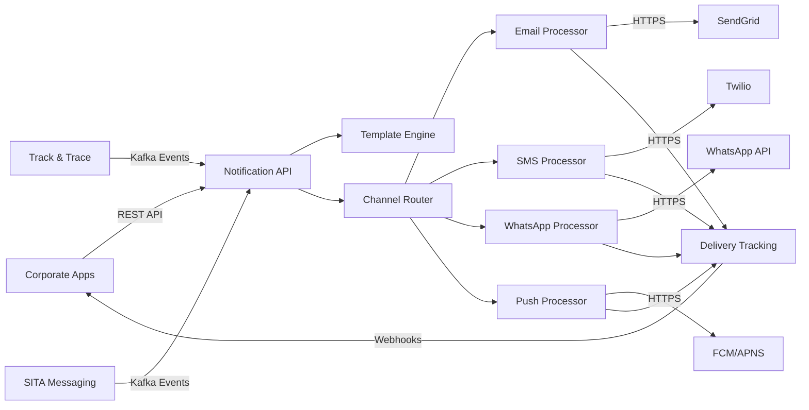

# 3. Contexto y alcance del sistema

El **Sistema de Notificaciones** actúa como la plataforma centralizada de comunicaciones multi-canal dentro de la arquitectura de servicios corporativos de Talma, proporcionando capacidades de notificación agnósticas al proveedor para todas las aplicaciones corporativas.

## 3.1 Contexto de negocio

### Posición en el Ecosistema

El sistema se integra con el ecosistema corporativo para proporcionar comunicaciones confiables y trazables:

**🎯 Diagrama de Contexto de Negocio**
*[INSERTAR AQUÍ: Diagrama C4 - Context Level]*

### Actores del Sistema

#### Usuarios Primarios

| Actor | Descripción | Interacciones Principales |
|-------|-------------|---------------------------|
| **Aplicaciones Corporativas** | Sistemas empresariales que requieren envío de notificaciones | Envío de solicitudes vía API REST |
| **Usuarios Finales** | Clientes, empleados y stakeholders corporativos | Recepción por Email, SMS, WhatsApp, Push |
| **Sistemas de Terceros** | Proveedores, partners y sistemas externos | Integración vía API y webhooks |
| **Administradores del Sistema** | Gestores de configuración y monitoreo | Configuración de templates, canales, monitoring |

#### Usuarios Secundarios

| Actor | Descripción | Interacciones |
|-------|-------------|---------------|
| **Equipos de Marketing** | Equipos de marketing regional por país | Configuración de campañas promocionales |
| **Equipos Operacionales** | Equipos operacionales aeroportuarios | Monitoreo de entregas, resolución de problemas |
| **Oficiales de Cumplimiento** | Responsables de cumplimiento regulatorio | Auditoría de entregas, gestión de opt-outs |

### Interfaces de Dominio

#### Entradas al Sistema

| Origen | Interface | Tipo de Datos | Propósito |
|--------|-----------|---------------|-----------|
| **Aplicaciones Corporativas** | REST API `/notifications` | JSON notification requests | Solicitudes de envío |
| **Sistema de Templates** | Gestión de Plantillas API | Template definitions | Gestión de plantillas |
| **Admin Console** | Configuration API | Configuration data | Gestión de configuraciones |
| **Webhook Providers** | Callback endpoints | Delivery status | Status de entrega |

#### Salidas del Sistema

| Destino | Interface | Tipo de Datos | Propósito |
|---------|-----------|---------------|-----------|
| **Proveedores Email** | SMTP/API | Email messages | Envío de emails |
| **Proveedores SMS** | HTTP API | SMS messages | Envío de SMS |
| **WhatsApp Business** | WhatsApp API | WhatsApp messages | Mensajes WhatsApp |
| **Push Services** | FCM/APNS | Push notifications | Notificaciones push |
| **Sistemas Origen** | Webhooks | Delivery callbacks | Status de entrega |
| **Observability Stack** | Metrics/Logs | Telemetry data | Monitoreo y alertas |

### Objetivos de Negocio

| Prioridad | Objetivo | KPI | Target | Contexto Empresarial |
|-----------|----------|-----|--------|----------------------|
| **Alta** | **Confiabilidad de Entrega** | Tasa de Éxito de Entrega | > 99.5% | Crítico para notificaciones transaccionales |
| **Alta** | **Tiempo de Respuesta** | Tiempo de Respuesta API p95 | < 200ms | Notificaciones en tiempo real |
| **Media** | **Escalabilidad** | Manejo de Carga Pico | 50K notificaciones/min | Picos durante campañas y eventos |
| **Media** | **Cumplimiento** | Procesamiento de Opt-out | < 1 hora | Cumplimiento GDPR y regulaciones locales |
| **Baja** | **Eficiencia de Costo** | Costo por Notificación | < $0.05 | Optimización de costos operacionales |

### Casos de Uso Empresariales

#### Notificaciones Transaccionales
- **Confirmaciones**: Confirmación de transacciones, reservas y procesos
- **Alertas del sistema**: Notificaciones automáticas sobre cambios de estado
- **Recordatorios**: Notificaciones programadas para eventos importantes
- **Alertas de seguridad**: Comunicaciones críticas y de emergencia

#### Notificaciones Operacionales
- **Personal corporativo**: Cambios organizacionales, alertas operacionales
- **Coordinación de servicios**: Comunicación entre equipos y departamentos
- **Proveedores y partners**: Notificaciones sobre procesos y requerimientos

#### Notificaciones Comerciales
- **Campañas de marketing**: Promociones, ofertas y comunicaciones comerciales
- **Programas de fidelidad**: Actualizaciones de beneficios y recompensas
- **Encuestas de satisfacción**: Feedback y evaluación de servicios

## 3.2 Contexto técnico

### Arquitectura de Integración

**🔧 Diagrama de Contexto Técnico**
*[INSERTAR AQUÍ: Diagrama C4 - Technical Context]*

### Canales de Comunicación

#### Protocolos y Tecnologías

| Canal | Proveedor | Protocolo | Formato | Observaciones |
|-------|-----------|-----------|---------|---------------|
| **Email** | SendGrid / Amazon SES | HTTPS REST API | JSON | SMTP como fallback |
| **SMS** | Twilio | HTTPS REST API | JSON | Limitación de velocidad por operador |
| **WhatsApp** | WhatsApp Business API | HTTPS REST API | JSON | Pre-aprobación de template requerida |
| **Push** | Firebase FCM / APNS | HTTPS REST API | JSON | Gestión de device token |
| **In-App** | Pub/Sub Interno | WebSocket | JSON | Entrega en tiempo real |

#### Integración con Sistemas Internos

| Sistema | Protocolo | Formato | Autenticación | SLA |
|---------|-----------|---------|---------------|-----|
| **Track & Trace** | Bus de Eventos | Avro | mTLS | < 1s procesamiento evento |
| **SITA Messaging** | Bus de Eventos | JSON | mTLS | < 2s procesamiento evento |
| **Sistema de Identidad** | HTTPS REST | JWT | OAuth 2.0 | < 200ms respuesta |
| **API Gateway** | HTTPS | JSON | JWT Bearer | < 100ms enrutamiento |

### Mapeo de Entrada/Salida a Canales

#### Flujo de Datos Simplificado



#### Tecnologías de Integración

| Componente | Tecnología | Propósito | Configuración |
|------------|------------|-----------|---------------|
| **API Gateway** | YARP (ASP.NET Core) | Routing y limitación de velocidad | Load balancing, timeout 30s |
| **Message Broker** | Event Bus agnóstico | Event streaming | Retention 7 days, 3 replicas |
| **Database** | PostgreSQL | Data persistence | Multi-tenant schema design |
| **Cache** | Redis | Response caching | TTL 300s, cluster mode |
| **File Storage** | S3-Compatible | Attachment storage | Versioning enabled, lifecycle policies |
| **Monitoring** | Prometheus + Grafana | Observability | 15s scrape interval |
| **Tracing** | OpenTelemetry | Distributed tracing | 100% sampling in dev, 1% in prod |

### Restricciones Técnicas

#### Limitaciones de Proveedores

| Proveedor | Restricción | Impacto | Mitigación |
|-----------|-------------|---------|-------------|
| **SendGrid** | 100 requests/second | Rate limiting | Request queuing, multiple API keys |
| **Twilio** | 1 message/second por number | SMS throttling | Number pool rotation |
| **WhatsApp** | Template pre-approval | Content restrictions | Template library management |
| **FCM** | 10MB payload limit | Large content | Content optimization, image compression |

#### Requerimientos de Red

| Destino | Latencia Target | Bandwidth | Disponibilidad |
|---------|----------------|-----------|----------------|
| **Proveedores Externos** | < 2s timeout | 1 Mbps sustained | 99.9% uptime dependency |
| **Internal Services** | < 500ms | 10 Mbps | 99.95% uptime |
| **Database** | < 50ms | 100 Mbps | 99.99% uptime |
| **API Requests** | Web/Mobile apps | Manual notifications | On-demand | REST API (JSON) |
| **Bulk Requests** | Corporate systems | Batch notifications | Scheduled | REST API (JSON Array) |
| **Template Updates** | Content management | Template changes | As needed | REST API (JSON) |

#### Salida de Datos

| Interface | Destino | Tipo de Datos | Frecuencia | Formato |
|-----------|---------|---------------|------------|---------|
| **Email Messages** | Email providers | Email content + metadata | Real-time | SMTP/API calls |
| **SMS Messages** | SMS providers | Text messages + metadata | Real-time | REST API calls |
| **WhatsApp Messages** | WhatsApp API | Template messages | Real-time | REST API calls |
| **Push Notifications** | FCM/APNS | Push payloads | Real-time | Provider APIs |
| **Delivery Reports** | Monitoring systems | Status updates | Real-time | Webhook callbacks |
| **Audit Logs** | SIEM systems | Delivery logs, errors | Continuous | Structured logs |

## 3.4 Alcance funcional

### Funcionalidades Incluidas

| Función | Descripción | Usuarios Objetivo | Prioridad |
|---------|-------------|-------------------|-----------|
| **Multi-channel Delivery** | Envío Email, SMS, WhatsApp, Push | Todos los usuarios | Alta |
| **Event-driven Notifications** | Automatización basada en eventos | Sistemas internos | Alta |
| **Gestión de Plantillas** | Gestión centralizada de plantillas | Content managers | Alta |
| **Delivery Tracking** | Seguimiento estado entregas | Operations, customer service | Alta |
| **Retry & Fallback** | Reintentos automáticos y canales alternativos | Sistema automático | Media |
| **Personalization** | Contenido personalizado por usuario/contexto | End users | Media |
| **Bulk Notifications** | Envío masivo eficiente | Marketing, operaciones | Media |
| **A/B Testing** | Pruebas de variantes de contenido | Equipos de marketing | Baja |
| **Analytics & Reporting** | Métricas de entrega y engagement | Gestión | Baja |

### Funcionalidades Excluidas

| Función | Razón de Exclusión | Alternativa |
|---------|-------------------|-------------|
| **Content Creation Tools** | Fuera del dominio técnico | Herramientas empresariales de gestión de contenido |
| **User Preference Management** | Responsabilidad del Identity System | Gestión de perfiles de usuario |
| **Campaign Management** | Funcionalidad de marketing | Plataformas dedicadas de marketing |
| **Customer Database** | Propiedad de datos externa | Sistemas CRM, bases de datos de usuarios |
| **Payment Notifications** | Dominio especializado | Notificaciones de pasarela de pago |

## 3.5 Casos de uso principales

### Notificación Automática por Evento

```text
Actor: Track & Trace System
Precondición: Evento operacional crítico ocurre
Flujo Principal:
1. Track & Trace detecta evento crítico (retraso vuelo)
2. Sistema publica evento a Kafka topic
3. Notification System consume evento
4. Sistema identifica template por tipo evento
5. Sistema obtiene lista destinatarios afectados
6. Sistema personaliza contenido por destinatario
7. Sistema envía notificaciones por canales preferidos
8. Sistema rastrea estado de entrega
9. Sistema maneja reintentos si hay fallos
Postcondición: Destinatarios notificados de evento crítico
```

### Envío Manual de Notificación

```text
Actor: Customer Service Agent
Precondición: Agente autenticado con permisos
Flujo Principal:
1. Agente accede a interfaz de notificaciones
2. Agente selecciona destinatario(s)
3. Agente elige template o crea contenido personalizado
4. Agente selecciona canales de entrega
5. Sistema valida contenido y destinatarios
6. Sistema procesa y envía notificación
7. Sistema retorna confirmación a agente
8. Agente puede monitorear estado entrega
Postcondición: Notificación manual enviada exitosamente
```

### Gestión de Template Multi-idioma

```text
Actor: Content Manager
Precondición: Manager autenticado con permisos de template
Flujo Principal:
1. Content manager accede a gestión de templates
2. Manager crea/edita template base
3. Manager agrega versiones por idioma/país
4. Manager define variables de personalización
5. Sistema valida sintaxis y variables
6. Manager somete template para aprobación
7. Aprobador revisa y aprueba template
8. Sistema activa template para uso
Postcondición: Template multi-idioma disponible
```

### Procesamiento Masivo de Notificaciones

```text
Actor: Corporate System
Precondición: Sistema con credenciales válidas
Flujo Principal:
1. Sistema corporativo prepara lote de notificaciones
2. Sistema llama API bulk notification endpoint
3. Notification System valida y acepta lote
4. Sistema divide lote en chunks procesables
5. Sistema procesa chunks en paralelo
6. Sistema envía notificaciones por canales
7. Sistema agrega estados de entrega
8. Sistema retorna resumen de procesamiento
Postcondición: Lote procesado con reporte de entrega
```

## 3.6 Canales de notificación

### Email Channel

| Aspecto | Especificación | Providers | Capacidades |
|---------|---------------|-----------|-------------|
| **Delivery** | Email transaccional de alto volumen | SendGrid (primary), Amazon SES (fallback) | 100k emails/hora |
| **Features** | Templates, adjuntos, seguimiento | HTML/texto, DKIM/SPF, seguimiento de apertura/clic | Soporte de contenido enriquecido |
| **Compliance** | Cumplimiento CAN-SPAM, GDPR | Desuscripción, gestión de listas | Cumplimiento automatizado |

### SMS Channel

| Aspecto | Especificación | Providers | Capacidades |
|---------|---------------|-----------|-------------|
| **Delivery** | Entrega global de SMS | Twilio (primary), proveedores locales (fallback) | 50k SMS/hora |
| **Features** | Soporte Unicode, recibos de entrega | Límites 160/70 caracteres, concatenación | Soporte multi-idioma |
| **Compliance** | Regulaciones de operadores, opt-out | Palabra clave STOP, cumplimiento de operadores | Opt-out automatizado |

### WhatsApp Channel

| Aspecto | Especificación | Providers | Capacidades |
|---------|---------------|-----------|-------------|
| **Delivery** | Mensajería WhatsApp Business | WhatsApp Business API | 10k mensajes/hora |
| **Features** | Mensajes de template, soporte multimedia | Templates pre-aprobados, imágenes/documentos | Mensajería multimedia enriquecida |
| **Compliance** | Políticas de WhatsApp | Aprobación de templates, directrices de contenido | Cumplimiento de plataforma |

### Push Notifications Channel

| Aspecto | Especificación | Providers | Capacidades |
|---------|---------------|-----------|-------------|
| **Delivery** | Notificaciones push móviles | Firebase FCM, Apple APNS | 1M pushes/hora |
| **Features** | Notificaciones enriquecidas, deep links | Imágenes, acciones, datos personalizados | Notificaciones interactivas |
| **Compliance** | Directrices de plataforma | Gestión de permisos, control de badge | Consentimiento del usuario requerido |

## 3.7 Atributos de calidad

### Confiabilidad

| Atributo | Métrica | Objetivo | Medición |
|----------|---------|--------|----------|
| **Tasa de Entrega** | Entregas exitosas | > 95% en todos los canales | Webhooks de proveedores, seguimiento |
| **Disponibilidad del Sistema** | Tiempo de actividad del servicio | 99.9% | Monitoreo de salud |
| **Durabilidad de Mensajes** | Tasa de pérdida de mensajes | < 0.01% | Monitoreo de colas |
| **Éxito de Reintentos** | Tasa de entrega tras reintentos | > 80% después de reintentos | Analítica de reintentos |

### Rendimiento

| Atributo | Métrica | Objetivo | Medición |
|----------|---------|--------|----------|
| **Latencia de Procesamiento** | Tiempo de entrega extremo a extremo | p95 < 5 segundos | Monitoreo APM |
| **Rendimiento** | Mensajes por hora | 100k mensajes/hora | Pruebas de carga |
| **Procesamiento de Templates** | Tiempo de renderizado de template | < 500ms | Perfilado de rendimiento |
| **Tiempo de Respuesta API** | Latencia API REST | p95 < 200ms | Monitoreo de API |

### Escalabilidad

| Atributo | Métrica | Objetivo | Medición |
|----------|---------|--------|----------|
| **Escalado Horizontal** | Capacidad de auto-escalado | Escalado lineal | Pruebas de carga |
| **Capacidad de Cola** | Profundidad de cola de mensajes | Manejar 1M mensajes en cola | Monitoreo de colas |
| **Procesamiento Concurrente** | Manejo paralelo de mensajes | 1000 procesadores concurrentes | Pruebas de concurrencia |
| **Escalado de Almacenamiento** | Almacenamiento de templates/logs | Expansión automática | Monitoreo de almacenamiento |

## Referencias

### External Provider APIs

- [SendGrid API Documentation](https://docs.sendgrid.com/api-reference)
- [Twilio SMS API](https://www.twilio.com/docs/sms)
- [WhatsApp Business API](https://developers.facebook.com/docs/whatsapp)
- [Firebase Cloud Messaging](https://firebase.google.com/docs/cloud-messaging)

### Compliance Standards

- [CAN-SPAM Act Compliance](https://www.ftc.gov/enforcement/rules/rulemaking-regulatory-reform-proceedings/can-spam-rule)
- [GDPR Article 7 (Consent)](https://gdpr-info.eu/art-7-gdpr/)
- [CASL (Canada Anti-Spam Legislation)](https://crtc.gc.ca/eng/casl-lcap/)

### Architecture References

- [Event-Driven Architecture Patterns](https://microservices.io/patterns/data/event-driven-architecture.html)
- [Event Bus Architecture Documentation](https://docs.microsoft.com/en-us/azure/architecture/patterns/event-sourcing)
- [Arc42 Context Template](https://docs.arc42.org/section-3/)
```

## 3.2 Alcance

- **Incluye:**
  - Gestión y envío de notificaciones multicanal
  - Soporte multi-tenant y multi-país
  - Integración con sistemas externos (ERP, CRM)
  - Gestión de adjuntos y programación de envíos
- **Excluye:**
  - Generación de contenido de notificaciones (solo se envía contenido recibido)
  - Gestión de usuarios finales (delegada a sistemas externos)
