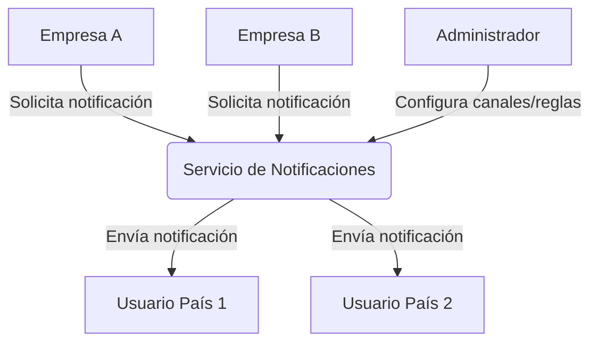

# 3. Contexto y alcance

## 3.1 Contexto empresarial

El Servicio de Notificaciones opera como plataforma multi-tenant y multi-país, permitiendo a múltiples empresas y administradores gestionar y enviar notificaciones a usuarios finales en diferentes países, con aislamiento de datos y configuración regional.

### Actores y límites

| Actor/Interlocutor | Rol/Responsabilidad | Entrada | Salida |
|--------------------|--------------------|---------|--------|
| Empresa/Cliente    | Solicita notificaciones, consulta estado | Solicitud de notificación | Estado de envío |
| Administrador      | Configura canales, reglas y plantillas por país/tenant | Configuración | Confirmación |
| Usuario final      | Recibe notificaciones | - | Notificación recibida |

### Diagrama de contexto (multi-tenant/multi-país)

## 3.2 Contexto técnico

El sistema se integra con los siguientes sistemas y canales externos:

| Sistema         | Canal        | Protocolo |
|-----------------|--------------|-----------|
| API Gateway     | HTTP         | REST      |
| SQS/SNS         | Mensajería   | AWS       |
| S3              | Archivos     | AWS       |
| PostgreSQL      | Datos        | SQL       |

## 3.3 Alcance funcional y no funcional

**Alcance funcional:**
- Envío de notificaciones multicanal (email, SMS, WhatsApp, push, in-app).
- Gestión de plantillas y reglas por tenant y país.
- Consulta de estado de envío y reintentos.
- Configuración de canales y preferencias por empresa y región.

**Alcance no funcional:**
- Soporte multi-tenant y multi-país con aislamiento de datos y configuración regional.
- Escalabilidad, alta disponibilidad y tolerancia a fallos.
- Seguridad, trazabilidad y cumplimiento normativo regional.
