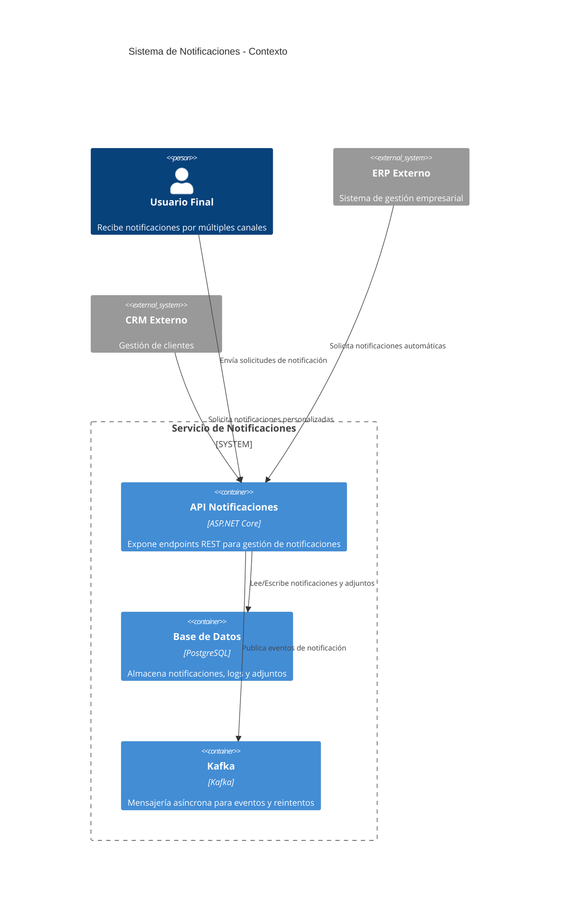

# 3. Contexto y alcance

## 3.1 Diagrama de contexto

## 3.2 Alcance

- **Incluye:**
  - Gestión y envío de notificaciones multicanal
  - Soporte multi-tenant y multi-país
  - Integración con sistemas externos (ERP, CRM)
  - Gestión de adjuntos y programación de envíos
- **Excluye:**
  - Generación de contenido de notificaciones (solo se envía contenido recibido)
  - Gestión de usuarios finales (delegada a sistemas externos)
