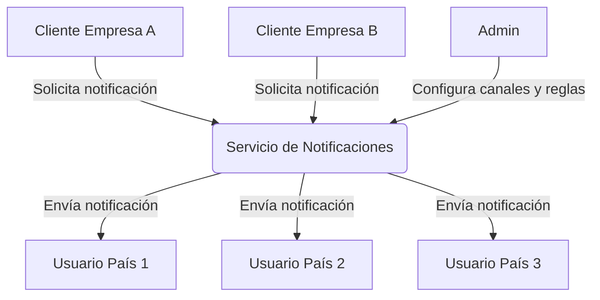
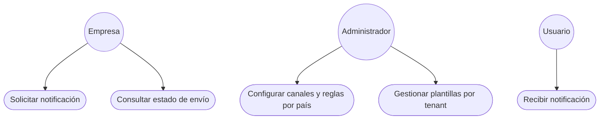

# 3. Contexto y alcance

## 3.1 Contexto empresarial

**Diagrama de flujo multi-tenant y multipaís:**

**Diagrama de casos de uso multi-tenant y multipaís (simulado):**

| Interlocutor | Entrada | Salida |
|--------------|--------|--------|
| App Talma | Solicitud de notificación | Estado de envío |
| Admin | Configuración de plantillas/canales | Confirmación |
| Usuario final | - | Notificación recibida |

## 3.2 Contexto técnico

| Sistema | Canal | Protocolo |
|---------|-------|----------|
| API Gateway | HTTP | REST |
| SQS/SNS | Mensajería | AWS |
| S3 | Archivos | AWS |
| PostgreSQL | Datos | SQL |
