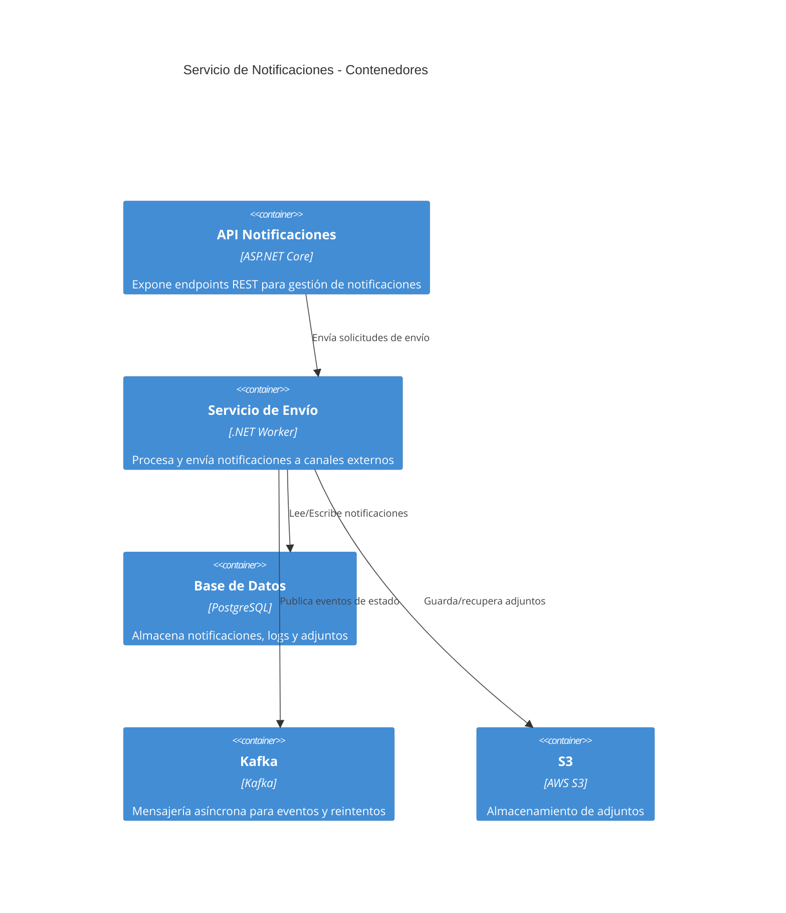

# 5. Vista de bloques de construcción

## 5.1 Diagrama de componentes principales

## 5.2 Descripción de componentes

| Componente         | Descripción                                                      |
|--------------------|------------------------------------------------------------------|
| `API Notificaciones` | Expone endpoints REST para gestión y consulta de notificaciones |
| `Servicio de Envío`  | Procesa y envía notificaciones a canales externos               |
| `Base de Datos`      | Almacena notificaciones, logs y adjuntos                        |
| `Kafka`              | Mensajería asíncrona para eventos y reintentos                  |
| `S3`                 | Almacenamiento de adjuntos                                      |
