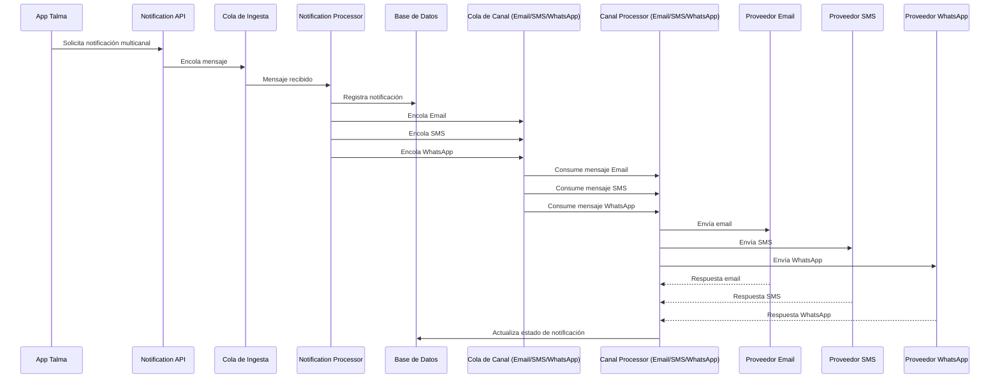
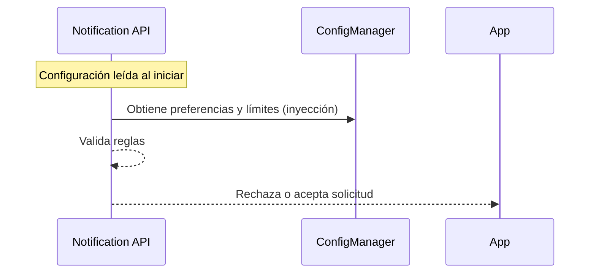
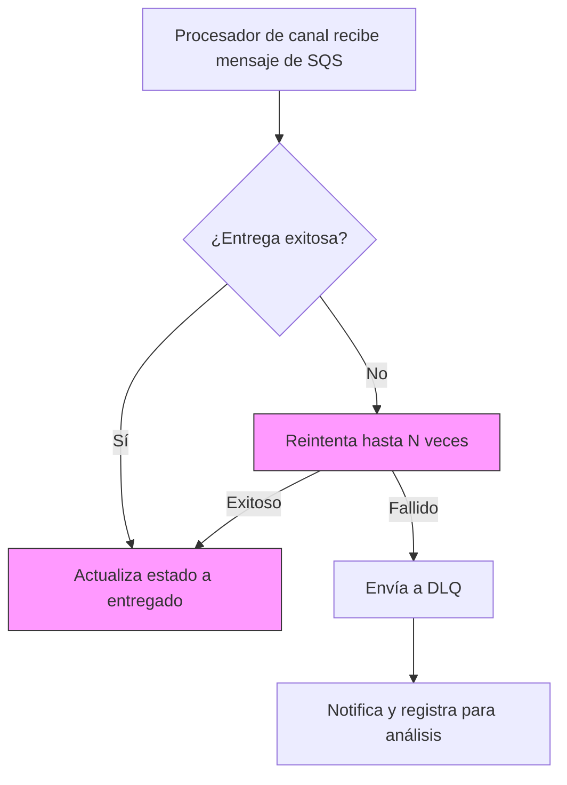
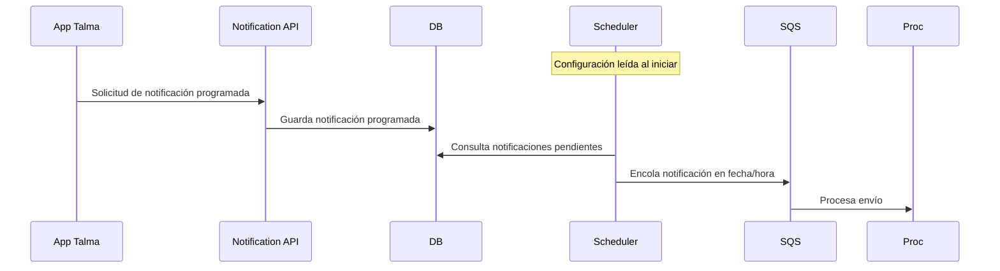
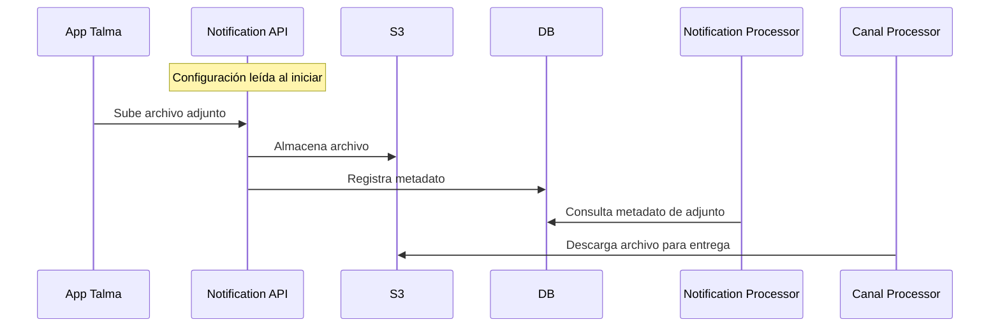
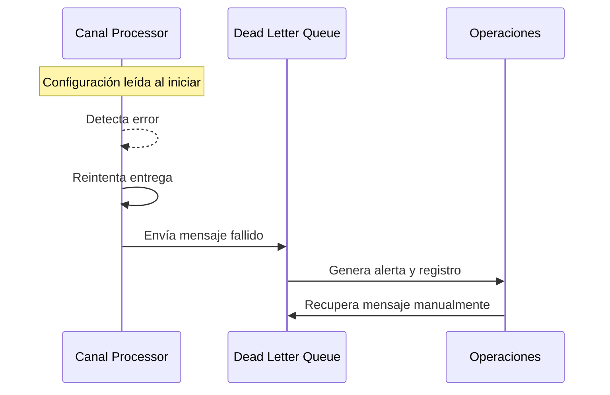

# 6. Vista de tiempo de ejecución

A continuación se describen los principales escenarios del servicio de notificaciones, mostrando cómo cada componente interactúa y cómo la configuración se utiliza en cada caso.

> **Nota transversal:**
> ConfigManager solo provee configuración y credenciales al inicio; los componentes usan directamente DB, S3 y servicios externos.

## 6.1 Envío multicanal (flujo principal)

**Descripción:** El usuario solicita una notificación multicanal. La API valida reglas y límites y encola el mensaje en la Cola de Ingesta. El Notification Processor recibe el mensaje, registra la notificación en la base de datos y la distribuye a la Cola de Canal (Email/SMS/WhatsApp). El Canal Processor (Email/SMS/WhatsApp) consume de la cola, realiza la entrega por el canal correspondiente y actualiza el estado de la notificación en la base de datos. La configuración se lee al inicio y no interviene en el flujo.

**Diagrama de secuencia:**

**Ejemplo:**
Un usuario solicita el envío de una notificación por email, SMS y WhatsApp. El sistema encola el mensaje, el Notification Processor registra la notificación y la distribuye por canal, y el estado de la notificación se actualiza en la base de datos.

## 6.2 Validación de preferencias y límites

**Descripción:** Antes de enviar, se verifica que el canal esté habilitado y no se excedan límites, usando la configuración cargada al inicio.

**Diagrama de secuencia:**

**Ejemplo:**
Un usuario intenta enviar una notificación SMS, pero ha superado el límite diario. El sistema rechaza la solicitud y notifica el motivo.

## 6.3 Manejo de reintentos y Dead Letter Queue (DLQ)

**Descripción:** Si la entrega falla, el sistema reintenta según los parámetros configurados; si no se logra, envía el mensaje a la DLQ para revisión.

**Diagrama de flujo:**

**Ejemplo:**
El proveedor de email está caído. El sistema reintenta 3 veces y luego envía el mensaje a la DLQ para revisión manual.

## 6.4 Programación de notificaciones

**Descripción:** El usuario agenda una notificación; el Scheduler la envía en la fecha indicada usando la configuración inicial.

**Diagrama de secuencia:**

**Ejemplo:**
Un usuario agenda una notificación para el día siguiente. El Scheduler la envía automáticamente en la fecha indicada.

## 6.5 Gestión de adjuntos

**Descripción:** El sistema permite adjuntar archivos a las notificaciones, gestionando su almacenamiento y recuperación. La configuración de almacenamiento y límites es leída al inicio; la interacción con S3 y DB es directa por los componentes.

**Diagrama de secuencia:**

**Ejemplo:**
El usuario adjunta un PDF a la notificación. El archivo se almacena en S3 y el procesador de canal lo descarga para enviarlo por email.

## 6.6 Escenario de error y recuperación

**Descripción:** Ante errores, el sistema reintenta y alerta según la configuración; la recuperación es manual si el mensaje llega a la DLQ.

**Diagrama de secuencia:**

**Ejemplo:**
El proveedor de WhatsApp rechaza la entrega. El sistema reintenta, envía a DLQ y genera una alerta para el equipo de operaciones, que puede recuperar el mensaje manualmente.
