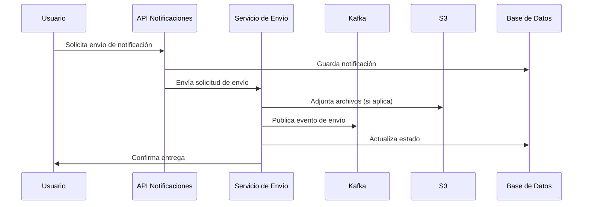

# 6. Vista de tiempo de ejecución

## 6.1 Escenario: Envío de notificación multicanal

## 6.2 Consideraciones

- **Reintentos automáticos** ante fallos de canal
- **Trazabilidad** de cada mensaje
- **Aislamiento multi-tenant** en cada paso
- **Logs estructurados** para auditoría
