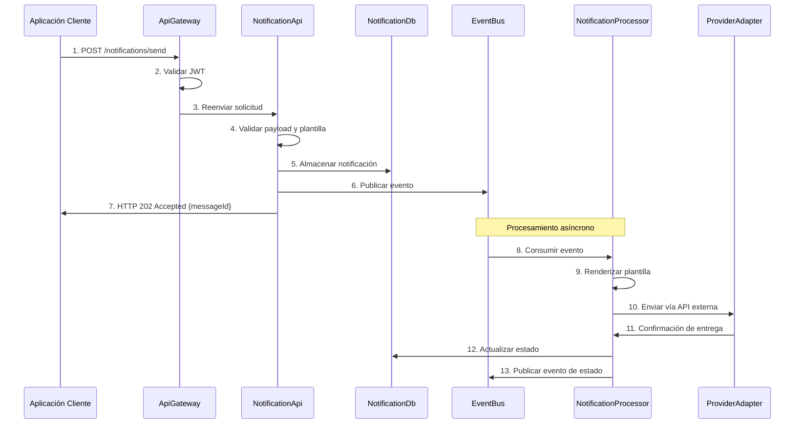
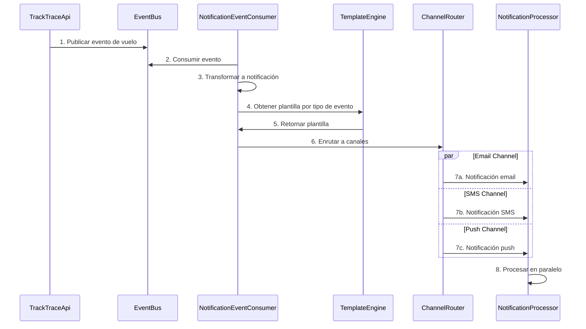
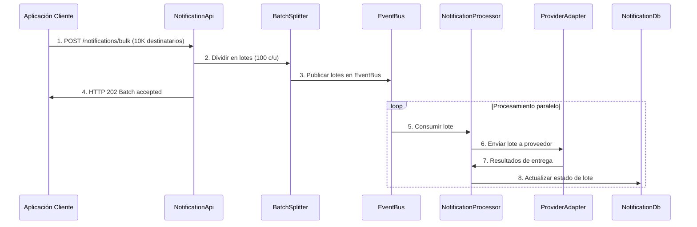
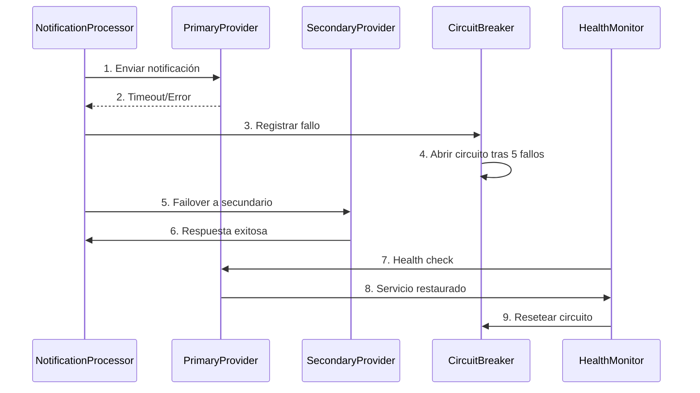

# 6. Vista De Tiempo De Ejecución

## 6.1 Escenarios Principales

| Escenario               | Flujo                              | Componentes         |
|-------------------------|------------------------------------|---------------------|
| Envío inmediato         | API → Orchestrator → Handler       | API, Processor      |
| Envío programado        | API → Repository → Scheduler       | API, Processor      |
| Procesamiento plantilla | Template Engine → Handler          | Processor           |

## 6.2 Patrones De Interacción

| Patrón      | Descripción                   | Tecnología         |
|-------------|------------------------------|--------------------|
| CQRS        | Separación comando/consulta  | API, Processor     |
| Queue       | Cola de mensajes             | `EventBus`         |
| Template    | Procesamiento de plantillas  | Motor de plantillas|

Esta sección describe los principales escenarios de ejecución del sistema, mostrando cómo los componentes interactúan durante el tiempo de ejecución para cumplir con los casos de uso más relevantes arquitectónicamente.

## 6.3 Escenario: Envío Transaccional Individual

### Descripción Del Envío Transaccional

Flujo crítico para notificaciones transaccionales de alta prioridad (confirmaciones, alertas críticas) que requieren entrega garantizada y baja latencia.

### Actores

- Aplicación Cliente: Sistema que origina la notificación
- `ApiGateway`: Punto de entrada con autenticación
- `NotificationApi`: Servicio de ingesta y validación
- `NotificationDb`: Persistencia de notificaciones
- `EventBus`: Intermediario de mensajes para desacoplamiento
- `NotificationProcessor`: Procesador especializado por canal
- `ProviderAdapter`: Adaptador a proveedor externo

### Flujo Principal

### Aspectos Notables

- Respuesta inmediata: API responde en `< 100ms` con acknowledgment
- Procesamiento asíncrono: Desacopla ingesta de entrega
- Idempotencia: Cada request incluye `messageId` para deduplicación
- Observabilidad: Cada paso genera telemetría para tracking

### Métricas De Rendimiento

| Métrica                   | Target                | Medición                |
|---------------------------|----------------------|-------------------------|
| `API Response Time`       | `p95 < 100ms`        | Monitoreo APM           |
| `Event Processing`        | `< 500ms`            | Métricas personalizadas |
| `End-to-End Delivery`     | `< 30s` (transactional) | Métricas de negocio |
| `Capacidad de procesamiento` | `10K req/min/instancia` | Pruebas de carga   |

## 6.4 Escenario: Procesamiento De Eventos Track & Trace

### Descripción Del Procesamiento De Eventos

Flujo automático triggered por eventos del sistema Track & Trace para notificaciones operacionales como actualizaciones de vuelo, cambios de puerta, etc.

### Flujo De Eventos

### Características Especiales

- Event-driven: Triggered automáticamente por eventos externos
- Transformación de datos: Mapping de eventos a formato de notificación
- Multi-canal automático: Routing inteligente según preferencias
- Procesamiento paralelo: Canales procesan simultáneamente

## 6.8 Escenario: Bulk De Notificaciones

### Descripción Del Bulk De Notificaciones

Envío masivo de notificaciones con optimizaciones de batch processing.

### Flujo De Ejecución

### Optimizaciones

- Batch size: 100 recipients por batch
- Parallel workers: 10 procesadores concurrentes
- Provider rotation: Balanceo de carga
- Retry policy: Exponential backoff

## 6.9 Escenario: Failover Y Recovery

### Descripción De Failover Y Recovery

Manejo de fallos de proveedor con failover automático.

### Flujo De Ejecución

### Recovery Policies

- Circuit breaker: 5 fallos consecutivos
- Timeout: 30 segundos por provider
- Health check: Cada 60 segundos
- Auto-recovery: Automático cuando provider responde

## 6.14 Consideraciones Generales

- Reintentos automáticos ante fallos de canal
- Trazabilidad de cada mensaje
- Aislamiento multi-tenant en cada paso
- Logs estructurados para auditoría
