# 6. Vista de tiempo de ejecución

Esta sección describe los principales escenarios de ejecución del sistema, mostrando cómo los componentes interactúan durante el tiempo de ejecución para cumplir con los casos de uso más relevantes arquitectónicamente.

## 6.1 Escenario: Envío Transaccional Individual

### Descripción

Flujo crítico para notificaciones transaccionales de alta prioridad (confirmaciones, alertas críticas) que requieren entrega garantizada y baja latencia.

### Actores

- **Aplicación Cliente:** Sistema que origina la notificación
- **API Gateway:** Punto de entrada con autenticación
- **Notification API:** Servicio de ingesta y validación
- **Kafka:** Message broker para desacoplamiento
- **Channel Processors:** Procesadores especializados por canal
- **External Providers:** Servicios de entrega (SendGrid, Twilio, etc.)

### Flujo Principal

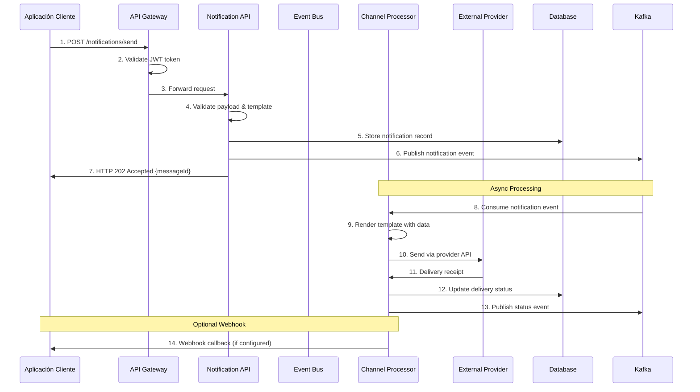

### Aspectos Notables

- **Respuesta inmediata:** API responde en <100ms con acknowledgment
- **Procesamiento asíncrono:** Desacopla ingesta de entrega
- **Idempotencia:** Cada request incluye messageId para deduplicación
- **Observabilidad:** Cada paso genera telemetría para tracking

### Métricas de Rendimiento

| Métrica | Target | Medición |
|---------|--------|----------|
| **API Response Time** | p95 < 100ms | APM monitoring |
| **Event Processing** | < 500ms | Custom metrics |
| **End-to-End Delivery** | < 30s (transactional) | Business metrics |
| **Throughput** | 10K req/min per instance | Load testing |

## 6.2 Escenario: Procesamiento de Eventos Track & Trace

### Descripción

Flujo automático triggered por eventos del sistema Track & Trace para notificaciones operacionales como actualizaciones de vuelo, cambios de puerta, etc.

### Flujo de Eventos

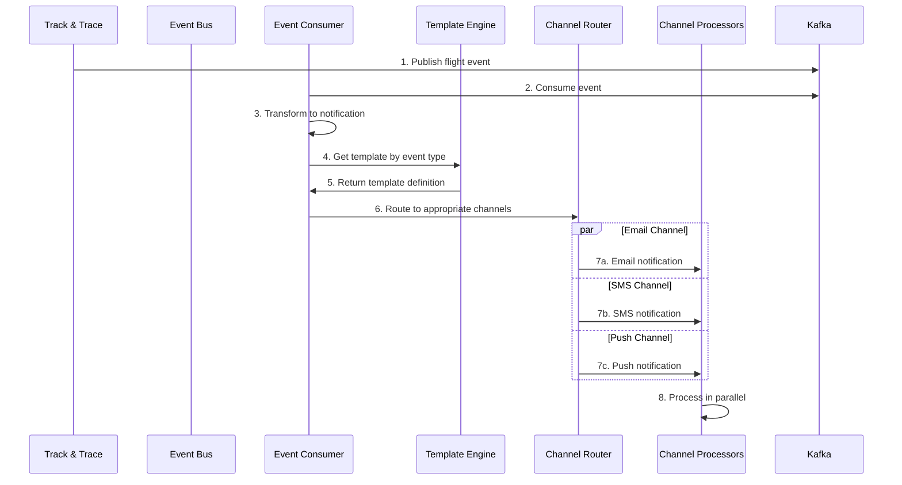

### Características Especiales

- **Event-driven:** Triggered automáticamente por eventos externos
- **Transformación de datos:** Mapping de eventos a formato de notificación
- **Multi-canal automático:** Routing inteligente según preferencias
- **Procesamiento paralelo:** Canales procesan simultáneamente

## 6.3 Escenario: Bulk Processing para Campañas

### Descripción

Procesamiento optimizado para envío masivo de notificaciones promocionales con rate limiting y batch processing.

### Flujo de Batch Processing

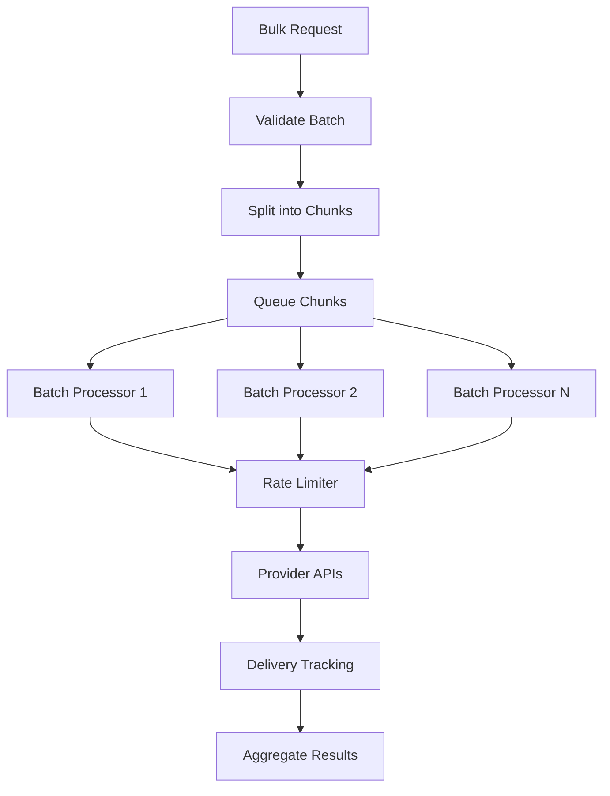

### Optimizaciones Aplicadas

- **Chunking:** División en lotes de 100-1000 recipients
- **Rate Limiting:** Respeto a límites de providers
- **Batch APIs:** Uso de APIs batch cuando están disponibles
- **Circuit Breaker:** Protección contra failures de providers

## 6.4 Escenario: Error Handling y Retry

### Descripción

Manejo de errores y sistema de reintentos con exponential backoff para garantizar entrega.

### Flujo de Resilience

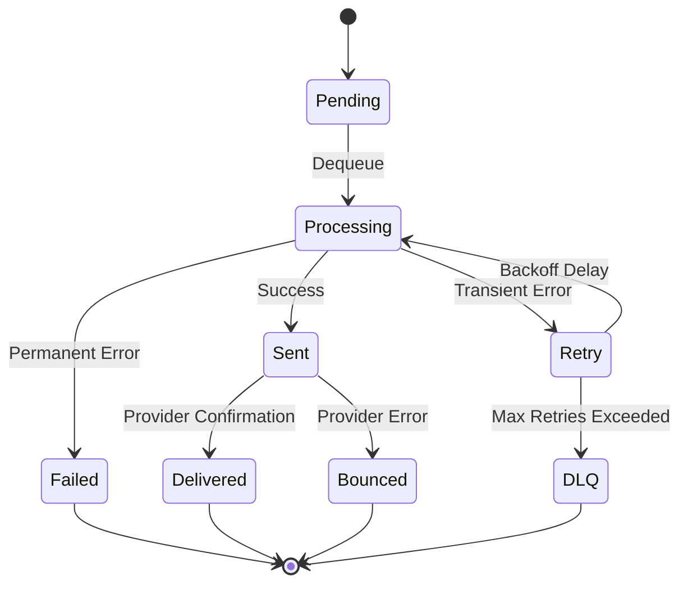

### Políticas de Retry

| Error Type | Retry Count | Backoff | Dead Letter |
|------------|-------------|---------|-------------|
| **Network Timeout** | 3 | Exponential (2s, 4s, 8s) | After 3 failures |
| **Rate Limit** | 5 | Linear (60s intervals) | After 5 failures |
| **Provider Error 5xx** | 3 | Exponential | After 3 failures |
| **Invalid Data** | 0 | None | Immediate |

## 6.5 Escenario: Monitoring y Observabilidad

### Descripción

Flujo de telemetría y métricas para observabilidad del sistema en tiempo real.

### Pipeline de Observabilidad

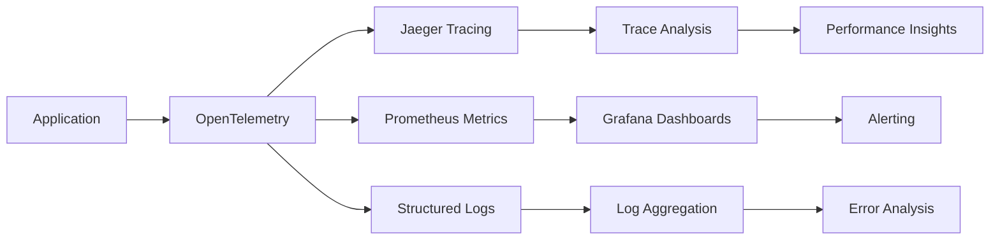

### Métricas Clave Capturadas

- **Request Rate:** Notifications per second by channel
- **Error Rate:** Failed notifications percentage
- **Latency:** p50, p95, p99 processing times
- **Provider Health:** External API availability
- **Queue Depth:** Backlog size by priority

Cada escenario incluye puntos de instrumentación específicos para troubleshooting y optimización continua.

## 6.2 Escenario: Procesamiento Bulk de Notificaciones

### Descripción

Envío masivo de notificaciones con optimizaciones de batch processing.

### Flujo de Ejecución

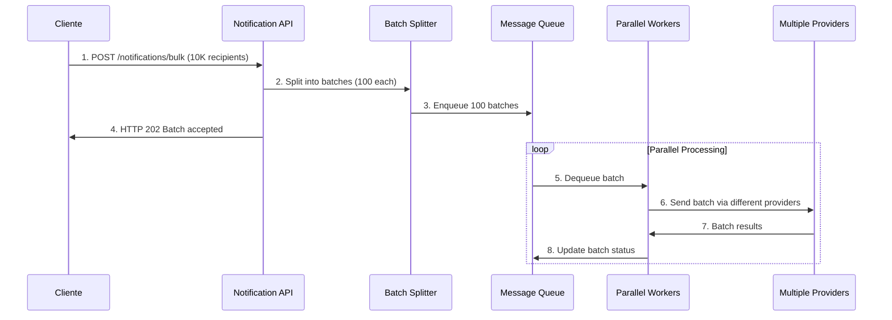

### Optimizaciones

- **Batch size:** 100 recipients per batch
- **Parallel workers:** 10 concurrent processors
- **Provider rotation:** Load balancing
- **Retry policy:** Exponential backoff

## 6.3 Escenario: Failover y Recovery

### Descripción

Manejo de fallos de proveedor con failover automático.

### Flujo de Ejecución

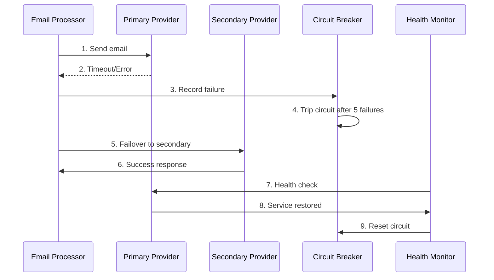

### Recovery Policies

- **Circuit breaker:** 5 fallos consecutivos
- **Timeout:** 30 segundos por provider
- **Health check:** Cada 60 segundos
- **Auto-recovery:** Automático cuando provider responde

## 6.4 Escenario: Multi-canal con Fallback

### Descripción

Envío por canal preferido con fallback automático a canales alternativos.

### Flujo de Ejecución

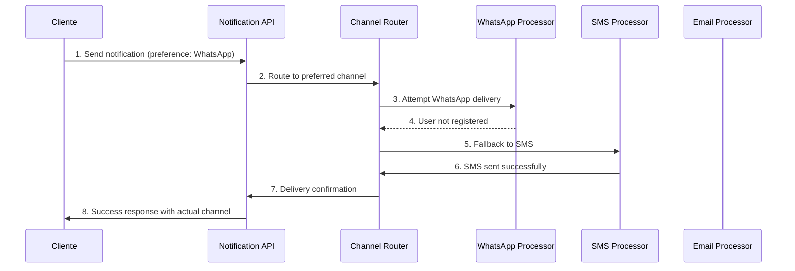

### Fallback Chain

```yaml
Channel Priorities:
  High Priority:
    1. WhatsApp Business
    2. SMS
    3. Email
    4. Push Notification

  Standard Priority:
    1. Email
    2. SMS
    3. Push Notification

  Marketing:
    1. Email
    2. Push Notification
```

## 6.5 Escenario: Template Personalization

### Descripción

Procesamiento de templates con personalización dinámica y localización.

### Flujo de Ejecución

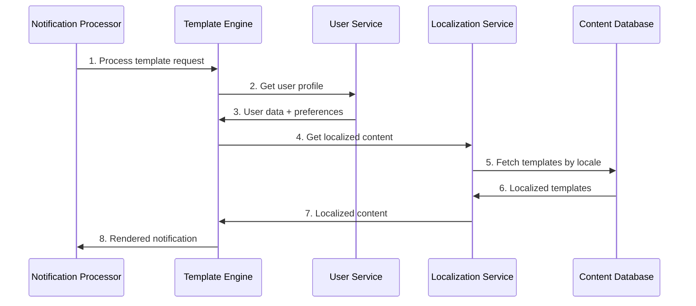

### Personalization Features

- **Dynamic Content:** Variables from user profile
- **Conditional Logic:** if/else based on user attributes
- **Localization:** Multiple languages and regions
- **A/B Testing:** Template variant selection

## 6.6 Escenario: Compliance y Opt-out

### Descripción

Manejo de preferencias de usuario y compliance con regulaciones.

### Flujo de Ejecución

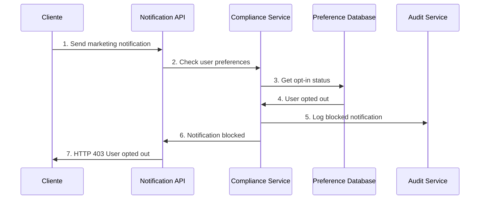

### Compliance Rules

- **GDPR:** Explicit consent required
- **CAN-SPAM:** Easy unsubscribe mechanism
- **TCPA:** SMS consent verification
- **Regional Laws:** Country-specific regulations

## 6.7 Escenario: Analytics y Tracking

### Descripción

Captura de métricas de entrega y engagement para analytics.

### Flujo de Ejecución

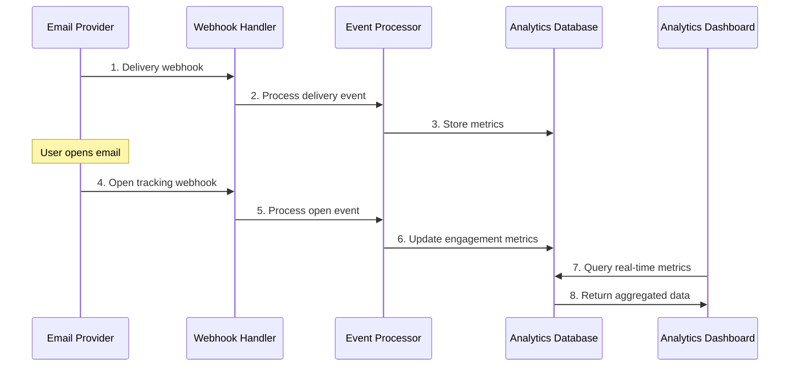

### Tracked Metrics

- **Delivery Rates:** Successful deliveries per channel
- **Open Rates:** Email opens, SMS reads
- **Click Rates:** Link clicks, call-to-action engagement
- **Conversion Rates:** Business goal completions
- **Bounce Rates:** Failed deliveries by reason

## Referencias

- [Message Queue Patterns](https://www.enterpriseintegrationpatterns.com/patterns/messaging/)
- [Circuit Breaker Pattern](https://martinfowler.com/bliki/CircuitBreaker.html)
- [Email Deliverability Best Practices](https://sendgrid.com/blog/email-deliverability-best-practices/)
- [Arc42 Runtime View](https://docs.arc42.org/section-6/)
    S->>S3: Adjunta archivos (si aplica)
    S->>K: Publica evento de envío
    S->>DB: Actualiza estado
    S->>U: Confirma entrega

```

## 6.2 Consideraciones

- **Reintentos automáticos** ante fallos de canal
- **Trazabilidad** de cada mensaje
- **Aislamiento multi-tenant** en cada paso
- **Logs estructurados** para auditoría
