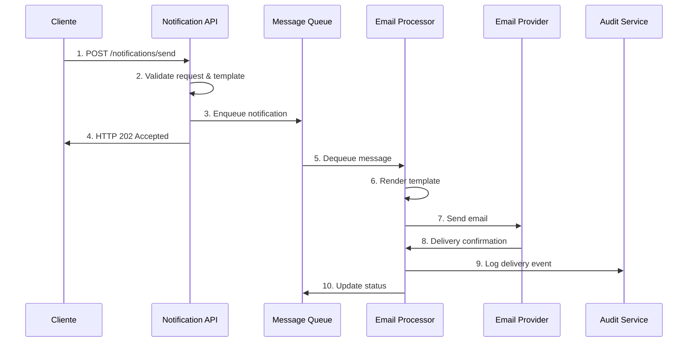
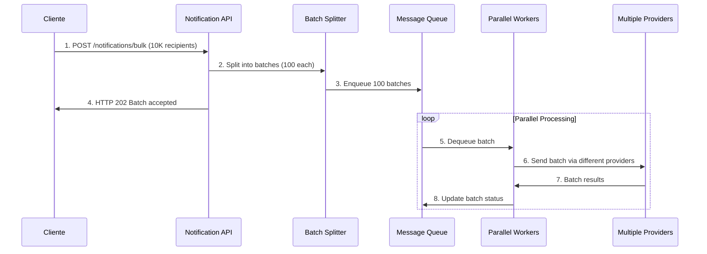
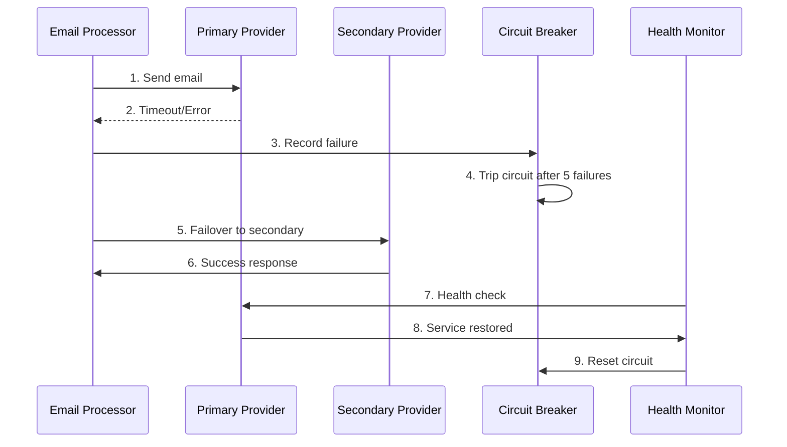
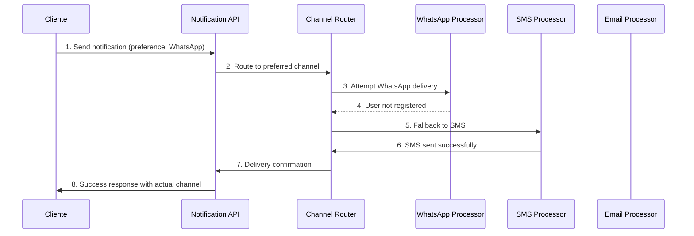
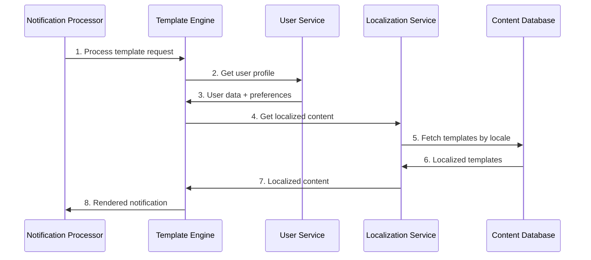
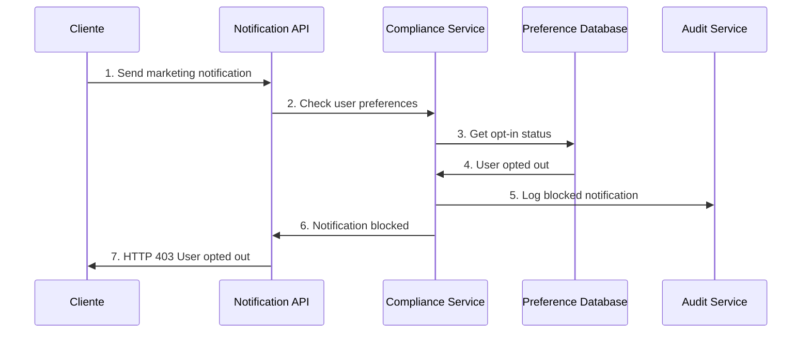
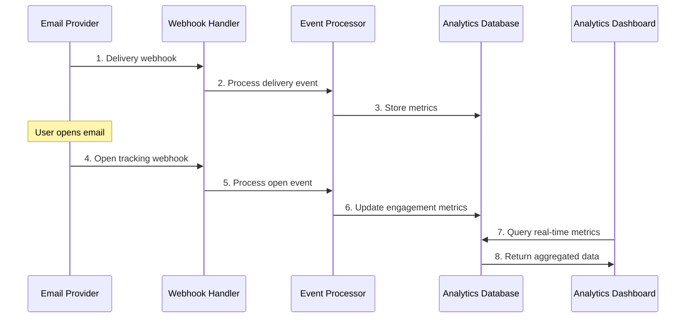

# 6. Vista de tiempo de ejecución

## 6.1 Escenario: Envío de Notificación Email

### Descripción
Flujo completo desde solicitud de notificación hasta entrega y confirmación.

### Participantes
- **Cliente:** Aplicación que solicita el envío
- **Notification API:** API REST de notificaciones
- **Message Queue:** Apache Kafka para encolado
- **Email Processor:** Procesador especializado en email
- **Email Provider:** Proveedor externo (SendGrid/SES)
- **Audit Service:** Servicio de auditoría

### Flujo de Ejecución


### Métricas de Performance
- **Enqueue time:** < 50ms
- **Processing time:** < 200ms
- **End-to-end:** < 5 segundos
- **Throughput:** 1000 notificaciones/segundo

## 6.2 Escenario: Procesamiento Bulk de Notificaciones

### Descripción
Envío masivo de notificaciones con optimizaciones de batch processing.

### Flujo de Ejecución


### Optimizaciones
- **Batch size:** 100 recipients per batch
- **Parallel workers:** 10 concurrent processors
- **Provider rotation:** Load balancing
- **Retry policy:** Exponential backoff

## 6.3 Escenario: Failover y Recovery

### Descripción
Manejo de fallos de proveedor con failover automático.

### Flujo de Ejecución


### Recovery Policies
- **Circuit breaker:** 5 fallos consecutivos
- **Timeout:** 30 segundos por provider
- **Health check:** Cada 60 segundos
- **Auto-recovery:** Automático cuando provider responde

## 6.4 Escenario: Multi-canal con Fallback

### Descripción
Envío por canal preferido con fallback automático a canales alternativos.

### Flujo de Ejecución


### Fallback Chain
```yaml
Channel Priorities:
  High Priority:
    1. WhatsApp Business
    2. SMS
    3. Email
    4. Push Notification

  Standard Priority:
    1. Email
    2. SMS
    3. Push Notification

  Marketing:
    1. Email
    2. Push Notification
```

## 6.5 Escenario: Template Personalization

### Descripción
Procesamiento de templates con personalización dinámica y localización.

### Flujo de Ejecución


### Personalization Features
- **Dynamic Content:** Variables from user profile
- **Conditional Logic:** if/else based on user attributes
- **Localization:** Multiple languages and regions
- **A/B Testing:** Template variant selection

## 6.6 Escenario: Compliance y Opt-out

### Descripción
Manejo de preferencias de usuario y compliance con regulaciones.

### Flujo de Ejecución


### Compliance Rules
- **GDPR:** Explicit consent required
- **CAN-SPAM:** Easy unsubscribe mechanism
- **TCPA:** SMS consent verification
- **Regional Laws:** Country-specific regulations

## 6.7 Escenario: Analytics y Tracking

### Descripción
Captura de métricas de entrega y engagement para analytics.

### Flujo de Ejecución


### Tracked Metrics
- **Delivery Rates:** Successful deliveries per channel
- **Open Rates:** Email opens, SMS reads
- **Click Rates:** Link clicks, call-to-action engagement
- **Conversion Rates:** Business goal completions
- **Bounce Rates:** Failed deliveries by reason

## Referencias
- [Message Queue Patterns](https://www.enterpriseintegrationpatterns.com/patterns/messaging/)
- [Circuit Breaker Pattern](https://martinfowler.com/bliki/CircuitBreaker.html)
- [Email Deliverability Best Practices](https://sendgrid.com/blog/email-deliverability-best-practices/)
- [Arc42 Runtime View](https://docs.arc42.org/section-6/)
    S->>S3: Adjunta archivos (si aplica)
    S->>K: Publica evento de envío
    S->>DB: Actualiza estado
    S->>U: Confirma entrega
```

## 6.2 Consideraciones

- **Reintentos automáticos** ante fallos de canal
- **Trazabilidad** de cada mensaje
- **Aislamiento multi-tenant** en cada paso
- **Logs estructurados** para auditoría
