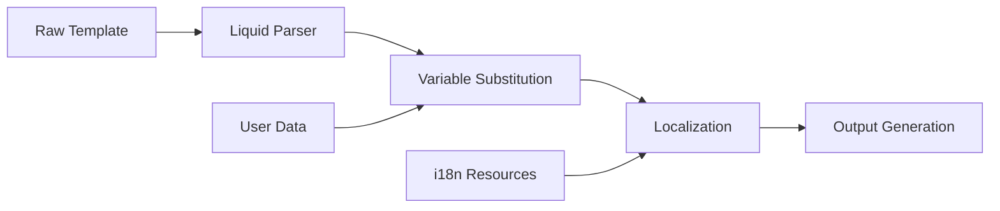

# 8. Conceptos transversales

Esta sección describe los conceptos, patrones y soluciones que abarcan múltiples componentes del sistema de notificaciones, proporcionando coherencia arquitectónica y operacional.

## 8.1 Seguridad y Autenticación

### Modelo de Seguridad Multi-tenant

El sistema implementa un modelo de seguridad robusta que garantiza el aislamiento entre tenants y la protección de datos sensibles.

#### Autenticación y Autorización

**OAuth 2.0 con JWT:**

- Integración con el sistema de identidad corporativo
- Scopes específicos para diferentes operaciones
- Token refresh automático para servicios internos

```json
{
  "sub": "system:notification-processor",
  "aud": "notification-api",
  "scope": "notifications:send notifications:read",
  "tenant": "talma-pe",
  "roles": ["notification-sender"],
  "exp": 1640995200
}
```

#### Control de Acceso Granular

| Rol | Permisos | Ámbito | Limitaciones |
|-----|----------|--------|--------------|
| **notification:admin** | CRUD plantillas, configuración | Global | Todos los tenants |
| **notification:operator** | Envío, consulta estado | Por tenant | Solo su tenant |
| **notification:reader** | Solo lectura | Por tenant | Métricas y logs |
| **system:processor** | Procesamiento interno | Sistema | APIs internas |

#### Cifrado y Protección de Datos

- **En tránsito:** TLS 1.3 para todas las comunicaciones
- **En reposo:** AES-256 para datos sensibles en BD
- **Tokens:** Firmado JWT con RS256
- **Secretos:** Gestión vía HashiCorp Vault o Azure Key Vault

### Multi-tenancy y Aislamiento

**Estrategia de Aislamiento:**

- Separación de esquema por tenant en PostgreSQL
- Filtrado automático en consultas por tenantId
- Storage isolation para attachments
- Rate limiting independiente por tenant

## 8.2 Observabilidad y Monitoreo

### Structured Logging

Implementación de logging estructurado consistente usando Serilog con enriquecimiento contextual.

```csharp
Log.Information("Notification {NotificationId} sent via {Channel} to {RecipientCount} recipients",
    notificationId, channel, recipients.Count);
```

#### Niveles de Log Estándar

| Nivel | Uso | Ejemplos |
|-------|-----|----------|
| **Trace** | Debugging detallado | Method entry/exit, variable values |
| **Debug** | Información de desarrollo | SQL queries, cache hits/misses |
| **Information** | Flujo normal del negocio | Notification sent, template rendered |
| **Warning** | Situaciones recuperables | Rate limit approached, retry attempt |
| **Error** | Errores que afectan funcionalidad | Provider API failure, validation error |
| **Critical** | Errores que comprometen el sistema | Database connection lost, service down |

### Métricas y KPIs

**Métricas Técnicas:**

# Request rate

notification_requests_total{method="POST",status="200"}

# Processing latency

notification_processing_duration_seconds_histogram

# Queue depth

notification_queue_depth_gauge

# Error rate

notification_errors_total{channel="email",error_type="provider_timeout"}

```

**Métricas de Negocio:**

- Delivery success rate por canal
- Average delivery time
- Template usage statistics
- Cost per notification por provider

### Distributed Tracing

Implementación de OpenTelemetry para trazabilidad distribuida:

```csharp
using var activity = ActivitySource.StartActivity("ProcessNotification");
activity?.SetTag("notification.id", notificationId);
activity?.SetTag("notification.channel", channel);
activity?.SetTag("tenant.id", tenantId);
```

## 8.3 Resilience y Error Handling

### Patrones de Resilience

#### Circuit Breaker Pattern

Protección contra failures en cascada de providers externos:

```csharp
var circuitBreaker = Policy
    .Handle<HttpRequestException>()
    .CircuitBreakerAsync(5, TimeSpan.FromMinutes(1));
```

#### Retry with Exponential Backoff

```csharp
var retryPolicy = Policy
    .Handle<TransientException>()
    .WaitAndRetryAsync(
        retryCount: 3,
        sleepDurationProvider: retryAttempt =>
            TimeSpan.FromSeconds(Math.Pow(2, retryAttempt))
    );
```

#### Timeout Policies

| Operación | Timeout | Justificación |
|-----------|---------|---------------|
| **Provider API calls** | 30s | Balance entre reliability y responsiveness |
| **Database operations** | 10s | Prevent connection pool exhaustion |
| **Template rendering** | 5s | Complex templates shouldn't block processing |
| **File uploads** | 2min | Large attachments in campaigns |

### Error Classification

```csharp
public enum ErrorCategory
{
    Transient,      // Network timeout, temporary provider issue
    Permanent,      // Invalid email, template not found
    Configuration,  // Missing API key, invalid settings
    Business        // User preferences, compliance violation
}
```

## 8.4 Multi-tenancy Implementation

### Data Isolation Strategy

**Schema per Tenant:**

```sql
-- Each tenant gets isolated schema
CREATE SCHEMA tenant_talma_pe;
CREATE SCHEMA tenant_talma_ec;

-- Automatic filtering in repositories
SELECT * FROM notifications
WHERE tenant_id = @currentTenantId;

```

### Configuration Management

**Tenant-specific Settings:**

```json
{
  "tenantId": "talma-pe",
  "channels": {
    "email": {
      "provider": "sendgrid",
      "apiKey": "vault://secrets/talma-pe/sendgrid",
      "templates": {
        "default": "peru-branding-template"
      }
    },
    "sms": {
      "provider": "twilio",
      "phoneNumbers": ["+51900123456"]
    }
  },
  "compliance": {
    "gdpr": false,
    "local_regulations": ["peru-data-protection-law"]
  }
}
```

## 8.5 Template Engine y Localization

### Template Processing Pipeline



### Internationalization Support

**Template Structure:**

```liquid


{{ greeting }}

{{ 'flight.status' | t: flight: flight_number, status: current_status }}
```

**Resource Files:**

```json
// es-PE.json
{
  "email.greeting": "Hola {{name}},",
  "flight.status": "Tu vuelo {{flight}} está {{status}}"
}

// en-US.json
{
  "email.greeting": "Hello {{name}},",
  "flight.status": "Your flight {{flight}} is {{status}}"

}
```

## 8.6 Performance y Caching

### Caching Strategy

**Multi-level Caching:**

```csharp
// L1: In-memory cache for frequently accessed templates
public async Task<Template> GetTemplateAsync(string templateId)
{
    return await _memoryCache.GetOrCreateAsync(templateId,
        factory => _repository.GetTemplateAsync(templateId),
        expiration: TimeSpan.FromMinutes(30));
}


// L2: Redis for rendered content
public async Task<string> GetRenderedContentAsync(string cacheKey)
{
    return await _distributedCache.GetStringAsync(cacheKey);
}
```

**Cache Invalidation:**

- Template updates trigger cache eviction
- Tenant configuration changes clear related caches

### Rate Limiting

**Adaptive Rate Limiting:**

```csharp
public class TenantRateLimiter
{
    private readonly Dictionary<string, int> _tenantLimits = new()
    {
        ["enterprise"] = 10000,  // requests per minute

        ["standard"] = 1000,
        ["basic"] = 100
    };
}
```

## 8.7 Deployment y Configuración

### Configuration Management

**Hierarchical Configuration:**

```yaml
# Base configuration
logging:
  level: Information

# Environment-specific
development:
  logging:
    level: Debug
  providers:
    email:
      mock: true

production:
  providers:
    email:
      sendgrid:
        api_key: ${SENDGRID_API_KEY}
```

### Health Checks `<user@dominio.com>`

```csharp
services.AddHealthChecks()
    .AddCheck<DatabaseHealthCheck>("database")
    .AddCheck<KafkaHealthCheck>("kafka")
    .AddCheck<RedisHealthCheck>("cache")
```

Estos conceptos transversales aseguran que el sistema opere de manera consistente, segura y observable, proporcionando una base sólida para el crecimiento y la evolución futura.
  "mensaje": "Error al enviar correo",
  "detalle": { "email": "<user@dominio.com>" }
}

```

Esto facilita la detección proactiva de incidentes, el análisis de causa raíz y la mejora continua de la operación.

## 8.3 Escalabilidad

El sistema está diseñado para escalar horizontalmente, permitiendo manejar incrementos de carga sin degradar el servicio. Los principales mecanismos son:

- **Desacoplamiento**: Uso de colas y procesadores desacoplados para distribuir la carga y evitar cuellos de botella.
- **Fan-out SNS/SQS**: Distribución de eventos a múltiples consumidores de forma eficiente.
- **Particionado y sharding**: División de datos y procesamiento por tenant, país o tipo de evento, permitiendo crecimiento lineal.

Esto asegura capacidad de crecimiento y alta disponibilidad en todos los bloques críticos.

## 8.4 Fiabilidad

La fiabilidad se garantiza mediante estrategias como:

- **Reintentos automáticos**: Ante fallos temporales en APIs o colas, los servicios reintentan operaciones según políticas configurables.
- **DLQ (Dead Letter Queue)**: Los mensajes no procesados tras varios intentos se almacenan en colas especiales para análisis posterior.
- **Backups y replicación multi-AZ**: Los datos críticos se respaldan periódicamente y se replican en varias zonas de disponibilidad para tolerancia a fallos.

Estas prácticas minimizan la pérdida de información y aseguran la continuidad operativa ante incidentes en cualquier componente.

## 8.5 Mantenibilidad

La mantenibilidad se logra mediante:

- **Arquitectura modular y DDD**: Separación clara de dominios y responsabilidades, facilitando la comprensión y evolución.
- **Documentación y pruebas automatizadas**: Cada módulo incluye documentación técnica y pruebas unitarias/integración, lo que reduce el costo de cambios y errores.

Esto permite incorporar nuevas funcionalidades o corregir errores de forma ágil y segura en todos los bloques de construcción.

## 8.6 Multi-tenant

El soporte multi-tenant permite que múltiples clientes o empresas utilicen el sistema de forma aislada y segura. Se implementa mediante:

- **Separación lógica de datos y recursos**: Cada tenant tiene su propio espacio lógico en la base de datos y recursos asociados.
- **Configuración y personalización por tenant**: Permite adaptar reglas, canales y notificaciones a cada cliente.
- **Aislamiento de datos**: Mecanismos técnicos y lógicos previenen accesos cruzados entre tenants.

Esto garantiza privacidad, personalización y cumplimiento de acuerdos contractuales.

## 8.7 Multipaís

El sistema está preparado para operar en múltiples países, adaptándose a normativas, idiomas, formatos y requisitos legales locales. Se implementa mediante:

- **Localización y formatos regionales**: Soporte de idiomas, monedas, zonas horarias y formatos de fecha/hora.
- **Configuración de canales y reglas por país**: Permite definir lógicas y flujos específicos según la región.
- **Cumplimiento legal**: Adaptación a regulaciones locales (protección de datos, retención, notificaciones legales).

Esto asegura cumplimiento regulatorio y una experiencia adecuada para cada región donde opera el sistema.
