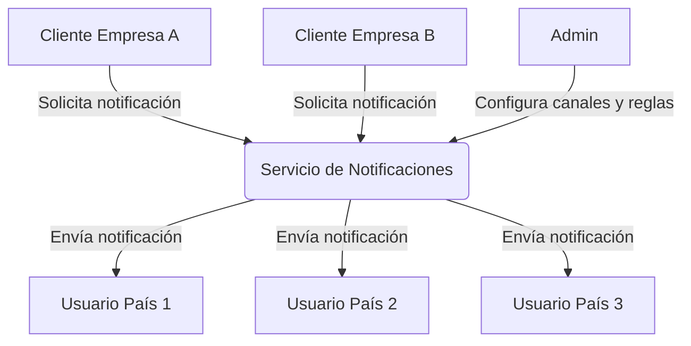
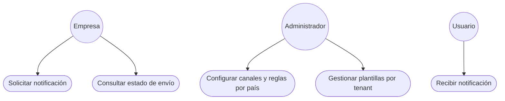
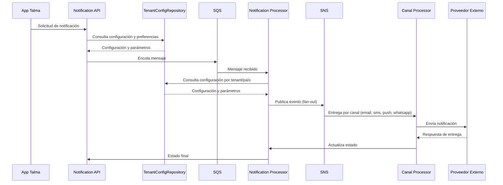
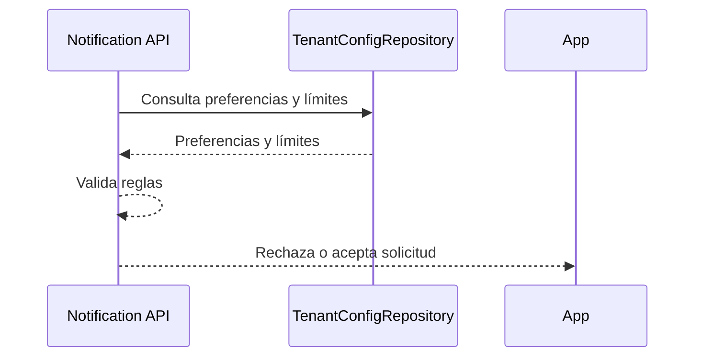
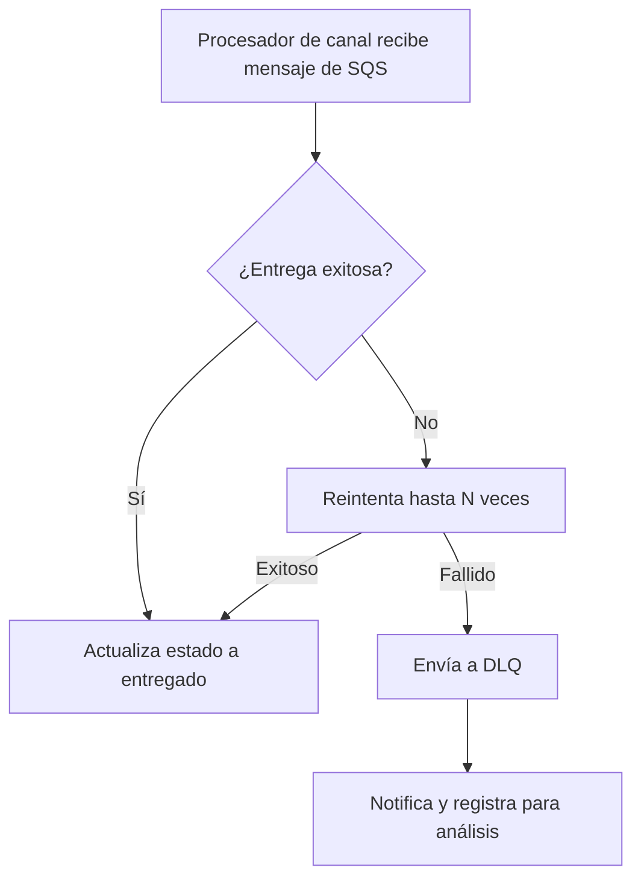
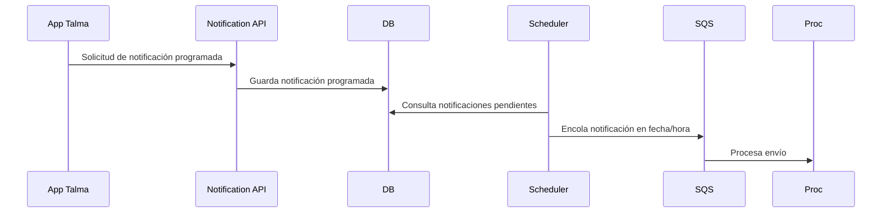
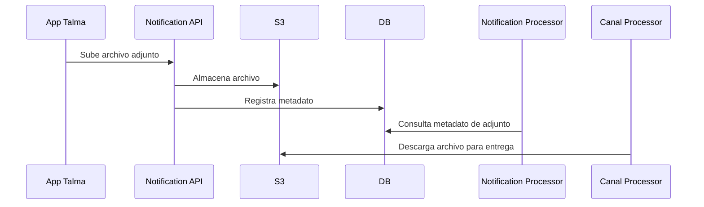
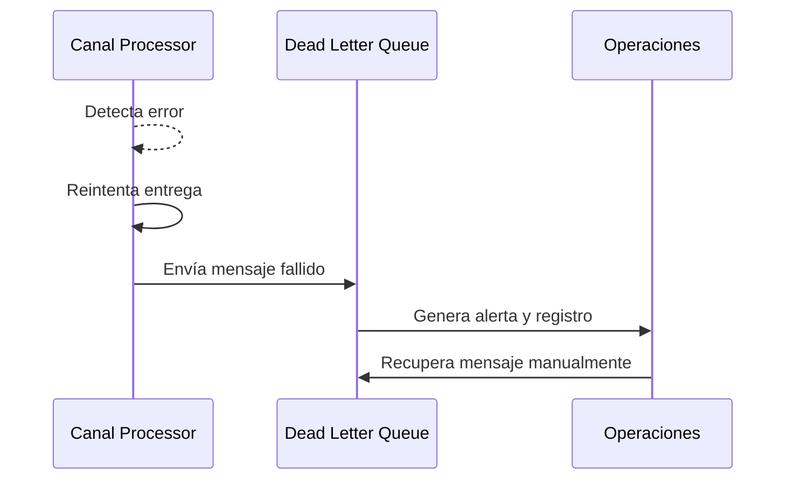

# Documentación de Arquitectura - Servicio de Notificaciones (arc42)

## 1. Introducción y objetivos

El Servicio de Notificaciones es una plataforma multi-tenant y multipaís para el envío de mensajes por múltiples canales (email, SMS, WhatsApp, push, in-app), gestionando adjuntos y programación de envíos. Permite operar para varios clientes/empresas y países, adaptándose a configuraciones regionales y normativas locales.

### 1.1 Descripción general de los requisitos

| Requisito | Descripción |
|-----------|-------------|
| Multicanal | Envío por email, SMS, WhatsApp, push, in-app |
| Adjuntos | Soporte para archivos adjuntos |
| Programación | Agendar envíos futuros |
| Preferencias | Opt-in/opt-out, límites diarios, horarios |
| Reintentos | Automáticos ante fallos |
| Extensibilidad | Integración de nuevos canales/proveedores |
| Multi-tenant | Múltiples clientes/empresas con aislamiento de datos |
| Multipaís | Operación en varios países con configuración regional |
| Tipos de notificación | Transaccionales, promocionales, alertas |
| Limitación de velocidad | Control de mensajes promocionales por usuario/día |
| Escalabilidad | Millones de notificaciones por minuto |
| Alta disponibilidad y confiabilidad | Entrega garantizada, tolerancia a fallos |
| Baja latencia | Entrega oportuna |
| Almacenamiento eficiente | Bases relacionales, NoSQL y blobs para adjuntos |

### 1.2 Objetivos de calidad

| Objetivo | Descripción |
|----------|-------------|
| Escalabilidad | Manejo de picos y crecimiento horizontal |
| Disponibilidad | Alta disponibilidad y tolerancia a fallos |
| Seguridad | Autenticación, autorización y privacidad |
| Fiabilidad | Entrega garantizada y trazabilidad |
| Mantenibilidad | Modularidad y facilidad de evolución |
| Multi-tenant | Separación lógica y segura de datos por cliente |
| Multipaís | Adaptabilidad a normativas y configuraciones regionales |

### 1.3 Partes interesadas

| Rol/Nombre | Contacto | Expectativas |
|------------|---------|--------------|
| Product Owner | <product@talma.com> | Plataforma robusta, flexible, multi-tenant y multipaís |
| Equipo Dev | <dev@talma.com> | Facilidad de mantenimiento y evolución |
| Operaciones | <ops@talma.com> | Monitoreo, alertas y recuperación |
| Usuarios finales | - | Recepción confiable y segura de notificaciones |
| Clientes corporativos | - | Aislamiento de datos y configuración personalizada |
| Administradores regionales | - | Cumplimiento de normativas locales |

## 2. Restricciones de la arquitectura

| Restricción | Descripción |
|-------------|-------------|
| .NET 8 y C# | Tecnología principal |
| AWS SQS/SNS/S3 | Colas y almacenamiento |
| PostgreSQL | Base de datos principal |
| YARP | API Gateway |
| Políticas de seguridad | Cumplimiento corporativo |
| Serverless preferido | Servicios gestionados |
| Multi-tenant | Separación lógica de datos y recursos |
| Multipaís | Configuración regional y soporte de localización |

## 3. Contexto y alcance

### 3.1 Contexto empresarial

**Diagrama de flujo multi-tenant y multipaís:**



**Diagrama de casos de uso multi-tenant y multipaís (simulado):**



| Interlocutor | Entrada | Salida |
|--------------|--------|--------|
| App Talma | Solicitud de notificación | Estado de envío |
| Admin | Configuración de plantillas/canales | Confirmación |
| Usuario final | - | Notificación recibida |

### 3.2 Contexto técnico

| Sistema | Canal | Protocolo |
|---------|-------|----------|
| API Gateway | HTTP | REST |
| SQS/SNS | Mensajería | AWS |
| S3 | Archivos | AWS |
| PostgreSQL | Datos | SQL |

## 4. Estrategia de solución

| Objetivo de calidad | Enfoque de solución |
|---------------------|--------------------|
| Escalabilidad | Procesadores por canal, colas desacopladas, escalabilidad horizontal |
| Disponibilidad | Serverless, DLQ, multi-AZ, replicación y balanceo de carga |
| Seguridad | OAuth2, RBAC, rate limiting |
| Fiabilidad | Reintentos, logs, métricas, DLQ |
| Mantenibilidad | Modularidad, patrones DDD |
| Multi-tenant | Separación de datos y configuración por cliente |
| Multipaís | Adaptación de canales y reglas por país |
| Almacenamiento eficiente | Bases relacionales, NoSQL y blobs para adjuntos, caché para preferencias |
| Estrategia de archivado | Para datos históricos |

## 5. Vista de bloques de construcción

### 5.1 Sistema general (Whitebox)

**Diagrama del sistema de notificaciones:**


### 5.1.1 Diagramas de componentes detallados

- **Notification API:**
  
- **Notification Processor:**
  
- **Email Processor:**
  
- **SMS Processor:**
  
- **Push Processor:**
  
- **WhatsApp Processor:**
  
- **Scheduler:**
  

### 5.2 Modelo de datos principal

A continuación se describe la estructura de las tablas principales del sistema de notificaciones:

### 5.2.1 Estructura de tablas principales

#### notificaciones

Representa cada notificación enviada por el sistema, incluyendo metadatos, estado y trazabilidad.

| campo               | tipo      | descripción                                      |
|---------------------|-----------|--------------------------------------------------|
| notificacion_id     | uuid      | Identificador único de la notificación           |
| tenant_id           | uuid      | Identificador del cliente/empresa (tenant)       |
| codigo_pais         | text      | Código del país de destino (ej: "PE", "CO")     |
| canal               | text      | Canal de envío (email, sms, whatsapp, etc.)      |
| contenido           | jsonb     | Contenido estructurado del mensaje               |
| estado              | text      | Estado actual (pendiente, enviado, fallido, etc.)|
| fecha_envio         | timestamp | Fecha y hora programada de envío                 |
| fecha_creacion      | timestamp | Fecha de creación de la notificación             |
| fecha_actualizacion | timestamp | Fecha de última actualización                    |

#### adjuntos

Registra los archivos adjuntos asociados a notificaciones, permitiendo trazabilidad y gestión de archivos.

| campo               | tipo      | descripción                                      |
|---------------------|-----------|--------------------------------------------------|
| adjunto_id          | uuid      | Identificador único del adjunto                  |
| notificacion_id     | uuid      | Referencia a la notificación asociada            |
| tenant_id           | uuid      | Identificador del cliente/empresa (tenant)       |
| codigo_pais         | text      | Código del país (ej: "PE", "CO")               |
| nombre_archivo      | text      | Nombre del archivo adjunto                       |
| url                 | text      | URL de almacenamiento del archivo                |
| tipo                | text      | Tipo de archivo (pdf, imagen, etc.)              |
| fecha_creacion      | timestamp | Fecha de creación del adjunto                    |
| fecha_actualizacion | timestamp | Fecha de última actualización                    |

#### preferencias_usuario

Almacena las preferencias de cada usuario para la recepción de notificaciones, canales y límites.

| campo               | tipo      | descripción                                      |
|---------------------|-----------|--------------------------------------------------|
| preferencia_id      | uuid      | Identificador único de la preferencia            |
| usuario_id          | uuid      | Identificador del usuario                        |
| tenant_id           | uuid      | Identificador del cliente/empresa (tenant)       |
| canales_preferidos  | text[]    | Lista de canales preferidos                      |
| opt_in              | boolean   | Indica si el usuario acepta recibir notificaciones|
| limites             | jsonb     | Configuración de límites diarios/horarios        |
| fecha_creacion      | timestamp | Fecha de creación de la preferencia              |
| fecha_actualizacion | timestamp | Fecha de última actualización                    |

#### canales

Define los canales disponibles por cliente y país, junto con su configuración específica.

| campo               | tipo      | descripción                                      |
|---------------------|-----------|--------------------------------------------------|
| canal_id            | uuid      | Identificador único del canal                    |
| tenant_id           | uuid      | Identificador del cliente/empresa (tenant)       |
| codigo_pais         | text      | Código del país (ej: "PE", "CO")               |
| nombre              | text      | Nombre del canal                                 |
| tipo                | text      | Tipo de canal (email, sms, etc.)                 |
| configuracion       | jsonb     | Configuración específica del canal                |
| fecha_creacion      | timestamp | Fecha de creación del canal                      |
| fecha_actualizacion | timestamp | Fecha de última actualización                    |

#### plantillas

Gestiona las plantillas de mensajes por cliente y país, con variables parametrizables para personalización.

| campo               | tipo      | descripción                                      |
|---------------------|-----------|--------------------------------------------------|
| plantilla_id        | uuid      | Identificador único de la plantilla              |
| tenant_id           | uuid      | Identificador del cliente/empresa (tenant)       |
| codigo_pais         | text      | Código del país (ej: "PE", "CO")               |
| nombre              | text      | Nombre de la plantilla                           |
| contenido           | text      | Contenido base de la plantilla                   |
| variables           | jsonb     | Variables disponibles para personalización       |
| fecha_creacion      | timestamp | Fecha de creación de la plantilla                |
| fecha_actualizacion | timestamp | Fecha de última actualización                    |

#### configuracion_tenant

Contiene la configuración general de cada cliente/empresa (tenant), incluyendo estado y parámetros regionales.

| campo               | tipo      | descripción                                      |
|---------------------|-----------|--------------------------------------------------|
| tenant_id           | uuid      | Identificador único del tenant                   |
| nombre              | text      | Nombre del cliente/empresa                       |
| codigo_pais         | text      | Código del país (ej: "PE", "CO")               |
| configuracion       | jsonb     | Configuración general y parámetros regionales     |
| estado              | text      | Estado del tenant (activo, inactivo, etc.)       |
| fecha_creacion      | timestamp | Fecha de creación del tenant                     |
| fecha_actualizacion | timestamp | Fecha de última actualización                    |

### 5.3 Endpoints principales

A continuación se describen los endpoints REST principales del sistema de notificaciones:

| Método | Ruta                                 | Descripción                              | Parámetros clave                |
|--------|--------------------------------------|------------------------------------------|---------------------------------|
| POST   | /api/v1/notifications                | Crear una nueva notificación             | tenant_id, país, canal, contenido|
| GET    | /api/v1/notifications/{id}           | Consultar estado de una notificación     | id, tenant_id                   |
| GET    | /api/v1/notifications                | Listar notificaciones                    | tenant_id, país, canal, estado  |
| POST   | /api/v1/notifications/schedule       | Programar notificación                   | tenant_id, país, canal, fecha_envio, contenido |
| POST   | /api/v1/attachments                  | Subir adjunto                            | tenant_id, país, archivo        |
| GET    | /api/v1/attachments/{id}             | Consultar metadatos de adjunto           | id, tenant_id                   |
| GET    | /api/v1/attachments/{id}/download    | Descargar adjunto                        | id, tenant_id                   |

### Definición de campos del payload de notificación

La siguiente tabla describe todos los campos posibles en el payload multicanal recomendado:

| Campo                        | Tipo                | Descripción                                                        |
|------------------------------|---------------------|--------------------------------------------------------------------|
| requestId                    | string              | Identificador único de la solicitud                                |
| notificationId               | string              | Identificador único de la notificación                             |
| timestamp                    | string (ISO 8601)   | Fecha y hora de creación de la solicitud o mensaje                 |
| notificationType             | string              | Tipo de notificación (ej: transactional, promotional, alert)       |
| channels                     | array[string]       | Canales por los que se enviará la notificación                     |
| recipient                    | objeto              | Información del destinatario                                       |
| recipient.userId             | string              | Identificador del usuario destinatario                             |
| recipient.email              | string              | Correo electrónico del destinatario                                |
| recipient.phone              | string              | Teléfono del destinatario (para SMS/WhatsApp)                      |
| message                      | objeto              | Contenido principal de la notificación                             |
| message.subject              | string              | Asunto del mensaje (email)                                         |
| message.body                 | objeto              | Cuerpo principal del mensaje (email, html/plainText)               |
| message.body.html            | string              | Contenido HTML del mensaje (correo electrónico)                    |
| message.body.plainText       | string              | Contenido en texto plano del mensaje (correo electrónico)          |
| message.attachments          | array[objeto]       | Archivos adjuntos (url, fileName, mimeType)                        |
| message.sms                  | objeto              | Contenido específico para SMS                                      |
| message.sms.text             | string              | Texto para el canal SMS                                            |
| message.push                 | objeto              | Detalle de la notificación push                                    |
| message.push.title           | string              | Título de la notificación push                                     |
| message.push.body            | string              | Cuerpo de la notificación push                                     |
| message.push.icon            | string              | URL del ícono para la notificación push                            |
| message.push.action          | objeto              | Acción asociada a la notificación push                             |
| message.push.action.type     | string              | Tipo de acción (ej: viewOrder)                                     |
| message.push.action.url      | string              | URL asociada a la acción                                           |
| message.whatsapp             | objeto              | Contenido específico para WhatsApp                                 |
| message.whatsapp.text        | string              | Texto para el canal WhatsApp                                       |
| schedule                     | objeto              | Información de programación de envío                               |
| schedule.sendAt              | string (ISO 8601)   | Fecha y hora programada para el envío                              |
| metadata                     | objeto              | Metadatos adicionales para control y priorización                  |
| metadata.priority            | string              | Prioridad de la notificación (ej: high, normal, low)               |
| metadata.retries             | integer             | Número de reintentos permitidos                                    |
| metadata.sentBy              | string              | Servicio o sistema que envió el mensaje                            |
| metadata.templateId          | string              | Identificador de la plantilla utilizada                            |

#### Ejemplo de payload multicanal

```json
{
  "requestId": "solicitud456",
  "notificationId": "notif78910",
  "timestamp": "2025-07-29T10:30:00Z",
  "notificationType": "operacional",
  "channels": ["email", "sms", "push", "whatsapp"],
  "recipient": {
    "userId": "empleado321",
    "email": "operaciones@talma.com",
    "phone": "+51123456789"
  },
  "message": {
    "subject": "Confirmación de despacho de carga - Guía 987654",
    "body": {
      "html": "<html><body><h1>Despacho confirmado</h1><p>La carga con guía 987654 ha sido despachada exitosamente. Consulte el estado en el sistema Talma Cargo.</p></body></html>",
      "plainText": "Despacho confirmado. La carga con guía 987654 ha sido despachada exitosamente. Consulte el estado en el sistema Talma Cargo."
    },
    "attachments": [
      {
        "url": "https://talma.com/documentos/guia987654.pdf",
        "fileName": "guia987654.pdf",
        "mimeType": "application/pdf"
      }
    ],
    "sms": {
      "text": "Despacho confirmado. Guía 987654. Verifique en Talma Cargo."
    },
    "push": {
      "title": "Despacho de carga confirmado",
      "body": "La carga con guía 987654 ha sido despachada. Consulte el sistema Talma Cargo.",
      "icon": "https://talma.com/imagenes/icono-carga.png",
      "action": {
        "type": "verGuia",
        "url": "https://talma.com/cargo/guia/987654"
      }
    },
    "whatsapp": {
      "text": "Talma: Despacho confirmado para la guía 987654. Más detalles en el sistema."
    }
  },
  "schedule": {
    "sendAt": "2025-07-29T11:00:00Z"
  },
  "metadata": {
    "priority": "alta",
    "retries": 2,
    "sentBy": "SistemaCargo",
    "templateId": "confirmacionDespacho"
  }
}
```

#### Ejemplo de payload multicanal con reemplazo de parámetros

```json
{
  "requestId": "solicitud789",
  "notificationId": "notif112233",
  "timestamp": "2025-07-29T12:00:00Z",
  "notificationType": "operacional",
  "channels": ["email", "sms", "push"],
  "recipient": {
    "userId": "empleado654",
    "email": "seguridad@talma.com",
    "phone": "+51198765432"
  },
  "message": {
    "subject": "Alerta de acceso restringido - Área {{area}}",
    "body": {
      "html": "<html><body><h1>Alerta de acceso</h1><p>El empleado {{nombre_empleado}} ha intentado acceder al área {{area}} el {{fecha}}.</p></body></html>",
      "plainText": "Alerta: El empleado {{nombre_empleado}} intentó acceder a {{area}} el {{fecha}}."
    },
    "variables": {
      "nombre_empleado": "Juan Pérez",
      "area": "Carga Internacional",
      "fecha": "2025-07-29 11:55"
    },
    "sms": {
      "text": "Alerta: {{nombre_empleado}} intentó acceder a {{area}} el {{fecha}}."
    },
    "push": {
      "title": "Acceso restringido detectado",
      "body": "{{nombre_empleado}} intentó acceder a {{area}} el {{fecha}}."
    }
  },
  "metadata": {
    "priority": "alta",
    "templateId": "alertaAcceso",
    "sentBy": "SistemaSeguridad"
  }
}
```

## 6. Vista de tiempo de ejecución

A continuación se describen los escenarios más relevantes para el servicio de notificaciones, cubriendo los principales flujos y casos de uso arquitectónicos:

### 6.1 Envío multicanal (flujo principal)

**Descripción:** Un usuario o sistema solicita el envío de una notificación, que es procesada y entregada por los canales configurados (email, SMS, push, WhatsApp, etc.), considerando reglas multi-tenant y multipaís.

**Diagrama de secuencia:**



**Ejemplo:**
Un usuario solicita el envío de una notificación por email y WhatsApp. El sistema consulta preferencias, valida límites, encola el mensaje y los procesadores de canal realizan la entrega por ambos canales.

### 6.2 Validación de preferencias y límites

**Descripción:** Antes de procesar una notificación, se valida que el usuario y el tenant tengan habilitado el canal, no hayan excedido límites diarios/horarios y cumplan con las reglas de opt-in/opt-out.

**Diagrama de secuencia:**



**Ejemplo:**
Un usuario intenta enviar una notificación SMS, pero ha superado el límite diario. El sistema rechaza la solicitud y notifica el motivo.

### 6.3 Manejo de reintentos y Dead Letter Queue (DLQ)

**Descripción:** Si la entrega de una notificación falla, el sistema realiza reintentos automáticos. Si se exceden los intentos, el mensaje se envía a la DLQ para análisis y recuperación manual.

**Diagrama de flujo:**



**Ejemplo:**
El proveedor de email está caído. El sistema reintenta 3 veces y luego envía el mensaje a la DLQ para revisión manual.

### 6.4 Programación de notificaciones

**Descripción:** El usuario programa una notificación para ser enviada en el futuro. El Scheduler gestiona el envío en la fecha y hora programada.

**Diagrama de secuencia:**



**Ejemplo:**
Un usuario agenda una notificación para el día siguiente. El Scheduler la envía automáticamente en la fecha indicada.

### 6.5 Gestión de adjuntos

**Descripción:** El sistema permite adjuntar archivos a las notificaciones, gestionando su almacenamiento y recuperación.

**Diagrama de secuencia:**



**Ejemplo:**
El usuario adjunta un PDF a la notificación. El archivo se almacena en S3 y el procesador de canal lo descarga para enviarlo por email.

### 6.6 Escenario de error y recuperación

**Descripción:** El sistema detecta un error inesperado (por ejemplo, caída de un proveedor externo) y activa mecanismos de recuperación y alerta.

**Diagrama de secuencia:**



**Ejemplo:**
El proveedor de WhatsApp rechaza la entrega. El sistema reintenta, envía a DLQ y genera una alerta para el equipo de operaciones, que puede recuperar el mensaje manualmente.

## 7. Vista de implementación


### Infraestructura por componente funcional

| Componente              | Tipo de despliegue         | Recursos DEV                | Recursos STG                | Recursos PROD               | Dependencias principales                | Escalado y alta disponibilidad |
|-------------------------|----------------------------|-----------------------------|-----------------------------|-----------------------------|-----------------------------------------|-------------------------------|
| Notification API        | ECS Fargate / Docker       | 1 vCPU, 2GB RAM, 1 tarea    | 2 vCPU, 4GB RAM, 1 tarea    | 4 vCPU, 8GB RAM, 2+ tareas, ALB | SQS, RDS, S3, YARP, IAM                | Autoescalado, ALB, multi-AZ   |
| Notification Processor  | ECS Fargate / Docker       | 1 vCPU, 2GB RAM, 1 tarea    | 2 vCPU, 4GB RAM, 2 tareas   | 4 vCPU, 8GB RAM, 4+ tareas         | SQS, SNS, RDS, S3, IAM                 | Autoescalado, multi-AZ        |
| Scheduler               | ECS Fargate / Docker       | 1 vCPU, 2GB RAM, 1 tarea    | 2 vCPU, 4GB RAM, 1 tarea    | 4 vCPU, 8GB RAM, 2+ tareas         | RDS, SQS, IAM                          | Autoescalado, multi-AZ        |
| Email Processor         | ECS Fargate / Docker       | 1 vCPU, 2GB RAM, 1 tarea    | 2 vCPU, 4GB RAM, 1 tarea    | 4 vCPU, 8GB RAM, 2+ tareas         | SQS, SNS, RDS, S3, Email Provider, IAM | Autoescalado, multi-AZ        |
| SMS Processor           | ECS Fargate / Docker       | 1 vCPU, 2GB RAM, 1 tarea    | 2 vCPU, 4GB RAM, 1 tarea    | 4 vCPU, 8GB RAM, 2+ tareas         | SQS, SNS, RDS, SMS Provider, IAM       | Autoescalado, multi-AZ        |
| WhatsApp Processor      | ECS Fargate / Docker       | 1 vCPU, 2GB RAM, 1 tarea    | 2 vCPU, 4GB RAM, 1 tarea    | 4 vCPU, 8GB RAM, 2+ tareas         | SQS, SNS, RDS, S3, WhatsApp Provider, IAM | Autoescalado, multi-AZ    |
| Push Processor          | ECS Fargate / Docker       | 1 vCPU, 2GB RAM, 1 tarea    | 2 vCPU, 4GB RAM, 1 tarea    | 4 vCPU, 8GB RAM, 2+ tareas         | SQS, SNS, RDS, S3, Push Provider, IAM  | Autoescalado, multi-AZ        |
| RDS PostgreSQL          | RDS (EC2)                  | t3.micro, 20GB, 1 AZ        | t3.small, 50GB, 2 AZ        | m5.large, 200GB, multi-AZ          | API, Processor, Scheduler, Canal Processors | Multi-AZ, backups automáticos |
| SQS (Colas de mensajes)     | AWS SQS (Serverless)         | 5 colas estándar/FIFO, DLQ, retención  | 5 colas estándar/FIFO, DLQ, retención  | 5 colas estándar/FIFO, DLQ, retención, colas por canal/tipo | IAM, integración con ECS, SNS, RDS | Autoescalado, alta disponibilidad, tolerancia a fallos |
| SNS (Notificaciones)        | AWS SNS (Serverless)         | 1 tópico, integración básica | 1 tópico, integración por canal | 1 tópico, integración avanzada | IAM, integración con SQS | Autoescalado, alta disponibilidad |
| Email/SMS/Push/WhatsApp Provider | 10        | 20            | 100           | Proveedor test/dev, bajo volumen | Proveedor test/stg, volumen medio | Proveedor productivo, alto volumen |
| IAM, CloudWatch, otros      | 5             | 10            | 30            | IAM mínimo, logs básicos | IAM mínimo, logs y métricas | IAM mínimo, logs, métricas, alertas |
| **Total estimado**          | **154**        | **375**        | **1590**      |                         |                         |                         |

**Notas por componente:**

- Se implementan 5 colas SQS (una por canal principal: email, sms, push, whatsapp, scheduler) y 1 tópico SNS para fan-out y desacoplamiento. No se crea un tópico SNS por canal, ya que un solo tópico permite simplificar la integración y reducir costos; si en el futuro se requiere segmentación avanzada por canal, se puede escalar a múltiples tópicos.
- Los servicios desplegados en Fargate no requieren tipo de instancia EC2, solo vCPU/RAM por tarea.
- RDS PostgreSQL sí requiere tipo de instancia EC2, por eso se especifica (t3.micro, t3.small, m5.large).
- Notification API expone endpoints REST y gestiona autenticación/autorización vía YARP/API Gateway.
- Notification Processor consume SQS, publica en SNS y actualiza estados en RDS.
- Scheduler consulta notificaciones programadas en RDS y las encola en SQS.
- Los procesadores de canal (Email, SMS, WhatsApp, Push) consumen SQS, procesan y notifican vía proveedores externos, gestionando adjuntos desde S3 si aplica.
- Todos los workers tienen IAM mínimo necesario y monitoreo con CloudWatch/Prometheus/Grafana según ambiente.
- En producción, todos los servicios están distribuidos en múltiples zonas de disponibilidad (multi-AZ) y protegidos por grupos de seguridad y WAF donde aplica.

### Estimación de costos por ambiente (referencial)

| Componente                  | DEV (USD/mes) | STG (USD/mes) | PROD (USD/mes) | Características DEV | Características STG | Características PROD |
|-----------------------------|---------------|---------------|---------------|---------------------|---------------------|---------------------|
| Notification API (Fargate)  | 20            | 40            | 160           | 1 vCPU, 2GB RAM, 1 tarea | 2 vCPU, 4GB RAM, 1 tarea | 4 vCPU, 8GB RAM, 2+ tareas, ALB |
| Notification Processor      | 20            | 80            | 320           | 1 vCPU, 2GB RAM, 1 tarea | 2 vCPU, 4GB RAM, 2 tareas | 4 vCPU, 8GB RAM, 4+ tareas |
| Scheduler                   | 10            | 20            | 80            | 1 vCPU, 2GB RAM, 1 tarea | 2 vCPU, 4GB RAM, 1 tarea | 4 vCPU, 8GB RAM, 2+ tareas |
| Email Processor             | 10            | 20            | 80            | 1 vCPU, 2GB RAM, 1 tarea | 2 vCPU, 4GB RAM, 1 tarea | 4 vCPU, 8GB RAM, 2+ tareas |
| SMS Processor               | 10            | 20            | 80            | 1 vCPU, 2GB RAM, 1 tarea | 2 vCPU, 4GB RAM, 1 tarea | 4 vCPU, 8GB RAM, 2+ tareas |
| WhatsApp Processor          | 10            | 20            | 80            | 1 vCPU, 2GB RAM, 1 tarea | 2 vCPU, 4GB RAM, 1 tarea | 4 vCPU, 8GB RAM, 2+ tareas |
| Push Processor              | 10            | 20            | 80            | 1 vCPU, 2GB RAM, 1 tarea | 2 vCPU, 4GB RAM, 1 tarea | 4 vCPU, 8GB RAM, 2+ tareas |
| RDS PostgreSQL              | 30            | 80            | 400           | t3.micro, 20GB, 1 AZ | t3.small, 50GB, 2 AZ | m5.large, 200GB, multi-AZ |
| SQS (Colas de mensajes)     | 5             | 10            | 40            | 5 colas estándar/FIFO, DLQ, retención | 5 colas estándar/FIFO, DLQ, retención | 5 colas estándar/FIFO, DLQ, retención, por canal/tipo |
| SNS (Notificaciones)        | 1             | 2             | 8            | 1 tópico, integración básica | 1 tópico, integración por canal | 1 tópico, integración avanzada |
| Email/SMS/Push/WhatsApp Provider | 10        | 20            | 100           | Proveedor test/dev, bajo volumen | Proveedor test/stg, volumen medio | Proveedor productivo, alto volumen |
| IAM, CloudWatch, otros      | 5             | 10            | 30            | IAM mínimo, logs básicos | IAM mínimo, logs y métricas | IAM mínimo, logs, métricas, alertas |
| **Total estimado**          | **154**        | **375**        | **1590**      |                         |                         |                         |

**Notas:**

- La arquitectura actual utiliza 5 colas SQS y 1 tópico SNS en todos los ambientes, lo que reduce el costo de SNS respecto a una arquitectura con múltiples tópicos por canal. La estimación refleja este ahorro y la lógica de simplificación. Si se requiere mayor granularidad por canal, se puede escalar a más tópicos SNS en el futuro, lo que incrementaría el costo.
- Los valores son referenciales y deben ajustarse según uso real, región y acuerdos con proveedores.
- Los costos de SQS y S3 dependen del volumen de mensajes y almacenamiento, así como de la configuración (DLQ, versionado, ciclo de vida).
- Los costos de Fargate y RDS dependen de la cantidad de tareas, vCPU/RAM y tipo de instancia.
- Los proveedores externos (Email, SMS, WhatsApp, Push) pueden variar significativamente según el volumen y el país.
- No se incluyen costos de transferencia de datos entre zonas/regiones ni backups adicionales.

## 8. Conceptos transversales

### 8.1 Seguridad

- OAuth2, RBAC, rate limiting, cifrado en tránsito y reposo.

### 8.2 Observabilidad

- Logs centralizados, métricas, alertas, trazabilidad de eventos.

### 8.3 Escalabilidad

- Procesadores y colas desacoplados, fan-out SNS/SQS, particionado y sharding.

### 8.4 Fiabilidad

- Reintentos automáticos, DLQ, backups y replicación multi-AZ.

### 8.5 Mantenibilidad

- Modularidad, patrones DDD, documentación y pruebas automatizadas.

### 8.6 Multi-tenant

- Separación lógica de datos y recursos por cliente/empresa.
- Configuración y personalización por tenant.
- Seguridad y aislamiento de datos.

### 8.7 Multipaís

- Soporte de localización, formatos y normativas regionales.
- Configuración de canales y reglas por país.
- Cumplimiento legal y adaptación a regulaciones locales.

## 9. Decisiones de arquitectura

| Título | Contexto | Decisión | Estado | Consecuencias |
|--------|----------|----------|--------|---------------|
| Uso de SQS/SNS | Necesidad de desacoplar y escalar | Adoptar colas gestionadas | Aceptada | Escalabilidad y tolerancia a fallos |
| API Gateway YARP | Unificar entrada y seguridad | Usar YARP | Aceptada | Centralización y flexibilidad |
| Serverless | Optimizar costos y operación | Usar Lambda/ECS | Aceptada | Menor mantenimiento, escalabilidad |
| DLQ | Manejo de fallos | Implementar DLQ en colas | Aceptada | Trazabilidad y recuperación |
| Modularidad | Evolución y mantenibilidad | Separar por canal y función | Aceptada | Facilidad de cambios y extensiones |
| Configuración por scripts | Baja frecuencia de cambios en tenants, canales y plantillas | Gestionar configuración mediante scripts (SQL, CLI, etc.) en vez de APIs | Aceptada | Menor costo y mantenimiento, requiere acceso controlado y personal técnico. Si la frecuencia de cambios aumenta o se requiere integración, se puede reconsiderar exponer una API. |

## 10. Requisitos de calidad

### 10.1 Descripción general

| Categoría | Descripción |
|-----------|-------------|
| Escalabilidad | Manejo de picos y crecimiento horizontal |
| Disponibilidad | Alta disponibilidad y tolerancia a fallos |
| Seguridad | Autenticación, autorización y privacidad |
| Fiabilidad | Entrega garantizada y trazabilidad |
| Mantenibilidad | Modularidad y facilidad de evolución |
| Eficiencia | Baja latencia y uso óptimo de recursos |

### 10.2 Escenarios de calidad

| ID | Nombre | Fuente | Estímulo | Entorno | Artefacto | Respuesta | Métrica |
|----|--------|--------|---------|---------|-----------|----------|--------|
| Q1 | Pico de envíos | Cliente | Solicitud masiva | Producción | API, Processor | Entrega sin pérdida | <1 seg/evento |
| Q2 | Fallo de canal | Worker | Error de envío | Producción | Processor, DLQ | Reintento y registro | 99.9% recuperado |
| Q3 | Nuevo canal | Dev | Solicitud de integración | Dev | API, Processor | Integración sin impacto | <2 días |
| Q4 | Seguridad | Auditor | Acceso no autorizado | Producción | API, DB | Bloqueo y alerta | 100% bloqueado |

## 11. Riesgos y deuda técnica

| Riesgo | Impacto | Mitigación |
|--------|---------|------------|
| Dependencia de AWS | Alto | Estrategia multi-cloud y backups |
| Complejidad multicanal | Medio | Documentación y pruebas |
| Latencia en picos | Medio | Autoescalado y monitoreo |
| Deuda en integración de nuevos canales | Bajo | Refactor y modularidad |
| Errores en aislamiento multi-tenant | Alto | Pruebas de seguridad y auditoría |
| Incumplimiento normativo multipaís | Alto | Revisión legal y configuración regional |

## 12. Glosario

| Término | Definición |
|---------|-----------|
| SQS | Simple Queue Service (AWS) |
| SNS | Simple Notification Service (AWS) |
| DLQ | Dead Letter Queue |
| YARP | Reverse Proxy para .NET |
| API Gateway | Puerta de entrada para APIs |
| Processor | Servicio que consume y procesa mensajes de notificación |
| Worker | Proceso que envía notificaciones por canal |
| Scheduler | Servicio que programa envíos futuros |
| DDD | Domain Driven Design |
| RBAC | Control de acceso basado en roles |
| Multi-AZ | Alta disponibilidad en varias zonas |

---
_Esta documentación sigue la estructura arc42 y se debe complementar con diagramas y detalles específicos de cada componente._
