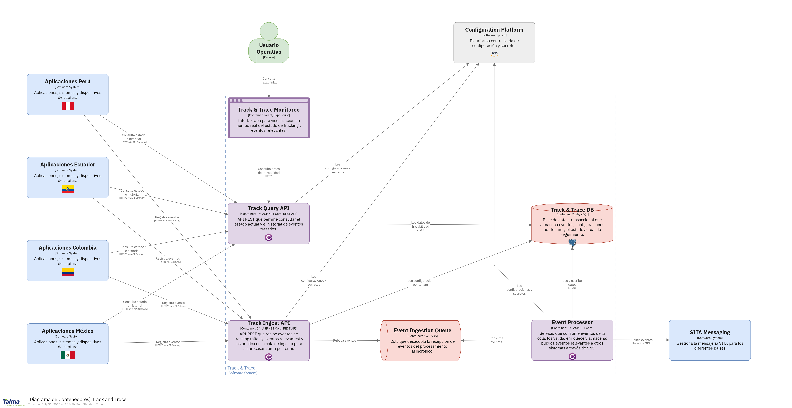

# 3. Contexto y alcance del sistema

El **Sistema de Track & Trace** es la plataforma centralizada de trazabilidad operacional que captura, procesa y proporciona visibilidad en tiempo real de todos los eventos críticos en las operaciones aeroportuarias y de aviación.

## 3.1 Contexto empresarial

### Propósito del Sistema

El sistema de track & trace actúa como el sistema nervioso de las operaciones, proporcionando:

- **Trazabilidad completa** de eventos operacionales en tiempo real
- **Visibilidad end-to-end** del flujo de operaciones aeroportuarias
- **Event sourcing** para reconstrucción histórica y auditoría
- **Dashboards en tiempo real** para toma de decisiones operacionales
- **Integración de eventos** entre sistemas heterogéneos

### Partes Interesadas Principales

| Parte Interesada | Rol | Responsabilidad | Expectativa |
|-------------|-----|----------------|-------------|
| **Operations Control Center** | Control Operacional | Monitoreo en tiempo real, respuesta a incidencias | Visibilidad completa, alertas inmediatas |
| **Airport Operations** | Operaciones Aeroportuarias | Coordinación de recursos, gestión de flujos | Información actualizada, trazabilidad |
| **Airline Operations** | Operaciones Aerolíneas | Seguimiento de vuelos, gestión de recursos | Datos precisos, integración SITA |
| **Management** | Gerencia | KPIs operacionales, análisis de rendimiento | Reportes, métricas, tendencias |
| **Compliance Officers** | Cumplimiento | Auditoría, investigaciones, regulaciones | Trazabilidad completa, reportes de auditoría |
| **IT Operations** | Operaciones TI | Mantenimiento sistema, rendimiento | Sistema estable, monitoreo proactivo |

### Objetivos Empresariales

| Objetivo | Descripción | Métricas de Éxito |
|----------|-------------|-------------------|
| **Visibilidad Operacional** | Transparencia completa de operaciones | 100% event capture, < 5 sec latency |
| **Trazabilidad Completa** | Auditoría completa de eventos críticos | 7 años retención, 99.999% durabilidad |
| **Decisiones Informadas** | Datos en tiempo real para operaciones | < 200ms query response, dashboards en tiempo real |
| **Cumplimiento Regulatorio** | Cumplimiento auditoría y regulaciones | 100% audit trail, regulatory compliance |
| **Integración Sin Interrupciones** | Conexión de sistemas heterogéneos | Event-driven integration, API standardization |



*Diagrama C4 - Contexto del Sistema Track & Trace mostrando integración con sistemas externos y componentes internos.*

## 3.2 Contexto técnico

### Posición en la Arquitectura

```text
┌─────────────────────────────────────────────────────────────────┐
│                    SISTEMAS EXTERNOS Y FUENTES DE DATOS         │
│  [SITA Network] [Airport Systems] [Airline Systems] [Gov APIs] │
└─────────────────────┬───────────────────────────────────────────┘
                      │ Events, API calls, Real-time feeds
                      ▼
┌─────────────────────────────────────────────────────────────────┐
│                     TRACK & TRACE SYSTEM                       │
│  ┌─────────────────────────────────────────────────────────────┐│
│  │              EVENT INGESTION LAYER                         ││
│  │  [API Gateway] [Event Consumers] [WebSocket] [File Proc]  ││
│  └─────────────────────────────────────────────────────────────┘│
│  ┌─────────────────────────────────────────────────────────────┐│
│  │                CQRS PROCESSING ENGINE                      ││
│  │  [Commands] [Event Store] [Query Models] [Projections]    ││
│  └─────────────────────────────────────────────────────────────┘│
│  ┌─────────────────────────────────────────────────────────────┐│
│  │                ANALYTICS & QUERY LAYER                     ││
│  │  [GraphQL] [REST APIs] [Real-time Queries] [Reports]      ││
│  └─────────────────────────────────────────────────────────────┘│
└─────────────────────┬───────────────────────────────────────────┘
                      │ Real-time data, APIs, Notifications
                      ▼
┌─────────────────────────────────────────────────────────────────┐
│                   CONSUMIDORES Y DASHBOARDS                     │
│  [Operations Dashboard] [Aplicaciones Móviles] [Notification System]   │
│  [SITA Messaging] [Reporting Tools] [External Partners]       │
└─────────────────────────────────────────────────────────────────┘
```

### Fronteras del Sistema

#### Dentro del Alcance

| Componente | Descripción | Responsabilidad |
|------------|-------------|-----------------|
| **Event Ingestion API** | REST/GraphQL APIs para recepción eventos | Event validation, normalization, routing |
| **Event Store** | Almacenamiento immutable de eventos | Event persistence, ordering, retrieval |
| **Command Handlers** | Procesamiento de comandos CQRS | Business logic, event generation |
| **Query Models** | Vistas materializadas para consultas | Optimized read models, projections |
| **Real-time Streaming** | WebSocket/SSE para actualizaciones | Live updates, real-time notifications |
| **Analytics Engine** | Procesamiento y agregación de datos | KPIs, metrics, trend analysis |
| **Dashboard APIs** | APIs para interfaces de usuario | Data access, filtering, pagination |
| **Audit & Compliance** | Logs y reportes de auditoría | Audit trails, compliance reporting |

#### Fuera del Alcance

| Componente | Razón de Exclusión | Responsable |
|------------|-------------------|-------------|
| **Source Systems** | Event generators | SITA Messaging, Airport systems, Airlines |
| **UI Dashboards** | Presentation layer | Frontend teams, dashboard vendors |
| **Data Warehousing** | Long-term analytics | BI teams, data warehouse systems |
| **Network Infrastructure** | Connectivity layer | Infrastructure, network teams |
| **External APIs** | Third-party integrations | External system owners |

## 3.3 Interfaces externas

### Actores Principales

| Actor | Tipo | Descripción | Interacciones |
|-------|------|-------------|---------------|
| **Operations Controller** | Humano | Control de operaciones en tiempo real | Dashboard monitoring, alert response |
| **Data Analyst** | Humano | Análisis de datos operacionales | Query APIs, report generation |
| **System Administrator** | Humano | Administración del sistema | Configuration, monitoring, maintenance |
| **Airport Staff** | Humano | Personal operacional aeroportuario | Mobile apps, status checking |
| **External Systems** | Sistema | Sistemas generadores de eventos | Event publishing, data integration |
| **Downstream Services** | Sistema | Consumidores de eventos | Event subscription, real-time updates |

### Sistemas Externos

| Sistema | Tipo | Protocolo | Propósito | Datos Intercambiados |
|---------|------|-----------|-----------|---------------------|
| **SITA Messaging System** | Internal Service | Event Bus | Flight message events | Message status, delivery confirmations, errors |
| **Airport Operations** | External System | REST API / WebSocket | Operational events | Gate assignments, baggage events, security events |
| **Airline Systems** | External Partners | REST API / SITA Network | Flight operations | Flight updates, crew changes, passenger data |
| **Air Traffic Control** | Government System | Secure APIs | Flight tracking | Flight plans, route changes, clearances |
| **Notification System** | Internal Service | Event Bus | Alert triggering | Event notifications, alert definitions |
| **Identity System** | Internal Service | OAuth2/OIDC | Authentication | User tokens, permissions, audit identity |
| **Government APIs** | External System | REST/SOAP | Regulatory reporting | Compliance data, incident reports |
| **Partner Airlines** | External Partners | EDI/XML/API | Data exchange | Schedule data, operational updates |

### Interfaces de Datos

#### Entrada de Datos

| Interface | Fuente | Tipo de Datos | Frecuencia | Formato |
|-----------|--------|---------------|------------|---------|
| **SITA Events** | SITA Messaging | Message lifecycle events | Real-time | Event messages (Avro) |
| **Flight Events** | Airlines/Airport | Flight operational data | Real-time | REST API (JSON) |
| **Equipment Events** | Airport Systems | Equipment status, alerts | Real-time | WebSocket (JSON) |
| **Manual Events** | Operations Staff | Manual event entry | On-demand | REST API (JSON) |
| **Batch Imports** | Legacy Systems | Historical data import | Scheduled | File upload (CSV/XML) |
| **External Feeds** | Partners | Operational updates | Real-time | Various (EDI/API) |

#### Salida de Datos

| Interfaz | Destino | Tipo de Datos | Frecuencia | Formato |
|-----------|---------|---------------|------------|---------|
| **Real-time Events** | Dashboards | Live operational data | Continuous | WebSocket (JSON) |
| **API Queries** | Client applications | Filtered event data | On-demand | REST/GraphQL (JSON) |
| **Notification Triggers** | Notification System | Alert events | Event-driven | Event messages |
| **Analytics Data** | BI Systems | Aggregated metrics | Batch/streaming | Data pipeline |
| **Audit Reports** | Compliance Systems | Audit trail data | Scheduled | Report files |
| **Partner Feeds** | External Partners | Operational status | Real-time | Partner-specific APIs |

## 3.4 Alcance funcional

### Funcionalidades Incluidas

| Función | Descripción | Usuarios Objetivo | Prioridad |
|---------|-------------|-------------------|-----------|
| **Event Ingestion** | Captura eventos de múltiples fuentes | Sistemas internos/externos | Alta |
| **Real-time Tracking** | Seguimiento en tiempo real de operaciones | Operations, management | Alta |
| **Event Sourcing** | Almacenamiento immutable de eventos | Sistema, auditoría | Alta |
| **Query & Analytics** | Consultas complejas y análisis | Analysts, operations | Alta |
| **Dashboards en Tiempo Real** | Visualización en tiempo real | Operations controllers | Media |
| **Alert Generation** | Detección automática de anomalías | Operations, management | Media |
| **Análisis Histórico** | Análisis de tendencias históricas | Management, analysts | Media |
| **Audit Trail** | Trazabilidad completa para auditoría | Compliance officers | Media |
| **Data Export** | Exportación para sistemas externos | BI teams, partners | Baja |
| **Event Replay** | Reproducción de eventos históricos | Development, debugging | Baja |

### Funcionalidades Excluidas

| Función | Razón de Exclusión | Alternativa |
|---------|-------------------|-------------|
| **Event Generation** | Responsibility of source systems | SITA Messaging, airport systems |
| **Business Intelligence** | Specialized BI tools more appropriate | Dedicated BI platforms |
| **Workflow Management** | Business process responsibility | BPM systems |
| **Document Storage** | Not core to event tracking | Document management systems |
| **User Interface** | Presentation layer responsibility | Dashboard applications |

## 3.5 Casos de uso principales

### Ingesta de Evento Operacional

```text
Actor: SITA Messaging System
Precondición: Evento de mensaje SITA ocurre
Flujo Principal:
1. SITA System detecta cambio estado mensaje
2. Sistema genera evento normalizado
3. Evento publicado a event topic específico
4. Track & Trace consume evento
5. Sistema valida formato y contenido
6. Evento almacenado en event store
7. Sistema actualiza query models relevantes
8. Notificaciones generadas si aplica
9. Dashboards actualizados en tiempo real
Postcondición: Evento trackeado y visible en sistema
```

### Consulta en Tiempo Real de Estado

```text
Actor: Operations Controller
Precondición: Controller autenticado en dashboard
Flujo Principal:
1. Controller accede a dashboard operacional
2. Sistema carga vista en tiempo real
3. Controller filtra por vuelo/operación específica
4. Sistema ejecuta query en read models
5. Datos históricos y estado actual mostrados
6. Sistema suscribe a actualizaciones tiempo real
7. Nuevos eventos actualizan vista automáticamente
8. Controller puede drill-down en detalles
Postcondición: Visibilidad completa de estado operacional
```

### Análisis de Tendencias Históricas

```text
Actor: Data Analyst
Precondición: Analyst tiene permisos de análisis
Flujo Principal:
1. Analyst accede a analytics interface
2. Analyst define criterios de análisis
3. Sistema ejecuta queries sobre event store
4. Datos agregados y procesados
5. Métricas y tendencias calculadas
6. Resultados presentados en dashboard
7. Analyst puede exportar resultados
8. Sistema guarda query para reutilización
Postcondición: Insights operacionales generados
```

### Detección de Anomalías y Alertas

```text
Actor: Alert Engine (Automated)
Precondición: Reglas de alerta configuradas
Flujo Principal:
1. Sistema recibe nuevo evento operacional
2. Engine evalúa evento contra reglas
3. Anomalía detectada (retraso significativo)
4. Sistema genera alerta estructurada
5. Alerta publicada a notification system
6. Dashboard actualizado con indicador
7. Stakeholders relevantes notificados
8. Event logged para análisis posterior
Postcondición: Anomalía identificada y comunicada
```

## 3.6 Arquitectura CQRS específica

### Command Side (Operaciones de Escritura)

| Componente | Responsabilidad | Tecnología | Capacidad |
|------------|----------------|------------|-----------|
| **Command Handlers** | Procesamiento de comandos | .NET Command Handlers | 50k commands/sec |
| **Event Store** | Almacenamiento de eventos | PostgreSQL/SNS+SQS/RabbitMQ | Scalable retention |
| **Aggregate Roots** | Domain logic, consistency | Domain models | Business rule enforcement |
| **Event Publishers** | Publicación de domain events | Event producers | Guaranteed delivery |

### Query Side (Operaciones de Lectura)

| Componente | Responsabilidad | Tecnología | Capacidad |
|------------|----------------|------------|-----------|
| **Read Models** | Optimized query views | PostgreSQL | p95 < 200ms queries |
| **Projections** | Event to read model mapping | Background processors | Real-time updates |
| **Query Handlers** | Query processing | .NET Query Handlers | 10k queries/sec |
| **Cache Layer** | Query acceleration | Redis | Sub-millisecond access |

### Infraestructura de Streaming de Eventos

| Componente | Responsabilidad | Tecnología | Configuración |
|------------|----------------|------------|---------------|
| **Event Topics** | Event categorization | Event Topics | Partitioned by entity |
| **Consumer Groups** | Parallel processing | Event Consumer Groups | Auto-scaling |
| **Schema Registry** | Event schema management | Confluent Schema Registry | Avro schemas |
| **Stream Processing** | Real-time analytics | Event Stream Processing | Windowed aggregations |

## 3.7 Atributos de calidad

### Rendimiento

| Atributo | Métrica | Objetivo | Medición |
|----------|---------|--------|----------|
| **Event Ingestion Rate** | Events per second | 50,000 events/sec | Event metrics |
| **Query Response Time** | Query latency | p95 < 200ms | APM monitoring |
| **Real-time Updates** | Update latency | < 5 seconds | End-to-end monitoring |
| **Dashboard Load Time** | UI responsiveness | < 2 seconds | Frontend monitoring |

### Confiabilidad

| Atributo | Métrica | Objetivo | Medición |
|----------|---------|--------|----------|
| **Data Durability** | Event loss rate | < 0.0001% | Data integrity checks |
| **System Disponibilidad** | Service uptime | 99.95% | Health monitoring |
| **Event Ordering** | Out-of-order events | < 0.01% | Sequence validation |
| **Recovery Time** | MTTR | < 1 hour | Incident response |

### Escalabilidad

| Atributo | Métrica | Objetivo | Medición |
|----------|---------|--------|----------|
| **Horizontal Scaling** | Linear scaling capability | Auto-scaling | Load testing |
| **Storage Scaling** | Data growth handling | Petabyte scale | Storage monitoring |
| **Query Scaling** | Concurrent query support | 10k concurrent queries | Concurrency testing |
| **Event Retention** | Historical data access | 7 years retention | Archive validation |

### Calidad de Datos

| Atributo | Métrica | Objetivo | Medición |
|----------|---------|--------|----------|
| **Data Completeness** | Missing events | < 0.1% | Completeness checks |
| **Data Accuracy** | Incorrect events | < 0.01% | Validation rules |
| **Schema Compliance** | Format violations | Zero tolerance | Schema validation |
| **Correlación de Eventos** | Orphaned events | < 0.1% | Relationship validation |

## Referencias

### CQRS and Event Sourcing

- [CQRS Pattern Documentation](https://docs.microsoft.com/en-us/azure/architecture/patterns/cqrs)
- [Event Sourcing Pattern](https://docs.microsoft.com/en-us/azure/architecture/patterns/event-sourcing)
- [Saga Pattern for Distributed Transactions](https://microservices.io/patterns/data/saga.html)

### Event Streaming Architecture

- [Event-Driven Architecture](https://martinfowler.com/articles/201701-event-driven.html)
- [Event Sourcing Pattern](https://martinfowler.com/eaaDev/EventSourcing.html)
- [PostgreSQL for Event Store](https://www.postgresql.org/docs/current/)

### Analytics and Time Series

- [InfluxDB Documentation](https://docs.influxdata.com/)
- [Elasticsearch Analytics](https://www.elastic.co/guide/en/elasticsearch/reference/current/search-aggregations.html)
- [PostgreSQL Time Series](https://www.postgresql.org/docs/current/functions-datetime.html)

### Architecture References

- [Event-Driven Architecture](https://martinfowler.com/articles/201701-event-driven.html)
- [Arc42 Context Template](https://docs.arc42.org/section-3/)
- [C4 Model Documentation](https://c4model.com/)
